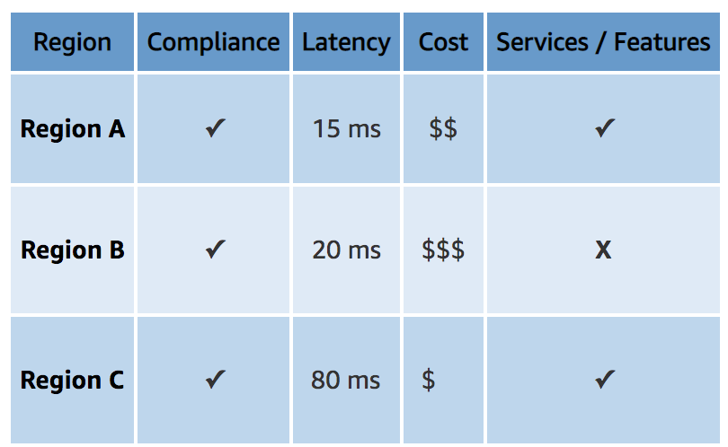

# Global Infrastructure

This exercise helps in understanding the components of AWS Global Infrastructure which includes Availability zones, regions and edge locations. It also talks about the factors to be considered by a company while choosing a preferred location.

## Key terminology

- Regions - In AWS, the concept of region is a physical location around the world where they cluster data centers. Each group of logical data centers is called an Availability Zone. Each AWS Region consists of multiple, isolated, and physically separate AZs within a geographic area. Unlike other cloud providers, who often define a region as a single data center, the multiple AZ design of every AWS Region offers advantages for customers. Each AZ has independent power, cooling, and physical security and is connected via redundant, ultra-low-latency networks. AWS customers focused on high availability can design their applications to run in multiple AZs to achieve even greater fault-tolerance. AWS infrastructure Regions meet the highest levels of security, compliance, and data protection. 

- AWS Availability Zone - An Availability Zone (AZ) is one or more discrete data centers with redundant power, networking, and connectivity in an AWS Region. AZs give customers the ability to operate production applications and databases that are more highly available, fault tolerant, and scalable than would be possible from a single data center. All AZs in an AWS Region are interconnected with high-bandwidth, low-latency networking, over fully redundant, dedicated metro fiber providing high-throughput, low-latency networking between AZs. All traffic between AZs is encrypted. The network performance is sufficient to accomplish synchronous replication between AZs. AZs make partitioning applications for high availability easy. If an application is partitioned across AZs, companies are better isolated and protected from issues such as power outages, lightning strikes, tornadoes, earthquakes, and more. AZs are physically separated by a meaningful distance, many kilometers, from any other AZ, although all are within 100 km (60 miles) of each other. 

- Edge location - Edge locations are AWS data centers designed to deliver services with the lowest latency possible. Amazon has dozens of these data centers spread across the world. They’re closer to users than Regions or Availability Zones, often in major cities, so responses can be fast and snappy. Edge locations are used for a number of AWS features. Edge locations serve requests for CloudFront and Route 53. CloudFront is a content delivery network, while Route 53 is a DNS service. Requests going to either one of these services will be routed to the nearest edge location automatically. This allows for low latency no matter where the end user is located.

i) CloudFront, is the most commonly discussed use of edge locations. It’s a content delivery network that caches content in edge locations. Content can be served directly from the cache, so it gets to users faster. CloudFront is often used to serve static assets, speed up websites, and stream video.

ii) Route 53 is purportedly a managed DNS service with name servers spread across Amazon’s edge locations. DNS responses come directly from the edge locations, so they’re as fast as possible.

iii) Web Application Firewall and AWS Shield provide a firewall and DDoS protection, respectively. These services filter traffic in edge locations so malicious or unwanted traffic can be discarded as close to source as possible. This, in turn, reduces congestion on Amazon’s global network and the public internet.

iv) AWS Global Accelerator allows you to route requests for key resources through  Amazon’s global network—even if the request is going halfway round the world. The request is initially routed to the closest edge location and then travels through Amazon’s network—often with lower latency and higher throughput than the public internet.

- Difference between AZ and EL - Both the Edge Locations (EL) and Availability Zones (AZ) are AWS Data Centers, but EL are primarily used for caching of the data to provide better user experience with low latency, the AZ are used for hosting servers, websites, applications, softwares, Big Data processing, analytics and a wide variety of use cases.

AZ are big and few when compared to the EL. Also, the EL are closer to the user providing better latency when compared to the AZ. 

-  AWS IAM - AWS Identity and Access Management (IAM) provides fine-grained access control across all of AWS. With IAM, you can specify who can access which services and resources, and under which conditions. With IAM policies, you manage permissions to your workforce and systems to ensure least-privilege permissions. IAM is an AWS service that is offered at no additional charge.

- RDS Instances - Amazon Relational Database Service (Amazon RDS) is a web service that that allows you to quickly create a relational database instance in the cloud. Amazon RDS manages the database instance on your behalf by performing backups, handling failover, and maintaining the database software.

-    Amazon CloudFront - CloudFront is Amazon’s content delivery network that is primarily used to speed up websites. It’s particularly useful for large, static assets—like images and videos. CloudFront sits in front of an “origin” server (which serves the original content), and caches it at the edge locations around the world.

When a user visits a site, they’re routed to the nearest edge location using DNS. CloudFront looks to see if the page they requested is cached. If it is, the page is served directly from the cache. If it isn’t, CloudFront fetches the page from the origin, stores it in the cache, and serves it to the user. The next user to hit the same edge location will get the page served from the cache.

The more responses that can be served from the cache, the lower the latency for users—and the lower the load on the origin.
 
### Exercise

Study:

1. What is an AWS Availability Zone?
2. What is a Region?
3. What is an Edge Location?
4. Why would you choose one region over another? (e.g. eu-central-1 (Frankfurt) over us-west-2 (Oregon)).

### Sources

- [Global Infrastructure AWS](https://aws.amazon.com/about-aws/global-infrastructure/regions_az/#:~:text=the%20Middle%20East.-,Availability%20Zones,connectivity%20in%20an%20AWS%20Region.)

- [Edge location](https://www.lastweekinaws.com/blog/what-is-an-edge-location-in-aws-a-simple-explanation/)

- [What to Consider when Selecting a Region for your Workloads](https://aws.amazon.com/blogs/architecture/what-to-consider-when-selecting-a-region-for-your-workloads/#:~:text=Choosing%20an%20AWS%20Region%20with,from%20one%20Region%20to%20another.)

- [ELvsAZ](https://www.edureka.co/community/54257/difference-between-an-edge-location-and-availability-zone)

- [AWS IAM](https://aws.amazon.com/iam/)

- [AWS tutorial](https://www.w3schools.com/aws/index.php)

- [AWS Edge Locations vs Availability Zones | AWS Local Zones | AWS Regions](https://www.youtube.com/watch?v=Uk2A9-JO-_w)

- [AWS tutorial for beginners](https://www.youtube.com/watch?v=r4YIdn2eTm4)

- [Regions and availability zones](https://cloudacademy.com/blog/aws-regions-and-availability-zones-the-simplest-explanation-you-will-ever-find-around/)

### Overcome challanges

I learnt about the meaning of each key terminologies mentioned in this exercise. It seemed quite similar when I read initially about the components of GI, but made more sense when I read further about the subtle differences involved behind each component. 

### Results

1. AWS Regions are separate geographical areas that AWS uses to house its infrastructure. These are distributed around the world so that customers can choose a region closest to them in order to host their cloud infrastructure there. The closer your region is to you, the better, so that you can reduce network latency as much as possible for your end-users. You want to be near the data centers for fast service. AWS has 26 launced regions now.

2. AWS availability zone is the logical building block that makes up an AWS Region. There are currently 84 AZs, which are isolated locations — data centers — within a region. Each region has multiple AZs and when you design your infrastructure to have backups of data in other AZs you are building a very efficient model of resiliency, i.e. a core concept of cloud computing.

3. An edge location is the closest point to the user using AWS service. It is basically a small setup in different locations. It provides low latency connectivity by providing static content to be available from the nearest location of the request. What actually happens here is that instead of getting the information from the source it just routes to the nearest edge location and delivers the information reducing the latency to the end users. So, by following this way the access time is reduced and response gets faster.

4. Why would you choose one region over another? (e.g. eu-central-1 (Frankfurt) over us-west-2 (Oregon)).

Selecting the optimal AWS region is an important step when deploying new workloads. Based on the factors discussed below, one can decide the suitable region.

The AWS Cloud is an ever-growing network of Regions and points of presence (PoP), with a global network infrastructure that connects them together. With such a vast selection of Regions, costs, and services available, it can be challenging for companies to select the optimal Region for a workload. This decision must be made carefully, as it has a major impact on compliance, cost, performance, and services available for your workloads.

Evaluating Regions for deployment

There are four main factors that play into evaluating each AWS Region for a workload deployment:

1. Compliance: If your workload contains data that is bound by local regulations, then selecting the Region that complies with the regulation overrides other evaluation factors. This applies to workloads that are bound by data residency laws where choosing an AWS Region located in that country is mandatory.

2. Latency: A major factor to consider for user experience is latency. Reduced network latency can make substantial impact on enhancing the user experience. Choosing an AWS Region with close proximity to your user base location can achieve lower network latency. It can also increase communication quality, given that network packets have fewer exchange points to travel through.

3. Cost: AWS services are priced differently from one Region to another. Some Regions have lower cost than others, which can result in a cost reduction for the same deployment.

4. Services and features: Newer services and features are deployed to Regions gradually. Although all AWS Regions have the same service level agreement (SLA), some larger Regions are usually first to offer newer services, features, and software releases. Smaller Regions may not get these services or features in time for you to use them to support your workload.
Evaluating all these factors can make coming to a decision complicated. This is where your priorities as a business should influence the decision.

Assess potential Regions for the right option: 

Evaluate by shortlisting potential Regions.

1. Checking if these Regions are compliant and have the services and features you need to run your workload using the AWS Regional Services website.
2. Checking feature availability of each service and versions available, if your workload has specific requirements.
3. Calculating the cost of the workload on each Region using the AWS Pricing Calculator.
4. Testing the network latency between your user base location and each AWS Region.
At this point, we should have a list of AWS Regions with varying cost and network latency that looks something Table 1:

So based on these factors, it is possible to determine the region.
 
