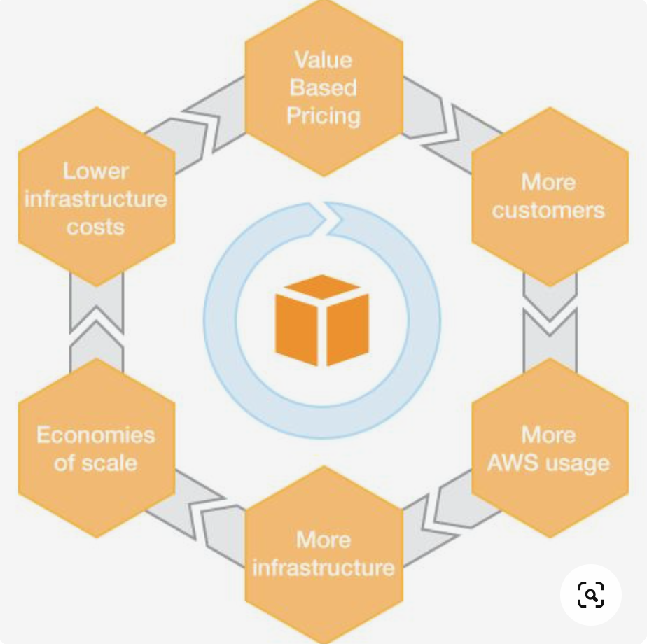
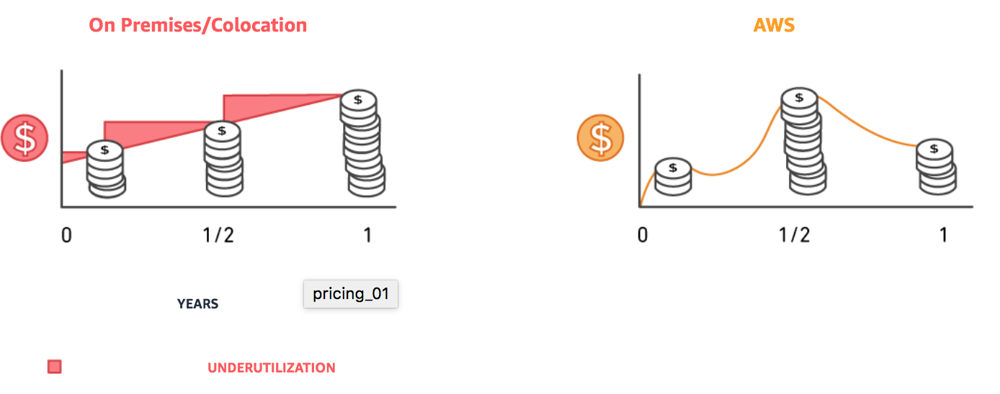
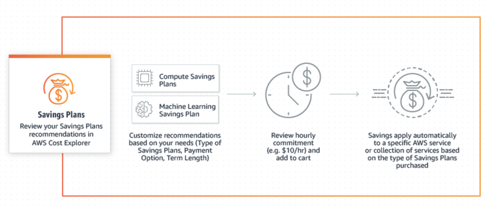
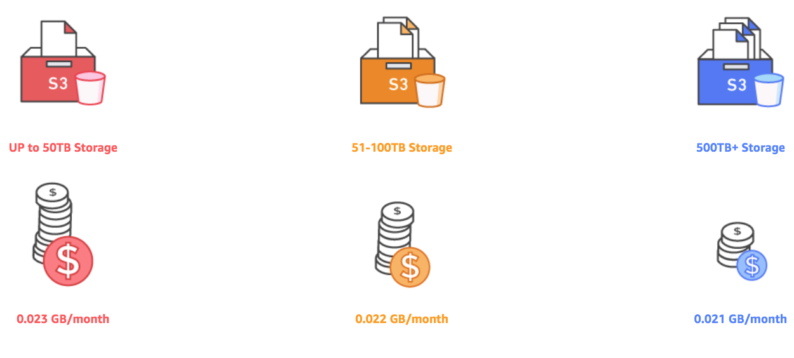
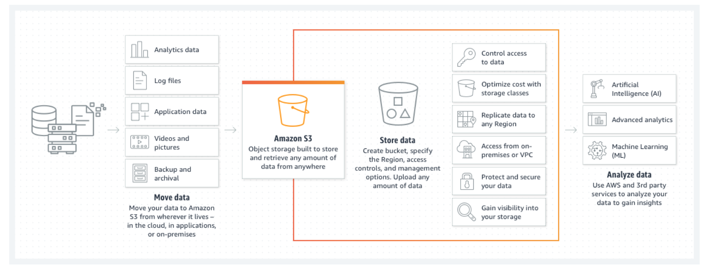
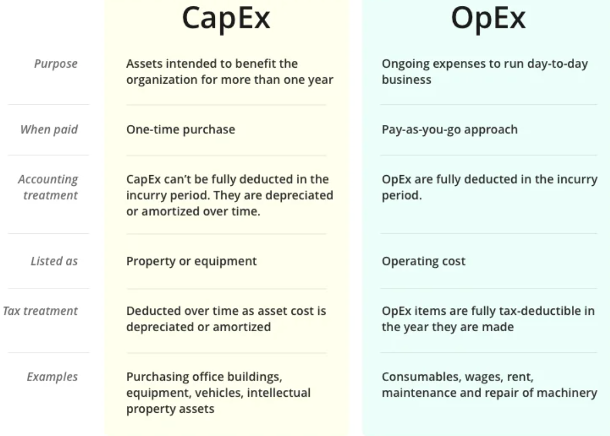

# Pricing

This exercise helps in understanding the AWS pricing model along with its advantages and the free tier services. I also learnt the differences between CapEx and OpEx.

One of the main reasons for organizations moving to the cloud is cost. If done well, public cloud infrastructures can reduce costs significantly compared to traditional data centers. 

AWS offers you a pay-as-you-go approach for pricing for over 200 cloud services. With AWS you pay only for the individual services you need, for as long as you use them, and without requiring long-term contracts or complex licensing. AWS pricing is similar to how you pay for utilities like water and electricity. You only pay for the services you consume, and once you stop using them, there are no additional costs or termination fees. 

You pay only for the compute capacity, storage, and outbound data transfer that you use. You never pay for inbound data transfer and data transfer between services within the same region.

## Key terminology

- Cloud computing - Cloud computing is the on-demand delivery of IT resources over the Internet with pay-as-you-go pricing. Instead of buying, owning, and maintaining physical data centers and servers, you can access technology services, such as computing power, storage, and databases, on an as-needed basis from a cloud provider like Amazon Web Services (AWS). 

Who is using Cloud computing?

Organizations of every type, size, and industry are using the cloud for a wide variety of use cases, such as data backup, disaster recovery, email, virtual desktops, software development and testing, big data analytics, and customer-facing web applications. For example, healthcare companies are using the cloud to develop more personalized treatments for patients. Financial services companies are using the cloud to power real-time fraud detection and prevention. And video game makers are using the cloud to deliver online games to millions of players around the world.

- AWS free tier - When creating a new AWS account, The AWS Free Tier provides customers the ability to explore and try out AWS services free of charge up to specified limits for each service. The Free Tier is comprised of three different types of offerings:

1. A 12-month Free Tier - Services with a 12-month Free Tier allow customers to use the product for free up to specified limits for one year from the date the account was activated. 

2. An Always Free offer - Services with an Always Free offer allow customers to use the product for free up to specified limits as long as they are an AWS customer. 

3. Short term trials - Services with a short term trial are free to use for a specified period of time or up to a one-time limit depending on the service selected. Details on the limits and services provided for free are detailed in each card on the Free Tier page. If your application use exceeds the free tier limits, you simply pay standard, pay-as-you-go service rates 

- The total cost of ownership (TCO) - It is used to calculate the total cost of purchasing and operating a technology product or service over its useful life. It combines both direct and indirect costs. The TCO is important for evaluating technology costs that aren’t always reflected in upfront pricing. Your TCO is a great compliment to your business’s return on investment (ROI) as the ROI helps illuminate benefits that may not be readily apparent, such as improved employee productivity or increased customer satisfaction.

### Exercise
Study:

1. The four advantages of the AWS pricing model.
2. AWS free tier for:
- S3
- EC2
- Always free services
3. Understand the differences between capex and opex
### Sources

- [AWS pricing](https://aws.amazon.com/pricing/)
- [Pricing](https://containersonaws.com/introduction/why-aws/)
- [Cloud computing](https://aws.amazon.com/what-is-cloud-computing/)
- [AWS free tier](https://aws.amazon.com/free/free-tier-faqs/#:~:text=The%20AWS%20Free%20Tier%20provides,offer%2C%20and%20short%20term%20trials.)
- [S3](https://aws.amazon.com/s3/)
- [EC2](https://docs.aws.amazon.com/AWSEC2/latest/UserGuide/concepts.html)
- [TCO](https://www.brockoa.com/total-cost-of-ownership/)
- [CapEx vs OpEx](https://www.investopedia.com/ask/answers/112814/whats-difference-between-capital-expenditures-capex-and-operational-expenditures-opex.asp#:~:text=Capital%20expenditures%20(CAPEX)%20are%20major,to%20keep%20its%20business%20operational.)
- [CapEx & OpEx YT](https://www.youtube.com/watch?v=dLyKfxkkA1s)

### Overcome challanges

I learnt about each terminology and how the pricing model is adapted in AWS.
### Results

1. Four advantages of AWS pricing model:

i) Pay-as-you-go : This means that you pay only for the services you need with no long term contracts or commitments. 
With AWS you only pay for what use, helping your organization remain agile, responsive and always able to meet scale demands.

Pay-as-you-go pricing allows you to easily adapt to changing business needs without overcommitting budgets and improving your responsiveness to changes. With a pay as you go model, you can adapt your business depending on need and not on forecasts, reducing the risk or overprovisioning or missing capacity.

By paying for services on an as needed basis, you can redirect your focus to innovation and invention, reducing procurement complexity and enabling your business to be fully elastic.

ii) Save when you commit:
Savings Plans is a flexible pricing model that provides significant savings on your AWS usage. This pricing model offers lower prices on AWS Compute and AWS Machine Learning. Savings Plans offer savings over On-Demand in exchange for a commitment to use a specific amount (measured in $/hour) of an AWS service or a category of services, for a one- or three-year period.

You can sign up for Savings Plans for a 1- or 3-year term and easily manage your plans by taking advantage of recommendations, performance reporting, and budget alerts in the AWS Cost Explorer.

iii) Pay less by using more:  This means pay less per unit as your organization grows. 

With AWS, you can get volume based discounts and realize important savings as your usage increases. For services such as S3 and data transfer OUT from EC2, pricing is tiered, meaning the more you use, the less you pay per GB. In addition, data transfer IN is always free of charge. As a result, as your AWS usage needs increase, you benefit from the economies of scale that allow you to increase adoption and keep costs under control.
As your organization evolves, AWS also gives you options to acquire services that help you address your business needs. For example, AWS’ storage services portfolio, offers options to help you lower pricing based on how frequently you access data, and the performance you need to retrieve it. To optimize your savings, choose the right combinations of storage solutions that help you reduce costs while preserving performance, security and durability.

iv) Benefit from massive economies of scale:

With AWS you also benefit from massive economy of scale. Because AWS serves millions of active customers each month the aggregate overhead is able to be optimized much more efficiently, resulting in lower costs that are passed on to customers as lower prices. As AWS has grown it has lowered prices more than 60 times.

2. AWS free tier - When creating a new AWS account, you automatically get a free-tier account for the first 12 months. Some services are free up to a certain limit with a free-tier account. Other services are always free. However, those services might be integrated with other services for which you have to pay.

AWS free tier for:

- Amazon Simple Storage Service (Amazon S3) - Amazon S3, in simple words is an object storage built to retrieve any amount of data from anywhere. It is an object storage service offering industry-leading scalability, data availability, security, and performance. Customers of all sizes and industries can store and protect any amount of data for virtually any use case, such as data lakes, cloud-native applications, and mobile apps. With cost-effective storage classes and easy-to-use management features, you can optimize costs, organize data, and configure fine-tuned access controls to meet specific business, organizational, and compliance requirements.

On creating an account with AWS, it offers 5 GB of S3 standard storage for 12 months with the AWS Free Tier.

- Amazon Elastic Compute Cloud (Amazon EC2) - It provides scalable computing capacity in the Amazon Web Services (AWS) Cloud. Using Amazon EC2 eliminates your need to invest in hardware up front, so you can develop and deploy applications faster. You can use Amazon EC2 to launch as many or as few virtual servers as you need, configure security and networking, and manage storage. Amazon EC2 enables you to scale up or down to handle changes in requirements or spikes in popularity, reducing your need to forecast traffic.

AWS offers 750 hours per month for 12 months with the AWS Free Tier.

- Always free services:

Listed below are some of the free services offered by AWS upto a specified limit. Although, these are called free service, they might be integrated with other services for which you have to pay:

1. Amazon DynamoDB - 25GB of free storage
2. AWS Lambda computing - 1 million free requests per month
3. AWS SNS push notifications - 1 million publishes
4. Amazon CloudWatch monitoring - 10 custom metrics and alarms
5. Amazon CloudFront - 1 TB of data transfer out
6. Amazon Cognito - 50,000 MAUs per month
7. Amazon Macie - 1 GB processed by the content classification engine
8. Amazon SES - 62,000 outbound messages per month
9. Amazon SQS - 1 Million requests
10. Amazon SWF - 10,000 activity tasks
11. AWS CodeBuild - 100 build minutes
12. AWS CodeCommit - 5 active users per month
13. AWS CodePipeline - 1 active pipeline per month
14. AWS Database Migration Service - 750 Hours of Amazon DMS Single-AZ dms.t2.micro instance usage
15. AWS Glue - 1 Million objects stored in the AWS Glue Data Catalog

Other than these, there are more services offered by AWS under the Always free range. The following link explains about these in detail. 

[Free tier services](https://aws.amazon.com/free/?all-free-tier.sort-by=item.additionalFields.SortRank&all-free-tier.sort-order=asc&awsf.Free%20Tier%20Types=tier%23always-free&awsf.Free%20Tier%20Categories=*all&awsm.page-all-free-tier=3)

3. CapEx vs OpEx

Businesses have a variety of expenses, from the rent they pay for their factories or offices to the cost of raw materials for their products, to the wages they pay their workers to the overall costs of growing their business. To simplify all of these costs, businesses organize them under different categories. Two of the most common are capital expenditures (CAPEX) and operating expenses (OPEX).

CapEx - Capital expenditures are purchases of significant goods or services that will be used to improve a company's performance in the future. CAPEX costs are paid upfront all at once. One of the defining features of capital expenditures is longevity; meaning the purchases benefit the company for longer than one tax year. Capital expenditures are typically for fixed assets like property(building), plant, and equipmen, machinery and vehicles. For example, if an oil company buys a new drilling rig, the transaction would be a capital expenditure.

OpEx - Operating expenses are the costs a company incurs for running its day-to-day operations. These expenses must be ordinary and customary costs for the industry in which the company operates. Companies report OPEX on their income statements and can deduct OPEX from their taxes for the year in which the expenses were incurred. OPEX are short-term expenses and are typically used up in the accounting period in which they were purchased. This means that they are paid weekly, monthly, or annually. Some examples of OpEx are Rent and utilities, Wages and salaries, Accounting legal fees and property taxes.

If a company chooses to lease a piece of equipment instead of purchasing it as a capital expenditure, the lease cost would be classified as an operating expense.

 
