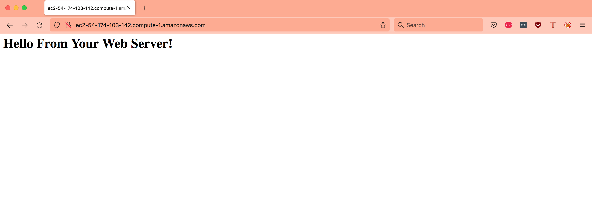
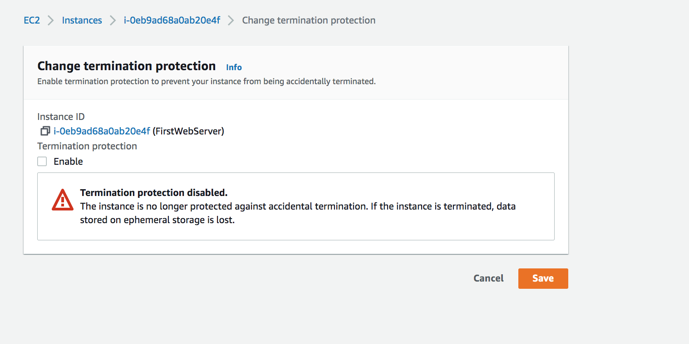

# Elastic Compute Cloud (EC2)
This exercise helps in understanding EC2 service offered by AWS. I also learnt how to launch an instance and how to connect to VM/EC2 instance using an SSH connection. 

Introduction:

The service with which you can run Virtual Machines in AWS is called EC2. These VMs can be used for anything a regular server is used for. Since they’re located at a remote location, connecting to the machine has to be done via the internet. For a connection to Linux machines, you use the Secure Shell (ssh) protocol. For a connection to Windows machines, you use the Remote Desktop Protocol (RDP).

## Key terminology

- Remote Desktop Protocol (RDP) - It is a proprietary protocol developed by Microsoft which provides a user with a graphical interface to connect to another computer over a network connection.[1] The user employs RDP client software for this purpose, while the other computer must run RDP server software.

- Amazon Machine Image (AMI) - An AMI is a blueprint for your machine. It contains a template for the OS among other things. An Amazon Machine Image (AMI) is a supported and maintained image provided by AWS that provides the information required to launch an instance. You must specify an AMI when you launch an instance. You can launch multiple instances from a single AMI when you require multiple instances with the same configuration. You can use different AMIs to launch instances when you require instances with different configurations.

- Instances - EC2 can have different sizes, called instance types. Every instance type has a different amount of (virtual)CPUs, memory, and network performance. An instance is a virtual server in the cloud. Its configuration at launch is a copy of the AMI that you specified when you launched the instance. You can launch different types of instances from a single AMI. An instance type essentially determines the hardware of the host computer used for your instance. Each instance type offers different compute and memory capabilities. Select an instance type based on the amount of memory and computing power that you need for the application or software that you plan to run on the instance.

For the root volume, an instance can use Elastic Block Store (EBS) or Instance store depending on its type.

- Elastic Block Store (EBS) - It provides block level storage volumes for use with EC2 instances. EBS volumes behave like raw, unformatted block devices. You can mount these volumes as devices on your instances. EBS volumes that are attached to an instance are exposed as storage volumes that persist independently from the life of the instance. You can create a file system on top of these volumes, or use them in any way you would use a block device (such as a hard drive). You can dynamically change the configuration of a volume attached to an instance. EBS is also known as EBS is known as persistent storage.

- Instance store - An instance store provides temporary block-level storage for your instance. This storage is located on disks that are physically attached to the host computer. Instance store is ideal for temporary storage of information that changes frequently, such as buffers, caches, scratch data, and other temporary content, or for data that is replicated across a fleet of instances, such as a load-balanced pool of web servers. Instance store is also known as ephemeral storage

- Security group - Every instance has a security group. A security group acts as a virtual firewall for your EC2 instances to control incoming and outgoing traffic. Inbound rules control the incoming traffic to your instance, and outbound rules control the outgoing traffic from your instance. When you launch an instance, you can specify one or more security groups. If you don't specify a security group, Amazon EC2 uses the default security group. You can add rules to each security group that allow traffic to or from its associated instances. By using the Security Group service, you don’t have to worry about firewalls on the OS level.

- Stateful firewall - A stateful firewall is a kind of firewall that keeps track and monitors the state of active network connections while analyzing incoming traffic and looking for potential traffic and data risks. This firewall is situated at Layers 3 and 4 of the Open Systems Interconnection (OSI) model. 

- User Data - AWS userdata is the set of commands/data you can provide to an instance at the time of launch. It allows us to create an EC2 instance and also helps automate some common tasks. With User Data you can specify a (bash) script that runs on boot. This is a way to quickly configure servers without having to log in and without doing any manual work.

- On-Demand Instances - With On-Demand Instances, you pay for compute capacity by the second with no long-term commitments. You have full control over its lifecycle—you decide when to launch, stop, hibernate, start, reboot, or terminate it.

- Reserved Instances - Reserved Instances provide you with significant savings on your Amazon EC2 costs compared to On-Demand Instance pricing. Reserved Instances are not physical instances, but rather a billing discount applied to the use of On-Demand Instances in your account. Reserved instances provide a greater discount depending on how much you pay up front. You can reserve instances only for 1 or 3 years.

- Spot Instances - A Spot Instance is an instance that uses spare EC2 capacity that is available for less than the On-Demand price. Because Spot Instances enable you to request unused EC2 instances at steep discounts, you can lower your Amazon EC2 costs significantly. The hourly price for a Spot Instance is called a Spot price. Spot instances are generally considered the cheapest, but their availability depends on the demand, so they’re not always reliable.

### Exercise

Exercise 1
1. Navigate to the EC2 menu.
2. Launch an EC2 instance with the following requirements:
- AMI: Amazon Linux 2 AMI (HVM), SSD Volume Type
- Instance type: t2.micro
- Default network, no preference for subnet
- Termination protection: enabled
- User data:

- Root volume: general purpose SSD, Size: 8 GiB
- New Security Group:
Name: Web server SG
Rules: Allow SSH, HTTP and HTTPS from anywhere

Exercise 2
1. Wait for the Status Checks to get out of the initialization stage. When you click the Status Checks tab, you should see that the System reachability and the Instance reachability checks have passed.
2. Log in to your EC2 instance using an ssh connection.
3. Terminate your instance.

### Sources

- [Remote Desktop Protocol (RDP)](https://en.wikipedia.org/wiki/Remote_Desktop_Protocol)
- [Amazon Machine Images](https://docs.aws.amazon.com/AWSEC2/latest/UserGuide/AMIs.html)
- [Instances and AMI](https://docs.aws.amazon.com/AWSEC2/latest/UserGuide/ec2-instances-and-amis.html)
- [EBS](https://docs.aws.amazon.com/AWSEC2/latest/UserGuide/AmazonEBS.html)
- [Instance storage](https://docs.aws.amazon.com/AWSEC2/latest/UserGuide/InstanceStorage.html)
-[Stateful firewall](https://www.fortinet.com/resources/cyberglossary/stateful-firewall)
- [EC2 on demand instances](https://docs.aws.amazon.com/AWSEC2/latest/UserGuide/ec2-on-demand-instances.html)
- [Reserved Instances](https://aws.amazon.com/ec2/pricing/reserved-instances/)
- [Using spot instances](https://docs.aws.amazon.com/AWSEC2/latest/UserGuide/using-spot-instances.html)
- [Accessing Instances Linux](https://docs.aws.amazon.com/AWSEC2/latest/UserGuide/AccessingInstancesLinux.html)

### Overcome challanges

I tried to understand the concept EC2 and this exercise again involved intense reading. When I tried to login using the ssh connection, it took me a while to realize that I needed a keypair in order to login.

### Results

Exercise 1:

Launch an Ec2 instance with the following configuration

1. Ec2 Dashboard page

2. AMI: Amazon Linux 2 AMI (HVM), SSD Volume Type

3. Termination protection enabled

4. User data script added to the instance

5. Root voume to genernal purpose SSD and size 8GB

6. Security groups for SSH, HTTP and HTTPS

7. Instance launched successfully

8. Reaching the webserver running in the instance

Exercise 2:

1. Status checks completed

2. Log into the ec2 instance

connect to the ec2 instance instructions

.png)

3. Terminating the instance

Since the termination protection was enabled, terminating the instance resulted in the following error

this setting needed to be changed in the instance setting as below

Disabling termination protection

Instance terminated

 
