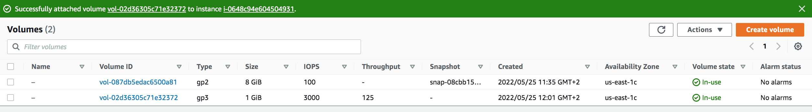

# Elastic Block Store (EBS)

In this exercise, I learnt how to create EBS Volumes and Snapshots. I also learnt how to create EBS Volumes from Snapshots and how to attach EBS volume to the EC2 instance.   

Introduction:

EBS can be seen as virtual hard drives in the cloud. They can be either root volumes (like an internal hard disk), or seperate volumes (like an external hard disk). 

For security, EBS volumes can be encrypted. Volumes can be scaled up, but not down.

Any external device, including EBS, needs to be mounted if you want to use them in Linux.
## Key terminology

- EBS Volumes - An Amazon EBS volume is a durable, block-level storage device that you can attach to your instances. After you attach a volume to an instance, you can use it as you would use a physical hard drive. EBS volumes are flexible. One instance of an EBS is called a volume. You can create snapshots of a volume to create backups or new identical volumes. These snapshots will be stored in S3.

- Volume types: Amazon EBS provides the following volume types, which differ in performance characteristics and price, so that you can tailor your storage performance and cost to the needs of your applications. The volumes types fall into these categories:

i) Solid state drives (SSD) — Optimized for transactional workloads involving frequent read/write operations with small I/O size, where the dominant performance attribute is IOPS.

ii) Hard disk drives (HDD) — Optimized for large streaming workloads where the dominant performance attribute is throughput.

iii) Previous generation — Hard disk drives that can be used for workloads with small datasets where data is accessed infrequently and performance is not of primary importance. We recommend that you consider a current generation volume type instead.

- snapshots - EBS Snapshots provide a simple and secure data protection solution that is designed to protect your block storage data such as EBS volumes, boot volumes, as well as on-premises block data. EBS Snapshots are a point-in-time copy of your data, and can be used to enable disaster recovery, migrate data across regions and accounts, and improve backup compliance. You can create snapshots of a volume to create backups or new identical volumes. These snapshots will be stored in S3.
### Exercise

Exercise 1
1. Navigate to the EC2 menu.
2. Create a t2.micro Amazon Linux 2 machine with all the default settings.
3. Create a new EBS volume with the following requirements:
- Volume type: General Purpose SSD (gp3)
- Size: 1 GiB
- Availability Zone: same as your EC2
4. Wait for its state to be available.

Exercise 2
1. Attach your new EBS volume to your EC2 instance.
2. Connect to your EC2 instance using SSH.
3. Mount the EBS volume on your instance.
4. Create a text file and write it to the mounted EBS volume.

Exercise 3
1. Create a snapshot of your EBS volume.
2. Remove the text file from your original EBS volume.
3. Create a new volume using your snapshot.
4. Detach your original EBS volume.
5. Attach the new volume to your EC2 and mount it.
6. Find your text file on the new EBS volume.
### Sources

- [Create an Amazon EBS volume](https://docs.aws.amazon.com/AWSEC2/latest/UserGuide/ebs-creating-volume.html)
- [To attach an EBS volume to an instance using the console](https://docs.aws.amazon.com/AWSEC2/latest/UserGuide/ebs-attaching-volume.html)
- [Make an Amazon EBS volume available for use on Linux](https://docs.aws.amazon.com/AWSEC2/latest/UserGuide/ebs-using-volumes.html)
- [Detach an EBS volume](https://docs.aws.amazon.com/AWSEC2/latest/UserGuide/ebs-detaching-volume.html#considerations)
- [snapshots](https://aws.amazon.com/ebs/snapshots/#:~:text=EBS%20Snapshots%20are%20a%20point,)%2C%20or%20the%20AWS%20SDKs.)
### Overcome challanges

This exercise involved extensive reading to understand the key terminologies and the reason for creating EBS volumes and snapshots. I also learnt the different commands for attaching and mounting volumes. 
### Results

Exercise 1

1. created a t2 micro ec2 instance

2. created an ebs volume 

Exercise 2

1. Attaching the EBS volume to the ec2 instance

2. Mounting EBS volume 

3. Creating a text file

Exercise 3

1. Creating a snapshot of the ebs volume

2. Removing the text file in the original file

3. Creating a volume out of the snapshot

4. Detaching the original vloume of the ec2

5. Attaching the new vloume and mounting the instance
