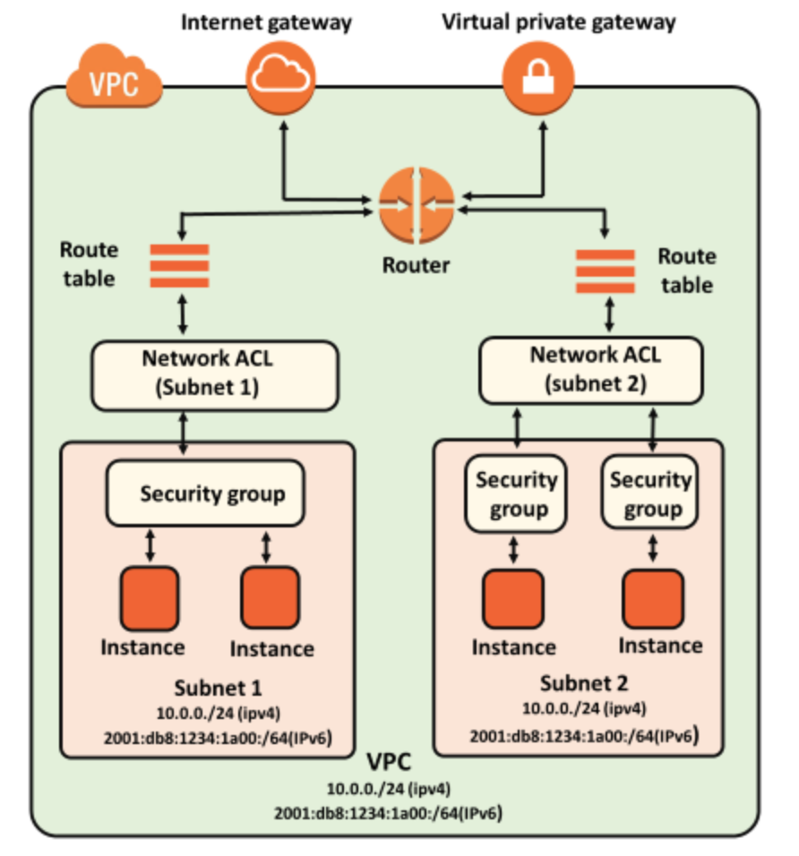
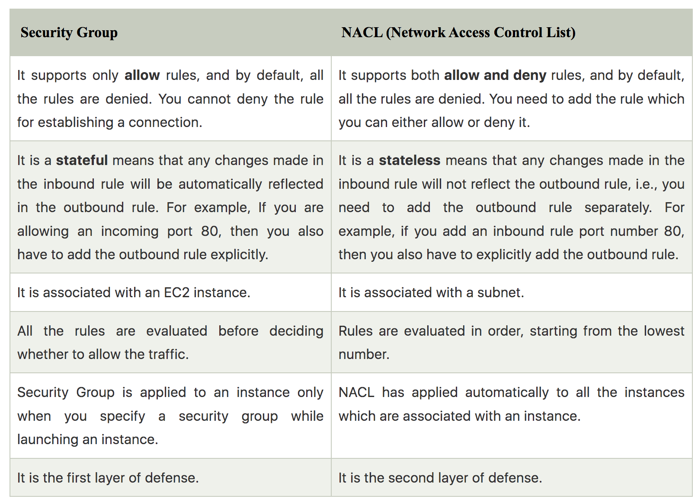

# Security Groups

This exercise helps in understanding the security groups and the network access control lists.

Introduction:

Security Groups are stateful virtual firewalls that can be assigned to instances. They are like firewall blueprints. They do not run in the OS, but rather in the VPC. One Security Group can be assigned to multiple instances. The other way around, one instance can have up to 5 Security Groups. Security Groups only have allow rules. Everything not explicitly allowed is automatically implicitly denied.
## Key terminology

- Security group - Every instance has a security group. A security group acts as a virtual firewall for your EC2 instances to control incoming and outgoing traffic. Inbound rules control the incoming traffic to your instance, and outbound rules control the outgoing traffic from your instance. When you launch an instance, you can specify one or more security groups. If you don't specify a security group, Amazon EC2 uses the default security group. You can add rules to each security group that allow traffic to or from its associated instances. By using the Security Group service, you don’t have to worry about firewalls on the OS level. 

- Stateful firewall - A stateful firewall is a kind of firewall that keeps track and monitors the state of active network connections while analyzing incoming traffic and looking for potential traffic and data risks. This firewall is situated at Layers 3 and 4 of the Open Systems Interconnection (OSI) model. 

- A Network Access Control List (NACL) - A network access control list (NACL) is an additional way to control traffic in and out of one or more subnets. Unlike AWS Security Groups, NACLs are stateless, so both inbound and outbound rules will get evaluated. Network ACLs can be set up as an optional, additional layer of security to your VPC. A Network Access Control List (NACL) is a stateless firewall that runs on the subnet level in a VPC.
A NACL has both explicit allow and deny rules. Rules have a number assigned to them. This number indicates the order in which the rules are applied.
By default, a NACL is configured to allow all traffic in and out of the network.
 
 - VPC Flow logs - VPC Flow Logs is a feature that enables you to capture information about the IP traffic going to and from network interfaces in your VPC. Flow log data can be published to Amazon CloudWatch Logs or Amazon S3. After you create a flow log, you can retrieve and view its data in the chosen destination.

Flow logs can help you with a number of tasks, such as:
- Diagnosing overly restrictive security group rules
- Monitoring the traffic that is reaching your instance
- Determining the direction of the traffic to and from the network interfaces
### Exercise

Study
1. Security Groups in AWS
2. Network Access Control Lists in AWS
### Sources

- Previous exercises
- [Network ACL](https://docs.aws.amazon.com/vpc/latest/userguide/vpc-network-acls.html)
- [VPC flow logs](https://docs.aws.amazon.com/vpc/latest/userguide/flow-logs.html)
- [NACL vs Security group](https://www.javatpoint.com/aws-nacl-vs-security-group)

### Overcome challanges

I learnt the key terminologies and differences between NACL and Security groups.
### Results

1. Both NACL and security groups are used to control the inbound and outbound traffic for the resources(instances) placed inside the VPC. The difference between these two is that NACL filters the traffic when it enters the network at the subnet level and further traffic is filtered by Security which is associated with an EC2 instance.
 

