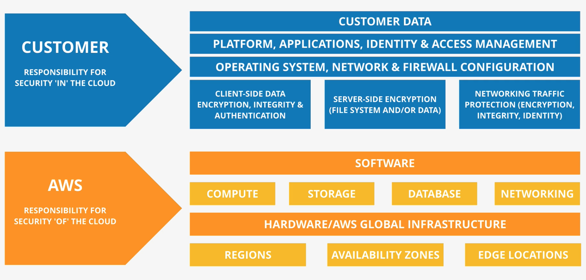

# Shared Responsibility Model

The Shared Responsibility Model - is how AWS provides clarity around which areas of systems security are theirs, and which are owned by the customer. 

In general, AWS is responsible for security of the cloud, while the customer is responsible for security in the cloud. AWS is always responsible for securing the physical infrastructure, while the customer is always responsible for encrypting customer data.

Security and Compliance is a shared responsibility between AWS and the customer. 

- This shared model can help relieve the customer’s operational burden as AWS operates, manages and controls the components from the host operating system and virtualization layer down to the physical security of the facilities in which the service operates. 

- The customer assumes responsibility and management of the guest operating system (including updates and security patches), other associated application software as well as the configuration of the AWS provided security group firewall. 

- Customers should carefully consider the services they choose as their responsibilities vary depending on the services used, the integration of those services into their IT environment, and applicable laws and regulations. 

- The nature of this shared responsibility also provides the flexibility and customer control that permits the deployment. As shown in the chart below, this differentiation of responsibility is commonly referred to as Security “of” the Cloud versus Security “in” the Cloud.

AWS responsibility **“Security of the Cloud”** - AWS is responsible for protecting the infrastructure that runs all of the services offered in the AWS Cloud. This infrastructure is composed of the hardware, software, networking, and facilities that run AWS Cloud services.

Customer responsibility **“Security in the Cloud”** – Customer responsibility will be determined by the AWS Cloud services that a customer selects. This determines the amount of configuration work the customer must perform as part of their security responsibilities. 

For example, a service such as Amazon Elastic Compute Cloud (Amazon EC2) is categorized as Infrastructure as a Service (IaaS) and, as such, requires the customer to perform all of the necessary security configuration and management tasks. Customers that deploy an Amazon EC2 instance are responsible for management of the guest operating system (including updates and security patches), any application software or utilities installed by the customer on the instances, and the configuration of the AWS-provided firewall (called a security group) on each instance. For abstracted services, such as Amazon S3 and Amazon DynamoDB, AWS operates the infrastructure layer, the operating system, and platforms, and customers access the endpoints to store and retrieve data. Customers are responsible for managing their data (including encryption options), classifying their assets, and using IAM tools to apply the appropriate permissions.

## Key terminology

Refer to summary(above) for understanding the Shared Responsibility Model

### Exercise

Study: The AWS Shared Responsibility Model

### Sources

- [Shared Responsibility Model - YT](https://www.youtube.com/watch?v=HlEv_9-VSxM)
- [Shared Responsibility Model - AWS](https://aws.amazon.com/compliance/shared-responsibility-model/#:~:text=Shared%20Controls%20%E2%80%93%20Controls%20which%20apply,their%20use%20of%20AWS%20services.)

### Overcome challanges

I learnt about the Shared Responsibility Model offered by AWS referring to the sources mentioned above. 

### Results

Refer to summary(above) for understanding the Shared Responsibility Model