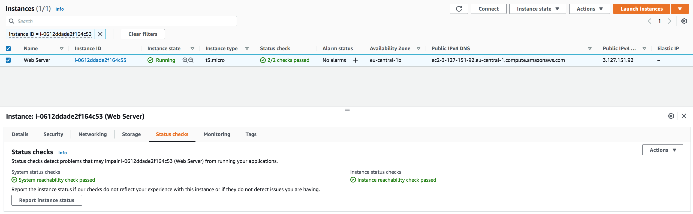

# Virtual Private Cloud (VPC)

This lesson guides through the VPC design and the architecture of VPC subnets - their features and some of the configuration options they provide. It also helps us to understand the architecture and functionality of Route Tables, Associations and the internet gateway functionality within a VPC.

Introduction:

Amazon VPC is typically described as a virtual private data center in the cloud. It is a virtual network that is logically isolated from other VPCs.
With a VPC you have full control over the design of the network. You can create subnets, internet gateways (igw), NAT gateways, VPN connections, and more.

There is always a default VPC when you create a new AWS account, but you can add up to 5 non-default VPCs per region per account. This is a soft limit. That is, you can request the limit to be raised.
Many services, like EC2, RDS and ECS require a VPC to be placed into.

## Key terminology

- Route table - A route table contains a set of rules, called routes, that determine where network traffic from your subnet or gateway is directed.

- Classless Inter-Domain Routing (CIDR) blocks - aare for specifying a range to IP addresses in format of IPv4 or IPv6. It is a method for allocating IP addresses and IP routing. When you create a network or route table, you need to specify what range are you working in. When you create a VPC, you must specify a range of IPv4 addresses for the VPC in the form of a Classless Inter-Domain Routing (CIDR) block. For example, 10.0.0.0/16. This is the primary CIDR block for your VPC. 

 CIDR block and subnet mask must be chosen carefully, as they have to allow for enough subnets and hosts and cannot be changed after creation.

- Elastic IPs - An Elastic IP address is a reserved public IP address that you can assign to any EC2 instance in a particular region, until you choose to release it. EIPs are public IP addresses that can be dynamically allocated to resources like EC2 instances or NAT gateways.
### Exercise

**Exercise 1**
1. Allocate an Elastic IP address to your account.
2. Use the Launch VPC Wizard option to create a new VPC with the following requirements:
- Region: Frankfurt (eu-central-1)
- VPC with a public and a private subnet
- Name: Lab VPC
- CIDR: 10.0.0.0/16
3. Requirements for the public subnet:
- Name: Public subnet 1
- CIDR: 10.0.0.0/24
- AZ: eu-central-1a
4. Requirements for the private subnet:
- Name: Private subnet 1
- CIDR: 10.0.1.0/24
- AZ: eu-central-1a

**Exercise 2**
1. Create an additional public subnet without using the wizard with the following requirements:
- VPC: Lab VPC
- Name: Public Subnet 2
- AZ: eu-central-1b
- CIDR: 10.0.2.0/24
2. Create an additional private subnet without using the wizard with the following requirements:
- VPC: Lab VPC
- Name: Private Subnet 2
- AZ: eu-central-1b
- CIDR: 10.0.3.0/24
3. View the main route table for Lab VPC. It should have an entry for the NAT gateway. Rename this route table to Private Route Table.
4. Explicitly associate the private route table with your two private subnets.
5. View the other route table for Lab VPC. It should have an entry for the internet gateway. Rename this route table to Public Route Table.
6. Explicitly associate the public route table to your two public subnets.

**Exercise 3**
1. Create a Security Group with the following requirements:
- Name: Web SG
- Description: Enable HTTP Access
- VPC: Lab VPC
- Inbound rule: allow HTTP access from anywhere
- Outbound rule: Allow all traffic

**Exercise 4**
1. Launch an EC2 instance with the following requirements:
- AMI: Amazon Linux 2
- Type: t3.micro
- Subnet: Public subnet 2
- Auto-assign Public IP: Enable
- User data:

- Tag:
- Key: Name
- Value: Web server
- Security Group: Web SG
- Key pair: no key pair
2. Connect to your server using the public IPv4 DNS name.
### Sources

- Previous exercises
- [VPC -AWS](https://docs.aws.amazon.com/vpc/latest/userguide/configure-your-vpc.html)
- [CIDR block](https://stackoverflow.com/questions/46616072/cidr-blocks-aws-explanation)
- [Elastic IP address](https://aws.amazon.com/premiumsupport/knowledge-center/intro-elastic-ip-addresses/#:~:text=An%20Elastic%20IP%20address%20is,Allocate%20an%20Elastic%20IP%20address.)

### Overcome challanges

I learnt this exercise mostly through trial and error basis. With the knowledge I gained from creating network architecture in one of the previous exercises, I was able to understand the initial design and input the information for creating a VPC. Then, I had to read about elastic IP adddress and route table to proceed further.

### Results

Exercise 1:
1. Using the Launch VPC Wizard option, I created a new VPC

Exercise 2:

1. Creating public subnet 2

2. Creating private subnet 2

3. VPC created with 2 public and 2 private subnets

4. Private route table with subnets added and nat gateway routes

5. Public route table with subnets added and igw route

Exercise 3:

1. Creating security group

Exercise 4:

1. Creating the ec2 instance and status checked

2. Connecting to the server with public DNS name

