# Elastic Load Balancing (ELB) and Auto Scaling

As the name suggests, this exercise helps in understanding ELB and auto-scaling. 

In cloud, you don't have to guess how much capacity you need instead you can scale up and down with on-demand services. Auto Scaling is one of the services that enables this feature.

When you run an application with a spiky workload, you can host the application on a fleet of EC2 instances instead of a single server. When the demand for the application is high, Auto Scaling can automatically add instances to the fleet. When the demand is lower, it can similarly remove instances.

To make sure all servers are the same, Auto Scaling makes use of a (custom) AMI. Auto Scaling makes use of CloudWatch metrics to determine whether to add or remove instances.

In a traditional architecture, a client connects to a single server with a single IP address. When dealing with a fleet of servers, this would not work. Therefore, a load balancer can be introduced as a connection endpoint for the client. Load balancer accepts connections from a user base and then distributes those connections to backend services. The load balancer will forward the request to one of the servers in the fleet, and relay the response back to the client.

## Key terminology

- AMI - An Amazon Machine Image (AMI) is a template that contains a software configuration (for example, an operating system, an application server, and applications). From an AMI, you launch an instance, which is a copy of the AMI running as a virtual server in the cloud. You can launch multiple instances of an AMI, as shown in the following figure.

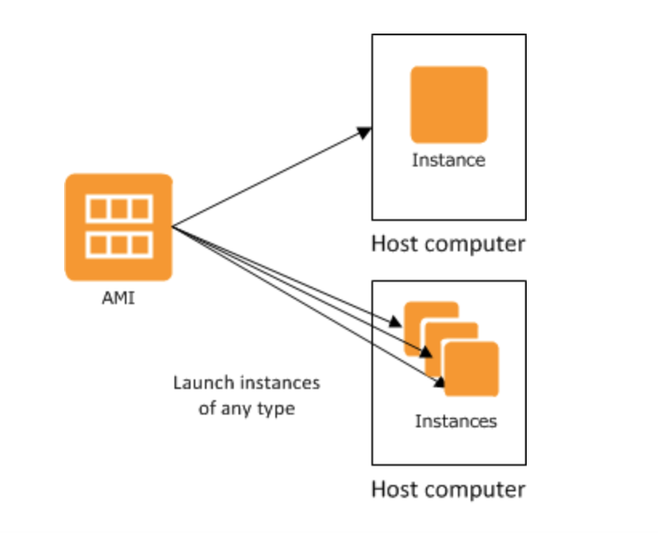 

- Elastic Load Balancing - Elastic Load Balancing automatically distributes your incoming traffic across multiple targets, such as EC2 instances, containers, and IP addresses, in one or more Availability Zones. It monitors the health of its registered targets, and routes traffic only to the healthy targets. Elastic Load Balancing scales your load balancer capacity automatically in response to changes in incoming traffic.

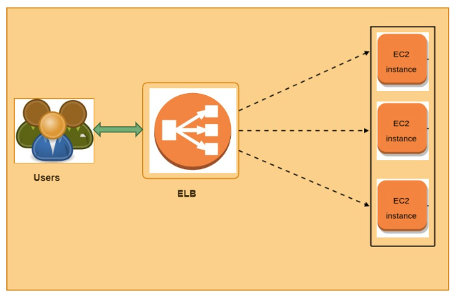

AWS’ ELB is a managed service that provides load balancing to a fleet of instances. There are four types of ELBs:

- Application Load Balancer: this ELB is best suited for load balancing of HTTP and HTTPS, i.e., for web sites and they can also route the request to a particular path also. (in layer 7 of the OSI stack).

- Network Load Balancer: this ELB works using TCP and UDP (layer 4 of the OSI stack).

- Classic Load Balancer: this ELB is outdated and not recommended for use. Classic Load Balancer provides basic load balancing across multiple Amazon EC2 instances. AWS has (so far) never stopped supporting any services. The reason for this is that it can harm existing applications.

- Gateway Load Balancer: this ELB acts as a gateway into your network, as well as a load balancer. It will first route traffic to a (3rd party) application that checks the traffic, like an IDS/IPS or Firewall. After the packet has been inspected, the GWLB acts like a NLB routing to your application. GWLB act on layers 3 and 4 of the OSI stack. 

- Target groups - A target group tells a load balancer where to direct traffic to : EC2 instances, fixed IP addresses; or AWS Lambda functions, amongst others. When creating a load balancer, you create one or more listeners and configure listener rules to direct the traffic to one target group.

- - listener - A listener is a process that checks for connection requests, using the protocol and port that you configure. The rules that you define for a listener determine how the load balancer routes requests to the targets in one or more target groups.

- listener rules - When you create a listener, you specify a rule for routing requests. This rule forwards requests to the specified target group.

- Auto-scaling group - An Auto Scaling group contains a collection of Amazon EC2 instances that are treated as a logical grouping for the purposes of automatic scaling and management. An Auto Scaling group also enables you to use Amazon EC2 Auto Scaling features such as health check replacements and scaling policies. 

Both maintaining the number of instances in an Auto Scaling group and automatic scaling are the core functionality of the Amazon EC2 Auto Scaling service.

The size of an Auto Scaling group depends on the number of instances that you set as the desired capacity. You can adjust its size to meet demand, either manually or by using automatic scaling.

For eg: When you run an application with a spiky workload, you can host the application on a fleet of EC2 instances instead of a single server. When the demand for the application is high, Auto Scaling can automatically add instances to the fleet. When the demand is lower, it can similarly remove instances.

- Launch Template / Launch Configuration - 

- ELB health check - It is used to determine the availability of registered EC2 instances and their readiness to receive traffic. Any downstream server that does not return a healthy status is considered unavailable and will not have any traffic routed to it. The ELB Health Check is configured with a protocol and port number to call on the target instances.

### Exercise

**Exercise 1**
1. Launch an EC2 instance with the following requirements:
- Region: Frankfurt (eu-central-1)
- AMI: Amazon Linux 2
- Type: t3.micro
- User data:

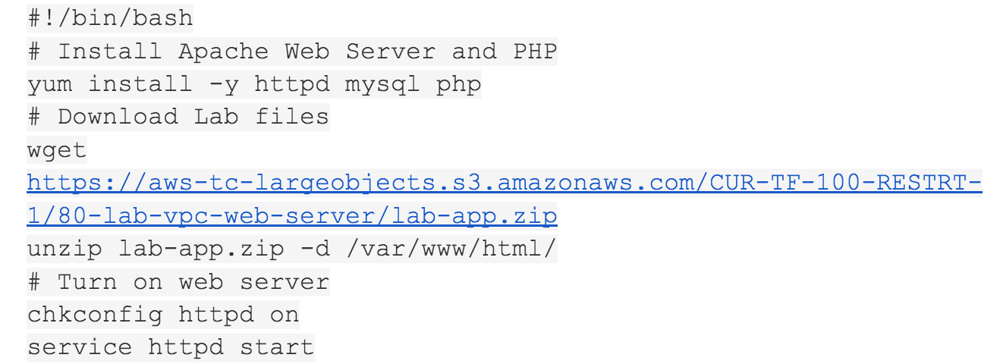

- Security Group: Allow HTTP
2. Wait for the status checks to pass.
3. Create an AMI from your instance with the following requirements:
4. Image name: Web server AMI    

**Exercise 2**
1. Create an application load balancer with the following requirements:
- Name: LabELB
- Listener: HTTP on port 80
- AZs: eu-central-1a and eu-central-1b
- Subnets: must be public
- Security Group: 
Name: ELB SG
Rules: allow HTTP access
- Target Group:
Name: LabTargetGroup
Targets: to be registered by Auto Scaling

**Exercise 3**
1. Create a launch configuration for the Auto Scaling group. It has to be identical to the server that is currently running.
2. Create an auto scaling group with the following requirements:
- Name: Lab ASG
- Launch Configuration: Web server launch configuration
- Subnets: must be in eu-central-1a and eu-central-1b
- Load Balancer: LabELB
- Group metrics collection in CloudWatch must be enabled
- Group Size:
Desired Capacity: 2
Minimum Capacity: 2
Maximum Capacity: 4
- Scaling policy: Target tracking with a target of 60% average CPU utilisation

**Exercise 4**
1. Verify that the EC2 instances are online and that they are part of the target group for the load balancer.
2. Access the server via the ELB by using the DNS name of the ELB.
3. Perform a load test on your server(s) using the website on your server to activate auto scaling. There might be a delay on the creation of new servers in your fleet, depending on the settings on your Auto Scaling Group.
### Sources

- Previous exercises
- [Elastic Load Balancing](https://docs.aws.amazon.com/elasticloadbalancing/latest/userguide/what-is-load-balancing.html)
- [Auto Scaling group](https://docs.aws.amazon.com/autoscaling/ec2/userguide/auto-scaling-groups.html)
- [EC2 Auto Scaling](https://eu-central-1.console.aws.amazon.com/ec2/v2/home?region=eu-central-1#AutoScalingGroups:)
- [AMI](https://docs.aws.amazon.com/AWSEC2/latest/UserGuide/AMIs.html)
- [Listener](https://docs.aws.amazon.com/elasticloadbalancing/latest/network/load-balancer-listeners.html#listener-rules)

### Overcome challanges

I had to understand the key terminologies first and then working on the exercises seemed less complex. 
### Results

Exercise 1:

1. Created an AMI from the EC2 instance I launched earlier:

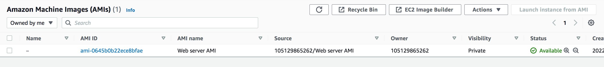

Exercise 2:

1. Creating an application load balancer

- Creating a security group:

- Security group created:

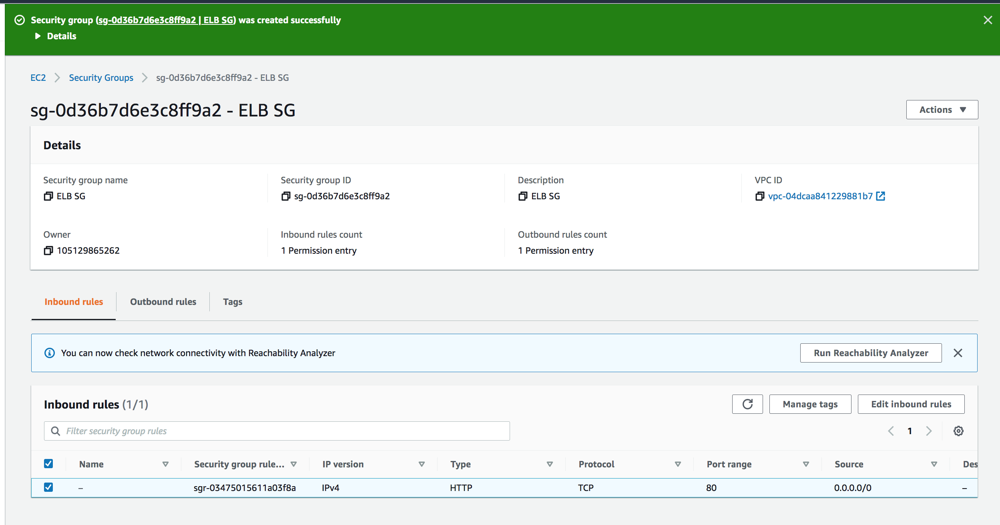

- Target group created:

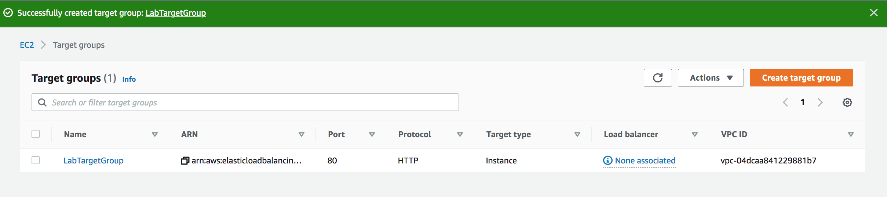

- Created an application load balancer :

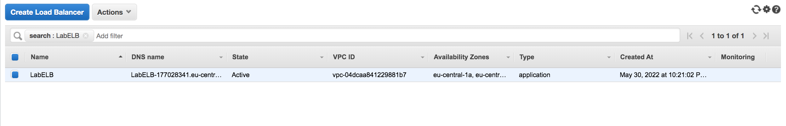

Exercise 3:

1. Created launch configuration for the Auto Scaling group, identical to the currently running server:

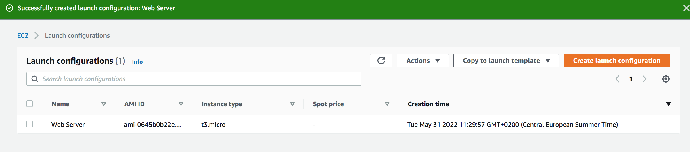

2. Auto Scaling group created: 

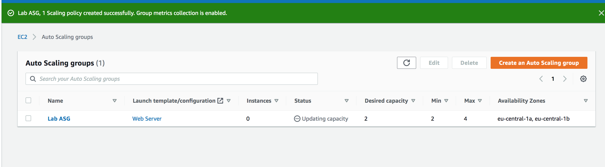

Exercise 4:

1. EC2 instance is provisioned by the Auto Scaling group:

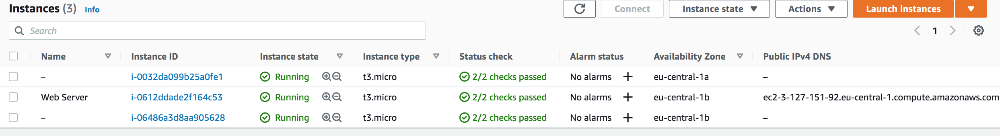

- Load balancer with the created target group:

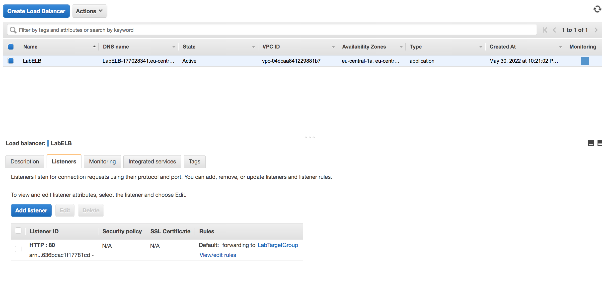

2. Finding the DNS name of ELB:

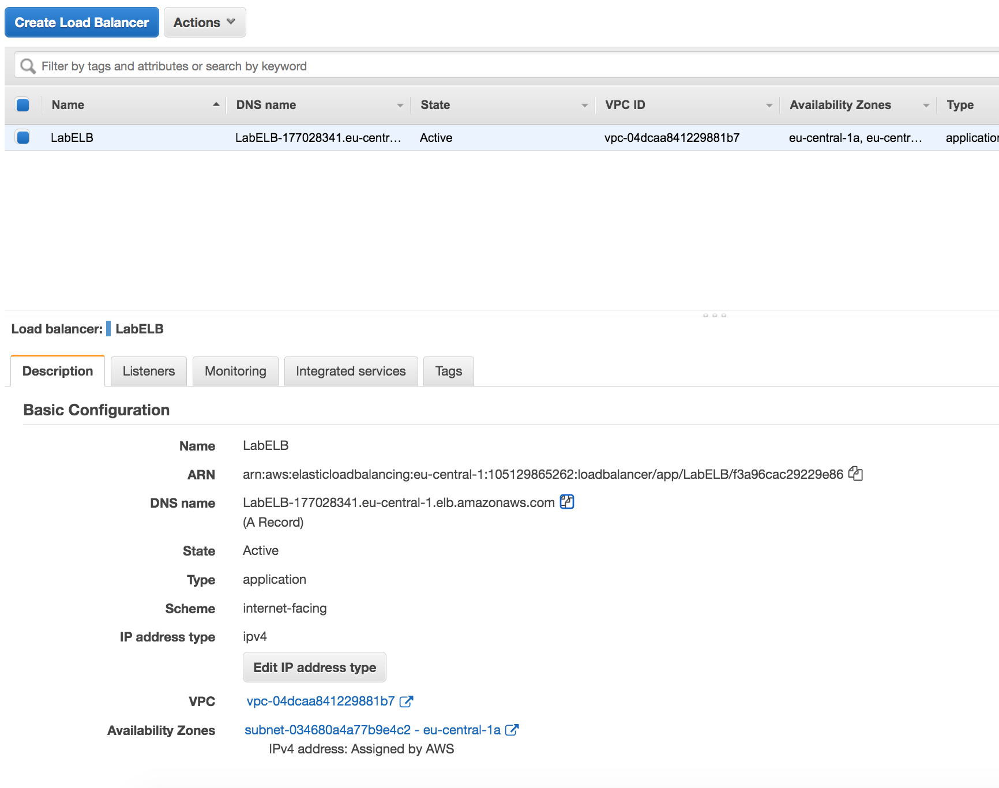

- Accessing the server using the DNS address of our ELB and enabling the load test:

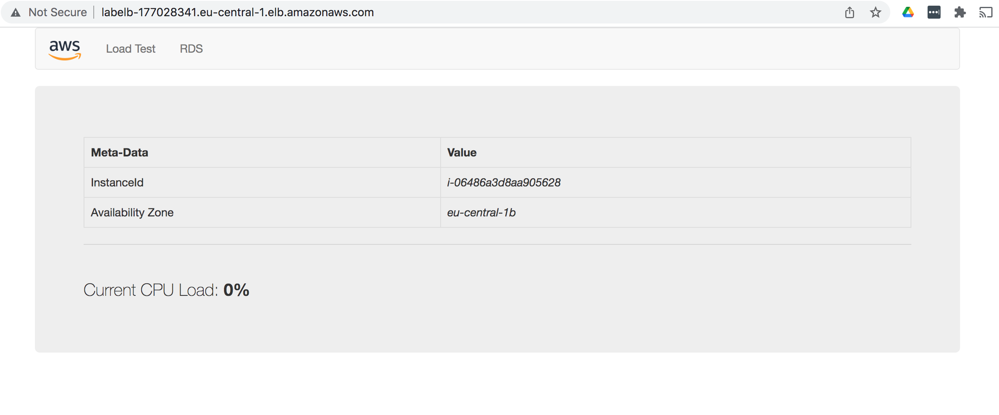

3. Performing load test to activate Auto Scaling:

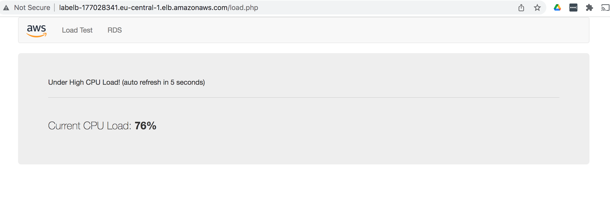

Activity log after enabling the load test:

I realized that there was a lot of delay on the creation of new servers, so I changed the Target tracking to a target of 30% average CPU utilisation instead of 60% as mentioned in the exercise and these were the results:
 
- Auto Scaling group notifications:

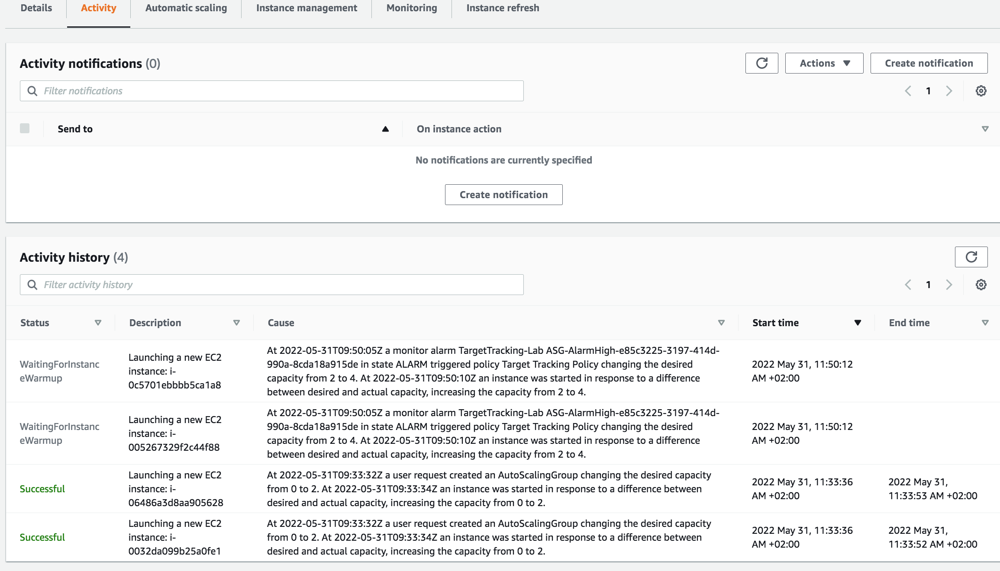

- Target group with 2 healthy instances:

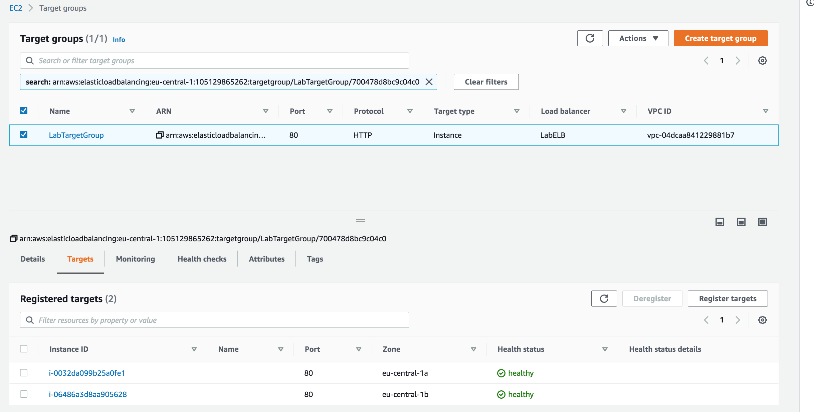

- 5 instances running out of which 2 are the new instances created by ELB:

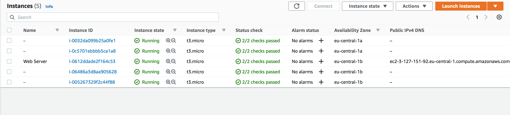