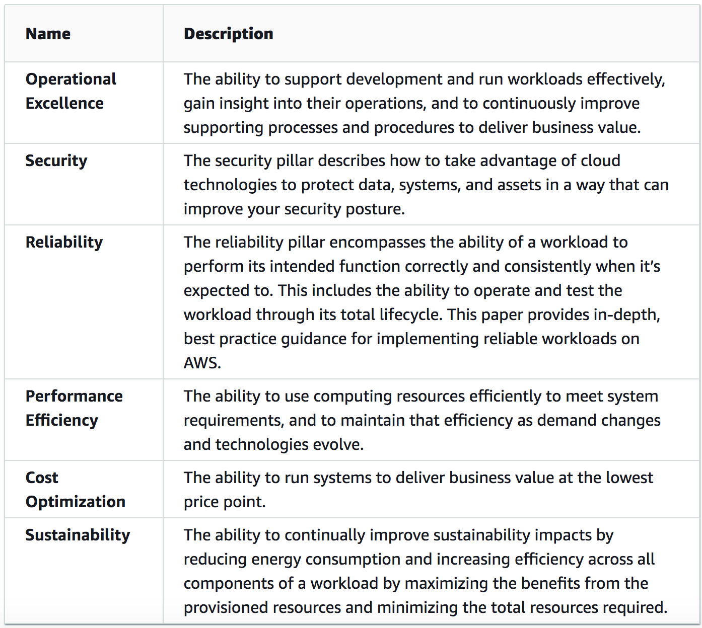

# Well Architected Framework (WAF)

The way you set up your IT or your application, the architecture, is a big part of how your application runs, how secure it is, and how much it costs. To help design architectures, AWS has the Well Architected Framework.

The AWS Well-Architected Framework helps you understand the pros and cons of decisions you make while building systems on AWS. By using the Framework you will learn architectural best practices for designing and operating reliable, secure, efficient, and cost-effective systems in the cloud.

WAF consists of six pillars, all with their own key concepts, design principles, and best practices. 

The mnemonic device for the six pillars is CROPSS (the first letter of each pillar). The pillars are:

1. Cost optimization
2. Reliability
3. Operational Excellence
4. Performance efficiency
5. Security
6. Sustainability

## Key terminology

In the AWS Well-Architected Framework, the following terms mean:

- A **component** is the code, configuration, and AWS Resources that together deliver against a requirement. A component is often the unit of technical ownership, and is decoupled from other components.

- The term **workload** is used to identify a set of components that together deliver business value. A workload is usually the level of detail that business and technology leaders communicate about.

- We think about **architecture** as being how components work together in a workload. How components communicate and interact is often the focus of architecture diagrams.

- **Milestones** mark key changes in your architecture as it evolves throughout the product lifecycle (design, implementation, testing, go live, and in production).

- Within an organization the **technology portfolio** is the collection of workloads that are required for the business to operate.
### Exercise

Study: The Well Architected Framework
### Sources

- [WAF](https://docs.aws.amazon.com/wellarchitected/latest/framework/welcome.html)

### Overcome challanges

I learnt the six pillars along with the key terminologies using the above source. 
### Results

Refer to summary and key terminologies.