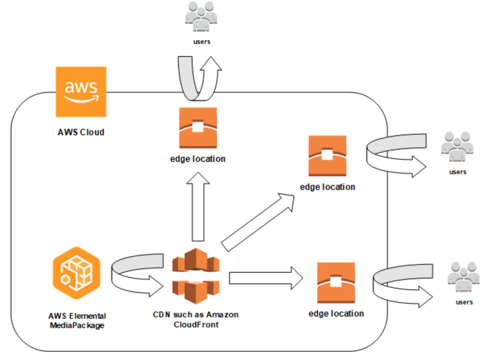
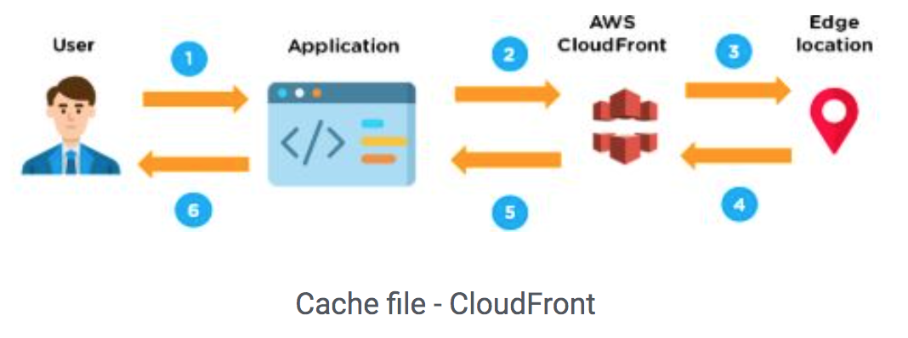
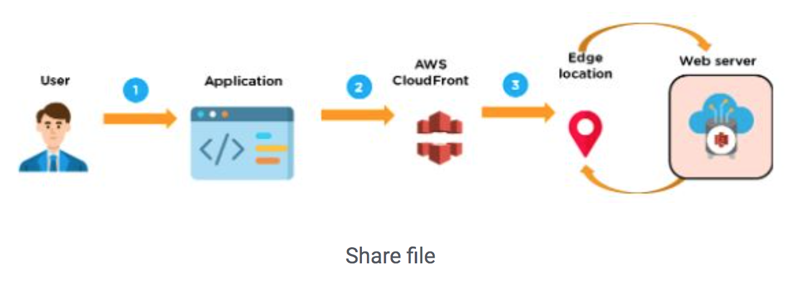

# CloudFront
### Content Delivery Network (CDN)

A CDN is a globally distributed set of servers that caches content such as videos. When a user requests your content, the CDN routes the request to the edge location that provides the lowest latency. If your content is already cached in that edge location, the CDN delivers it immediately. If your content is not currently in that edge location, the CDN retrieves it from your origin (in this case, the MediaPackage endpoint) and distributes it to the user. 

The benefits of a CDN include content and ad caching, consistent domain names across personalized manifests, and CDN DNS resolution. 

In AWS, CloudFront works as a CDN to serve the content that you store in AWS Elemental MediaPackage. Working with a content distribution network (CDN) such as Amazon CloudFront to improve the efficiency of the ad personalization and channel assembly workflow between AWS Elemental MediaTailor and your users.

### Amazon CloudFront

Amazon CloudFront is a web service that speeds up distribution of your static and dynamic web content, such as .html, .css, .js, and image files, to your users. CloudFront delivers your content through a worldwide network of data centers called edge locations. When a user requests content that you're serving with CloudFront, the request is routed to the edge location that provides the lowest latency (time delay), so that content is delivered with the best possible performance.

- If the content is already in the edge location with the lowest latency, CloudFront delivers it immediately.

- If the content is not in that edge location, CloudFront retrieves it from an origin that is defined by the client —such as an Amazon S3 bucket, a MediaPackage channel, or an HTTP server (for example, a web server) that you have identified as the source for the definitive version of your content.

To summarize in simple words, the benefits of AWS CloudFront are:

 1. It employs a global network of edge locations and regional edge caches that cache copies of your content close to your viewers. It ensures that end-user requests are served by the closest edge location. As a result, viewer requests travel a short distance, improving performance for your viewers. 

2. It is simple to use and ensures productivity enhancement. Using the AWS network dramatically reduces the number of networks that your users' requests must pass through, which improves performance.

3. It is less expensive, as it only charges for the data transfer.

4. Users get lower latency—the time it takes to load the first byte of the file—and higher data transfer rates.

5. It provides high security with the ‘Content Privacy’ feature.

6. It facilitates GEO targeting service for content delivery to specific end-users.

7. It uses HTTP or HTTPS protocols for quick delivery of content.
### How Does AWS CloudFront Work?

The following steps explain how CloudFront delivers the content:

Step 1: The client accesses a website and requests to download a file (like an image file).

Step 2: Now, the DNS routes the client request to the nearest edge location through CloudFront to serve the user request.

Step 3: At edge location, CloudFront looks for its requested cache file. Once the file is found, CloudFront sends the file to the user (as shown in image below).

Step 4: But, if the file is not found then CloudFront compares the requirements with the specifications and shares it with the respective server. 

Step 5: The web server responds to the request by sending the files back to the CloudFront edge location.

Step 6: As soon CloudFront receives the file, it shares it with the client and adds the file to the edge location.

## Key terminology

- AWS Elemental MediaPackage - MediaPackage is a just-in-time video packaging and origination service that runs in the AWS Cloud. With MediaPackage, you can deliver highly secure, scalable, and reliable video streams to a wide variety of playback devices and content delivery networks (CDNs).

### Exercise

Study: CloudFront

### Sources

- [AWS CloudFront Documentation](https://docs.aws.amazon.com/AmazonCloudFront/latest/DeveloperGuide/Introduction.html)
- [FAQ](https://aws.amazon.com/cloudfront/faqs/)
- [CloudFront tutorial](https://www.simplilearn.com/tutorials/aws-tutorial/aws-cloudfront)
-[CloudFront and Load Balancing](https://docs.aws.amazon.com/AmazonCloudFront/latest/DeveloperGuide/restrict-access-to-load-balancer.html)
-[Competitors](https://www.gartner.com/reviews/market/global-cdn/vendor/amazon-web-services/product/cloudfront-cdn/alternatives)

### Overcome challanges

 I understood the concept by referring to the sources shared above and I tried to create a distribution.

### Results

How is CloudFront different from S3?

Amazon CloudFront is a good choice for distribution of frequently accessed static content that benefits from edge delivery—like popular website images, videos, media files or software downloads.

CloudFront in association with Load balancing:

For a web application or other content that’s served by an Application Load Balancer in Elastic Load Balancing, CloudFront can cache objects and serve them directly to users (viewers), reducing the load on Application Load Balancer. CloudFront can also help to reduce latency and even absorb some distributed denial of service (DDoS) attacks. However, if users can bypass CloudFront and access the Application Load Balancer directly, these benefits aren't available. But by configuring Amazon CloudFront and Application Load Balancer, users are prevented from directly accessing the Application Load Balancer. This allows users to access the Application Load Balancer only through CloudFront, ensuring that the client gets the benefits of using CloudFront.

Alternatives and Market Competitors:

Some of the market competitors of CloudFront are Akamai CDN, Cloudfare CDN, Google Cloud CDN and Microsoft Azure CDN. Although, there are alternative options, CloudFront is widely used because it offers secure content hosting at no extra fee. AWS Certification Manager also allows the creation and managing of custom SSL certificates for your website free of charge.

Setting up Cloudfront to create a distribution:

You create a CloudFront distribution to tell CloudFront where you want content to be delivered from, and the details about how to track and manage content delivery. Then CloudFront uses computers—edge servers—that are close to your viewers to deliver that content quickly when someone wants to see it or use it.

Creating a distribution can be done using the following link. By enabling the distribution option, the status switches to the Deployed mode and is ready to process requests.

https://console.aws.amazon.com/cloudfront/.

