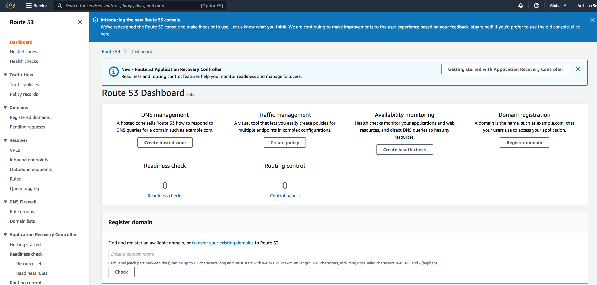

# Route 53

The global infrastructure called the Domain Name System (DNS) translates human-readable hostnames into numerical IP addresses. IP addresses on the cloud can change frequently, as services move between data centers and physical machines. This means the translation and communication process is complex.

Organizations that run machines in the cloud using Amazon Web Services (AWS) need an AWS DNS solution—a way to correctly translate user requests into Amazon IP addresses while adapting to cloud changes and quickly propagating them to DNS clients.

AWS Route 53 is Amazon’s official DNS solution which can be used with almost every other AWS service. 

**Amazon Route 53** is a highly available and scalable cloud Domain Name System (DNS) web service. It is designed to give developers and businesses an extremely reliable and cost effective way to route end users to Internet applications by translating names like www.example.com into the numeric IP addresses like 192.0.2.1 that computers use to connect to each other. Amazon Route 53 is fully compliant with IPv6 as well.

Amazon Route 53 effectively connects user requests to infrastructure running in AWS – such as Amazon EC2 instances, Elastic Load Balancing load balancers, or Amazon S3 buckets – and can also be used to route users to infrastructure outside of AWS. You can use Amazon Route 53 to configure DNS health checks, then continuously monitor your applications’ ability to recover from failures and control application recovery with Route 53 Application Recovery Controller.

Route 53 uses a **global network of DNS servers** at a series of world-wide locations to offer high availability and increased performance.

The name for this service (Route 53) comes from the fact that DNS servers respond to queries on **port 53** and provide answers that route end users to your applications on the Internet. In the future, we will add additional routing capabilities to Route 53 to better help your users find the best way to your website or application.

## Key terminology

- DNS - The Domain Name System (DNS) is a globally distributed service that is foundational to the way people use the Internet. DNS uses a hierarchical name structure, and different levels in the hierarchy are each separated with a dot ( . ). Consider the domain names www.amazon.com and aws.amazon.com. In both these examples, “com” is the Top-Level Domain and “amazon” the Second-Level Domain. There can be any number of lower levels (e.g., “www” and “aws”) below the Second-Level Domain. Computers use the DNS hierarchy to translate human readable names like www.amazon.com into the IP addresses like 192.0.2.1 that computers use to connect to one another.

### Exercise

Study : Route 53

### Sources

- Previous exercises
- [AWS Route 53 documentation](https://docs.aws.amazon.com/Route53/latest/DeveloperGuide/Welcome.html)
- [AWS Route 53 overview](https://aws.amazon.com/route53/)
- [Route 53 YT tutorail](https://www.youtube.com/watch?v=H6_VyaYjTYI)

### Overcome challanges

 I understood the concept by referring to the sources shared above.

### Results

I explored how Route 53 works following the link below
https://us-east-1.console.aws.amazon.com/route53/v2/home#Dashboard

