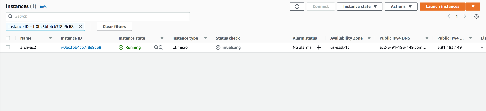

# Amazon Elastic File System (EFS)

Amazon Elastic File System (Amazon EFS) provides a simple, serverless, set-and-forget elastic file system for use with AWS Cloud services and on-premises resources. It is built to scale on demand to petabytes without disrupting applications, growing and shrinking automatically as you add and remove files, eliminating the need to provision and manage capacity to accommodate growth. Amazon EFS has a simple web services interface that allows you to create and configure file systems quickly and easily. 

The service manages all the file storage infrastructure for you, meaning that you can avoid the complexity of deploying, patching, and maintaining complex file system configurations.

EFS automatically grows and shrinks as you add and remove files with no need for management or provisioning.

Amazon EFS supports the Network File System version 4 (NFSv4.1 and NFSv4.0) protocol, so the applications and tools that you use today work seamlessly with Amazon EFS. Multiple compute instances, including Amazon EC2, Amazon ECS, and AWS Lambda, can access an Amazon EFS file system at the same time, providing a common data source for workloads and applications running on more than one compute instance or server.

With Amazon EFS, you pay only for the storage used by your file system and there is no minimum fee or setup cost. Amazon EFS offers a range of storage classes designed for different use cases. These include:

- Standard storage classes – EFS Standard and EFS Standard–Infrequent Access (Standard–IA), which offer multi-AZ resilience and the highest levels of durability and availability.

- One Zone storage classes – EFS One Zone and EFS One Zone–Infrequent Access (EFS One Zone–IA), which offer customers the choice of additional savings by choosing to save their data in a single Availability Zone.
## Key terminology

- IOPS - IOPS is an acronym for “input/output operations per second” and is a popular performance metric used to distinguish one storage type from another. 
### Exercise

Study : EFS
### Sources

- [EFS AWS](https://docs.aws.amazon.com/efs/latest/ug/whatisefs.html)
- [EFS YT tutorial](https://www.youtube.com/watch?v=Aux37Nwe5nc)
- [EFSvsS3vsEBS](https://aws.amazon.com/efs/when-to-choose-efs/)
- [EFS Ec2 setup](https://docs.aws.amazon.com/efs/latest/ug/wt1-create-ec2-resources.html#wt1-create-sg)
-[alternatives and competitors](https://www.g2.com/products/amazon-elastic-file-system-amazon-efs/competitors/alternatives)
### Overcome challanges

Using the following sources, I learnt how EFS works. 
### Results

When deciding if you should be using file, object, or block storage for your cloud application deployment, there are many factors to consider. By comparing Amazon EFS to Amazon S3 and Amazon EBS, we can understand when to choose EFS, as explained below.

## How is Amazon EFS different than Amazon S3?

Amazon EFS provides shared access to data using a traditional file sharing permissions model and **hierarchical directory structure** via the NFSv4 protocol. Applications that access data using a standard file system interface provided through the operating system can use Amazon EFS to take advantage of the scalability and reliability of file storage in the cloud without writing any new code or adjusting applications.

Amazon S3 is an object storage platform that uses a simple API for storing and accessing data. Applications that do not require a file system structure and are designed to work with object storage can use Amazon S3 as a massively scalable, durable, low-cost object storage solution.

## How is Amazon EFS different from Amazon EBS?

Amazon EFS provides **shared file storage** for use with compute instances in the AWS Cloud and on-premises servers. Applications that require shared file access can use Amazon EFS for reliable file storage delivering high aggregate throughput to thousands of clients simultaneously.

Amazon EBS is a cloud block storage service; so one EBS volume can be attached to only one EC2 instance. EBS provides direct access from a single Amazon EC2 instance to a dedicated storage volume. Applications that require persistent dedicated block access for a single host can use Amazon EBS as a highly available, low-latency block storage solution.

Comparing Amazon Cloud Storage:

Amazon EFS’s distributed nature enables high levels of availability, durability, and scalability. This distributed architecture results in a small latency overhead for each file operation. Due to this per-operation latency, overall throughput generally increases as the average I/O size increases, since the overhead is amortized over a larger amount of data. Amazon EFS's support for highly parallelized workloads (i.e. with concurrent operations from multiple threads and multiple EC2 instances) enables high levels of aggregate throughput and IOPS.

Alternatives and Market Competitors:

Some of the alternatives and competitors of EFS are Azure Files, Google Cloud Filestore, Cyberduck, and Igloo. However, EFS is easier to set up and it is also highly scalable and delivers consistent low latencies and high levels of throughput which makes it very popular.

## Practical Exercise: 

Creating an EFS file system and mounting it on an EC2 instance by following the steps in [EFS Ec2 setup](https://docs.aws.amazon.com/efs/latest/ug/wt1-create-ec2-resources.html#wt1-create-sg)

1. Creating the EFS file system (opted one-zone)

2. Creating the Ec2 instance

3. Creating the Security Groups for Ec2 and EFS instance

4. Attaching the security group to the EFS mount target

5. installing nfs utils and creating mounting directory

6. mounting the efs on to the folder

7. creating a folder inside the mounted efs

8. Creating a new instance; mounting the efs and seeing the shared file.

