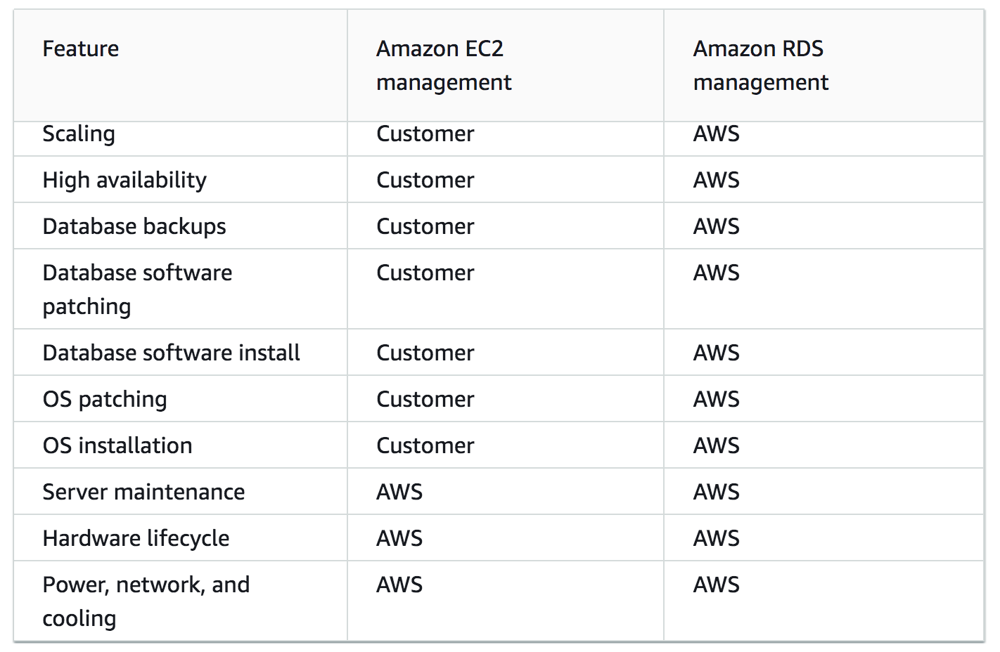

# Amazon Relational Database Service (RDS) and Aurora

## RDS

Amazon RDS is a web service that makes it easier to set up, operate, and scale a relational database in the cloud. It provides cost-efficient, resizable capacity for an industry-standard relational database and manages common database administration tasks.

Amazon RDS provides the following specific advantages over database deployments that aren't fully managed:

1. Database products like MySQL, MariaDB, PostgreSQL, Oracle, Microsoft SQL Server can be used.

2. Amazon RDS manages backups, software patching, automatic failure detection, and recovery.

3. Automated backups can be turned on, or backup snapshots can be manually created. These backups can be used to restore a database. The Amazon RDS restore process works reliably and efficiently.

4. It offers high availability with a primary instance and a synchronous secondary instance that can fail over to when problems occur. Read replicas can be used to increase read scaling.

5. In addition to the security in a database package, the client can also help control who can access their RDS databases by using AWS Identity and Access Management (IAM) to define users and permissions. 

Below is the comparison of the management models in Amazon EC2 and RDS:

as shown above, RDS being a managed database service is responsible for most management tasks. By eliminating tedious manual tasks, Amazon RDS helps it's clients focus on applications and users. RDS is recommended over EC2 as a default choice for most database deployments.
## Aurora

Amazon Aurora (Aurora) is a fully managed relational database engine that's compatible with MySQL and PostgreSQL. The code, tools, and applications you use today with your existing MySQL and PostgreSQL databases can be used with Aurora. Aurora includes a high-performance storage subsystem. Aurora can deliver up to five times the throughput of MySQL and up to three times the throughput of PostgreSQL without requiring changes to most of your existing applications.

## RDS vs Aurora

Amazon RDS is a fully managed, highly available, and secure database service that makes it simple to set up, operate, and run your choice of seven relational database engines: PostgreSQL, MySQL, MariaDB, Oracle, SQL Server, Amazon Aurora MySQL-Compatible Edition, and Amazon Aurora PostgreSQL-Compatible Edition. 

Amazon Aurora MySQL-Compatible Edition and Amazon Aurora PostgreSQL-Compatible Edition take advantage of the benefits of Amazon RDS, including automating time consuming database administrative tasks, and provide improved performance, scalability, and availability compared to community open-source MySQL and PostgreSQL.

## Key terminology

- Database and relational database - A database is a structured collection of data. It may be anything from a simple shopping list to a picture gallery or a place to hold the vast amounts of information in a corporate network. In particular, a relational database is a digital store collecting data and organizing it according to the relational model. In this model, tables consist of rows and columns, and relationships between data elements all follow a strict logical structure. An RDBMS is simply the set of software tools used to actually implement, manage, and query such a database. 

- MySQL - MySQL is a relational database management system (RDBMS) developed by Oracle that is based on structured query language (SQL).

- PostgrSQL - PostgreSQL is an advanced, enterprise class open source object-relational database that supports both SQL (relational) and JSON (non-relational) querying. It is a highly stable database management system, backed by more than 20 years of community development which has contributed to its high levels of resilience, integrity, and correctness. PostgreSQL is used as the primary data store or data warehouse for many web, mobile, geospatial, and analytics applications. The latest major version is PostgreSQL 12.

PostgreSQL has a rich history for support of advanced data types, and supports a level of performance optimization that is common across its commercial database counterparts, like Oracle and SQL Server. AWS supports PostgreSQL through a fully managed database service with Amazon Relational Database Service (RDS). Amazon Aurora with PostgreSQL compatibility is also built using PostgreSQL. 

### Exercise

Study : RDS and Aurora
### Sources

- [AWS RDS documentation](https://docs.aws.amazon.com/AmazonRDS/latest/UserGuide/Welcome.html)
- [RDS YT](https://www.youtube.com/watch?v=eMzCI7S1P9M)
-[PostgreSQL](https://aws.amazon.com/rds/postgresql/what-is-postgresql/)
-
- [Aurora AWS documentation](https://docs.aws.amazon.com/AmazonRDS/latest/AuroraUserGuide/CHAP_AuroraOverview.html)
- [Aurora vs RDS](https://aws.amazon.com/rds/aurora/faqs/)
- [alternative](https://www.g2.com/products/amazon-aurora/competitors/alternatives)
### Overcome challanges

 I understood the concept by referring to the sources shared above.
### Results

Alternatives and Market Competitors:

Some of the alternatives and competitors of EFS are Oracle Database, Azure SQL Database, Google Cloud Spanner, and Microsoft SQL Server. 

