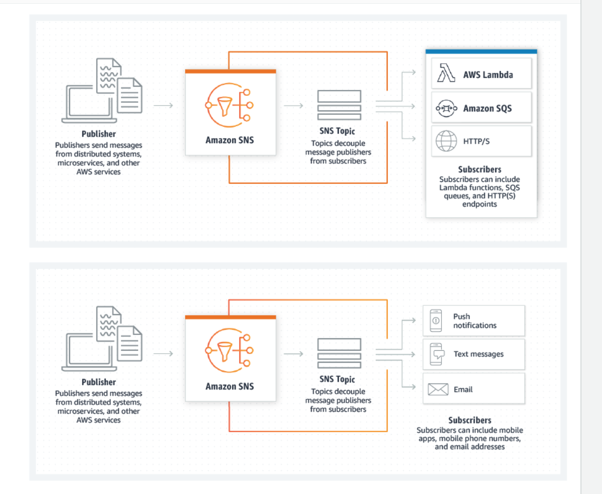

# SNS, SQS, Event Bridge

## Key terminology

N/A
### Exercise

Study : SNS, SQS, Event Bridge
### Sources

- [aws](https://aws.amazon.com/lambda/)
- [aws doc](https://docs.aws.amazon.com/lambda/latest/dg/welcome.html)
- [getting started](https://docs.aws.amazon.com/lambda/latest/dg/getting-started.html/)
- [YT](https://www.youtube.com/watch?v=eOBq__h4OJ4)

### Overcome challanges

I understood the concept by referring to the sources shared above.

### Results
 

