# SNS, SQS, Event Bridge

In this exercise, we will learn about the different messaging services offered by AWS.
## Simple Notification Service (SNS)

It is a fully managed messaging service with distributed publish-subscribe system, where subscribers can subscribe to topics and will receive messages whenever a publisher publishes to that topic.

Amazon SNS allows applications to send time-critical messages to multiple subscribers through a “push” mechanism, eliminating the need to periodically check or “poll” for updates. It provides developers with a highly scalable, flexible, and cost-effective capability to publish messages from an application and immediately deliver them to subscribers or other applications. It is designed to make web-scale computing easier for developers.

SNS is used for both application-to-application (A2A) and application-to-person (A2P) communication.

By using SNS topics, publishers can send messages to a large number of subscriber systems incl. SQS queues, AWS Lambda functions and HTTPS endpoints for parallel processing. The A2P functionality enables to send messages to users at scale via SMS, mobile push, and email.

Key benefits of SNS are:

1. Instantaneous, push-based delivery (no polling)
2. Simple APIs and easy integration with applications
3. Flexible message delivery over multiple transport protocols
4. Inexpensive, pay-as-you-go model with no up-front costs
5. Web-based AWS Management Console offers the simplicity of a point-and-click interface

### There are two types of topic types:

1. Standard Topics

Standard topics can be used in many scenarios, as long as your application can process messages that arrive more than once and out of order, for example: fanning out messages to media encoding, fraud detection, tax calculation, search index, and critical alerting applications.

2. FIFO Topics

This is an enhanced messaged between applications when the events are critical and where fault tolerance like duplication cannot be accepted. for example: fanning out messages to bank transaction logging, stock monitoring, flight tracking, inventory management, and price update applications.

## Simple Queue Service (SQS)

Amazon SQS is a fully managed message queue service, which stores messages in a queue. Different applications can use SQS to exchange messages through a polling model and can also be used to decouple sending and receiving components. 

SQS requires no administrative overhead and little configuration. Amazon SQS works on a massive scale, processing billions of messages per day. You can scale the amount of traffic you send to Amazon SQS up or down without any configuration. Amazon SQS also provides extremely high message durability, giving you and your stakeholders added confidence.

Applications can be made more flexible and scalable by using Amazon SQS with compute services such as EC2, ECS, and Lambda, as well as with storage and database services such as S3 and DynamoDB.

Similar to SNS, SQS offers two types of message queues. Standard queues offer maximum throughput, best-effort ordering, and at-least-once delivery. SQS FIFO queues are designed to guarantee that messages are processed exactly once, in the exact order that they are sent.

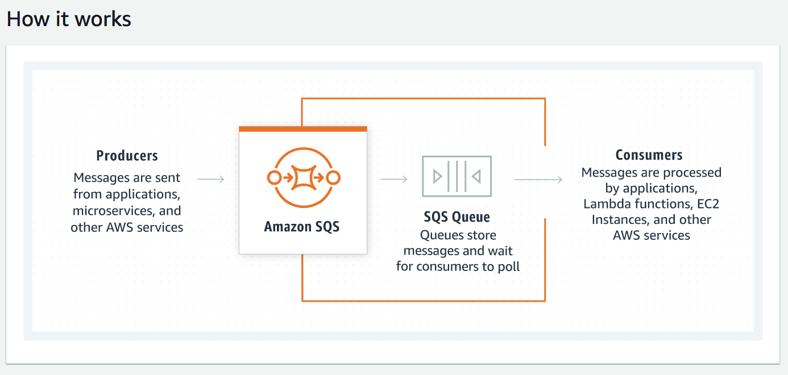

### How is SNS different from SQS?

Although, both are messaging services within AWS, it provides different benefits for developers. A common pattern is to use SNS to publish messages to Amazon SQS queues to reliably send messages to one or many system components asynchronously. Amazon SNS allows applications to send time-critical messages to multiple subscribers through a “push” mechanism, eliminating the need to periodically check or “poll” for updates. Amazon SQS is a message queue service used by distributed applications to exchange messages through a polling model, and can be used to decouple sending and receiving components. Amazon SQS provides flexibility for distributed components of applications to send and receive messages without requiring each component to be concurrently available.

## EventBridge

EventBridge is a serverless event bus that was built on top of the existing AWS CloudWatch Events API. It is a service that provides real-time access to changes in data in AWS services, your own applications, and software as a service (SaaS) applications without writing code. You can set up routing rules to determine where to send your data to build application architectures that react in real-time to your data sources with event publisher and consumer completely decoupled.

Amazon EventBridge builds upon and extends CloudWatch Events. It uses the same service API and endpoint, and the same underlying service infrastructure. CloudWatch Events enables developers to integrate many of the AWS services through events. For example, if there is a change in the state of an EC2 instance, a CloudWatch Event can trigger an event to AWS Lambda to take an action. EventBridge extends this functionality beyond the AWS ecosystem, letting us brings together our own (legacy) applications, SaaS, and AWS Services. EventBridge will automatically deliver the events in near-real-time.

## Key terminology

- Publish/subscribe messaging, or pub/sub messaging, - is a form of asynchronous service-to-service communication used in serverless and microservices architectures. In a pub/sub model, any message published to a topic is immediately received by all of the subscribers to the topic. 

- Application to application (A2A) integration (also known as enterprise application integration) - is the integration of applications and business processes within the same company (also known as an enterprise). For eg: From EC2 to Cloudwatch)

- Application-to-Person messaging (A2P) - is any kind of message traffic in which a person is receiving messages from an application rather than another individual, and which is not expected to receive a reply. (eg: OTP, emails, mobile push messages)

- Decouple components - SQS lets decouple application components, so that the applications run and fail independently which in turn increases the overall fault tolerance of the system. Multiple copies of every message are stored redundantly across multiple Availability Zones so that they are available whenever needed.

- Event bus - An event bus is a pipeline that receives events. Rules associated with the event bus evaluate events as they arrive. Each rule checks whether an event matches the rule's criteria. You associate a rule with a specific event bus, so the rule only applies to events received by that event bus.
### Exercise

Study : SNS, SQS, Event Bridge
### Sources

- [aws SNS](https://aws.amazon.com/sns/?whats-new-cards.sort-by=item.additionalFields.postDateTime&whats-new-cards.sort-order=desc)
- [AWS SNS pub/sub](https://aws.amazon.com/pub-sub-messaging/#:~:text=Publish%2Fsubscribe%20messaging%2C%20or%20pub,the%20subscribers%20to%20the%20topic.)
- [aws SQS](https://aws.amazon.com/sqs/)
- [EventBridge aws](https://aws.amazon.com/eventbridge/)
- [EventBridge aws doc](https://docs.aws.amazon.com/step-functions/latest/dg/cw-events.html)

### Overcome challanges

I understood the concept by referring to the sources shared above.

### Results

### SNS exercise:

To understand how SNS works, I created a topic; added a subscription via email. After confirming the subscription, I published a message on the topic and received the message via email. Below are the steps involved in this process:

1. Creating SNS topic

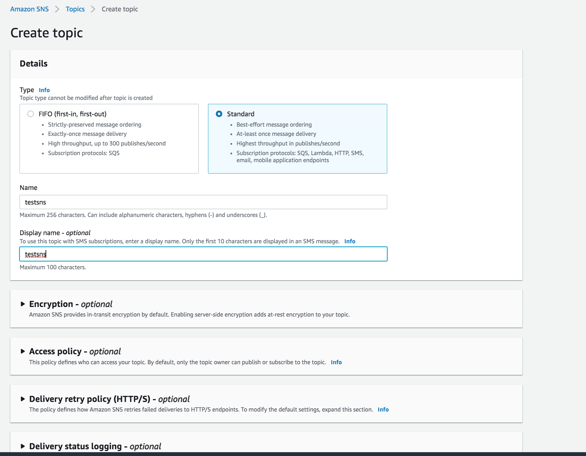

2. Subscribing to the topic via email

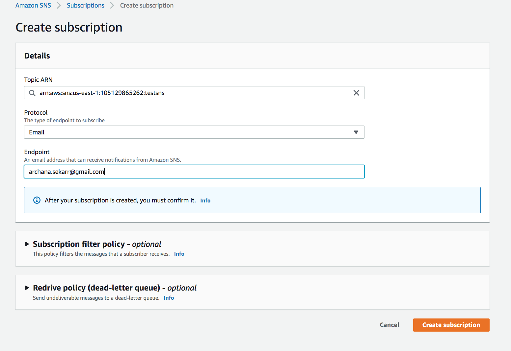

3. Confirming email subscription

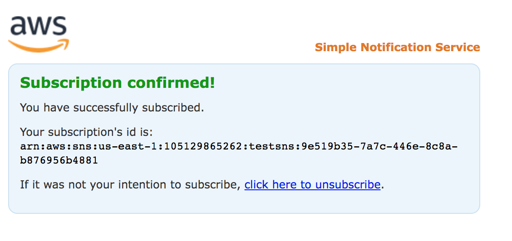

4. Subscription status is now confirmed

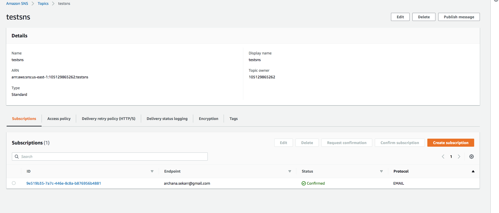

5. Publishing a message for the topic

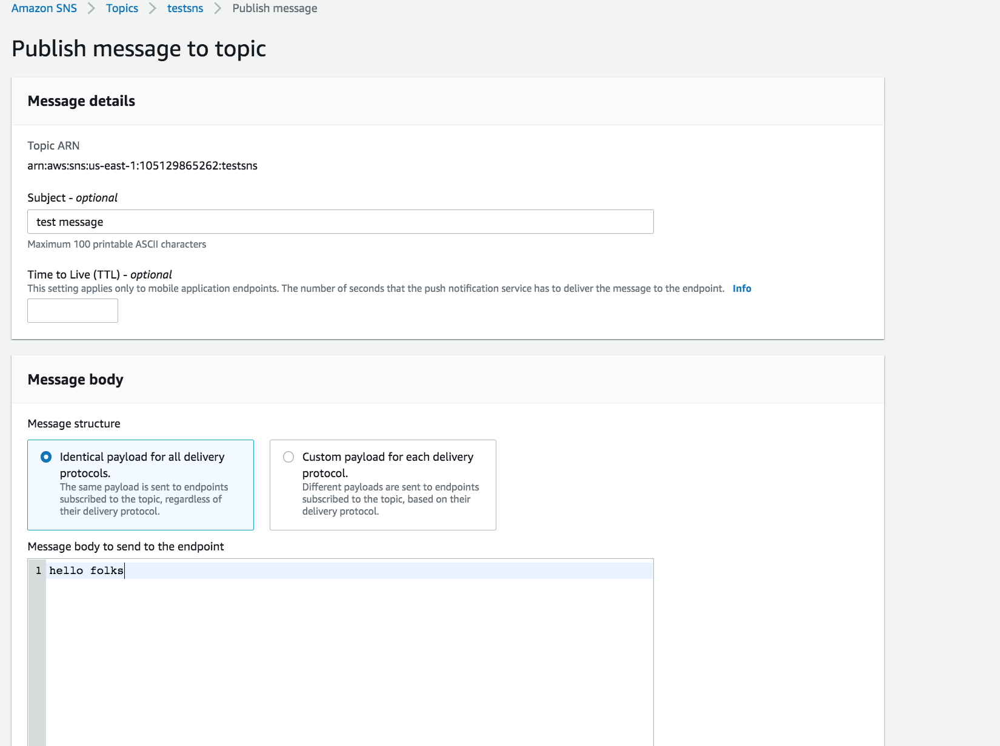

6. Received the published message in my inbox

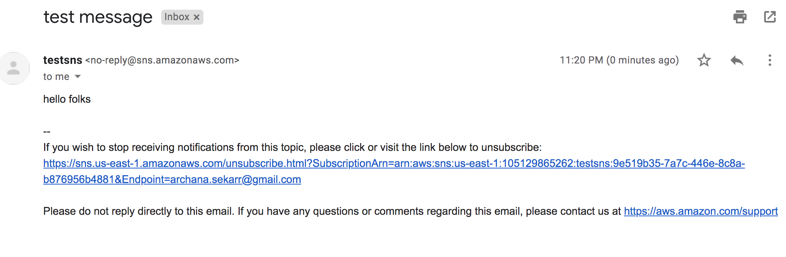

### SQS exercise:

In order to understand how SQS works, I created a queue and used the console to send messages into the queue and consumed them from the queue. Following are the steps involved in this process:

1. Created an SQS queue

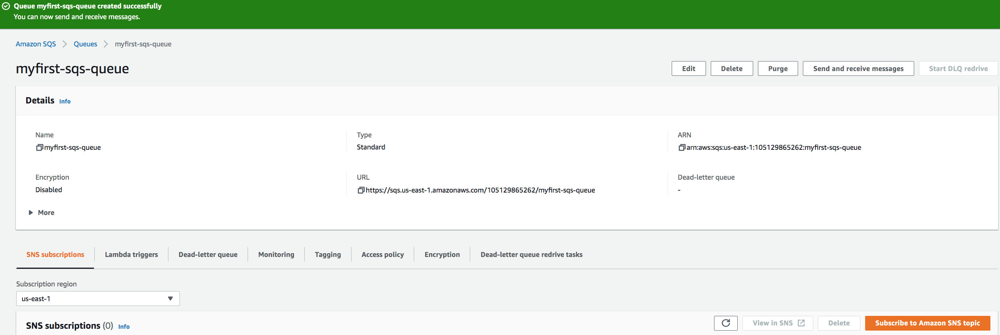

2. Sending message 1 to queue

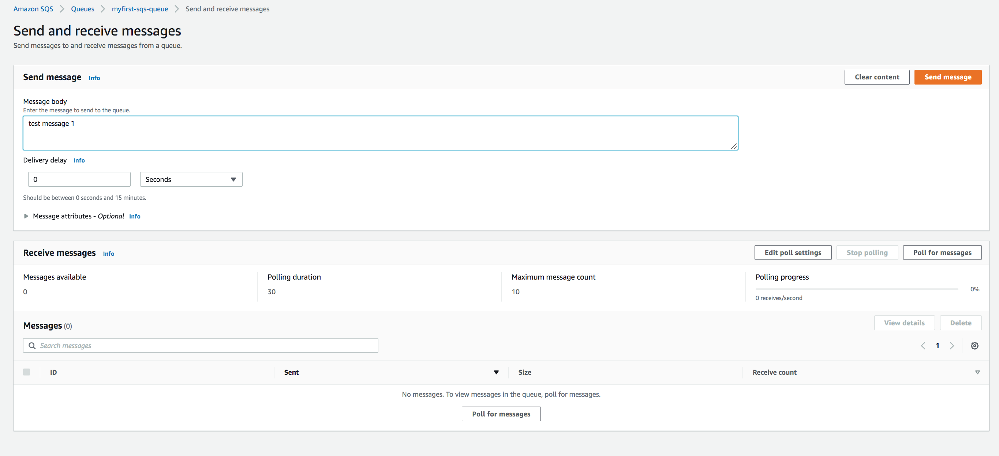

3. Sending message 2 to queue

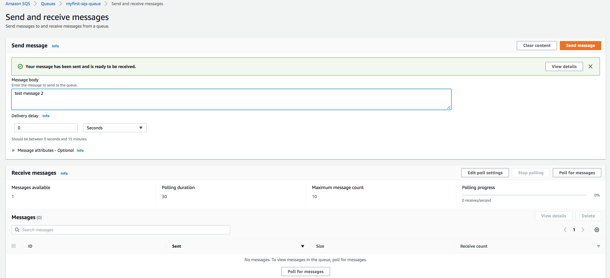

4. Both the messages are available in the queue to consume

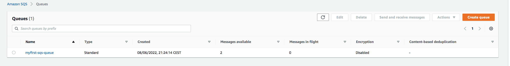

5. Consuming the messages from the console

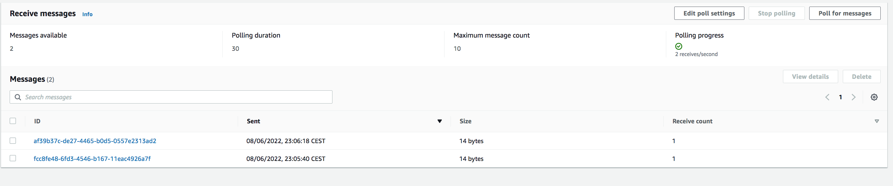

6. Message 2 consumed

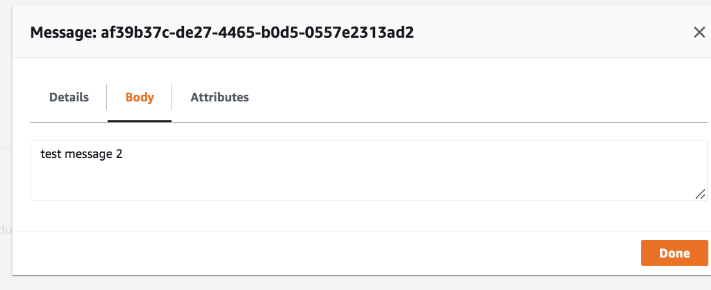

### EventBridge exercise:

In event bridge, i tried to explore event rule, where I created an event source with event rule and scheduled it to run every 1 minute. Added SNS topic as the event target and received the email when the event got triggered. Shown below are the steps involved:

1. Creating an event source that is scheduled to run every 1 minute.

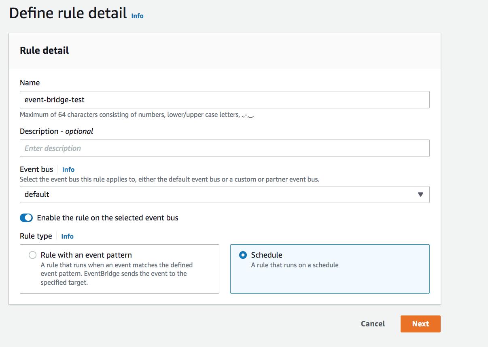

2. Configuring the scheduling interval for the event rule.

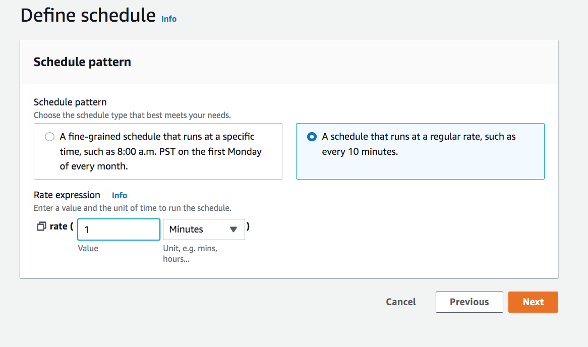

3. Adding SNS topic as the event target.

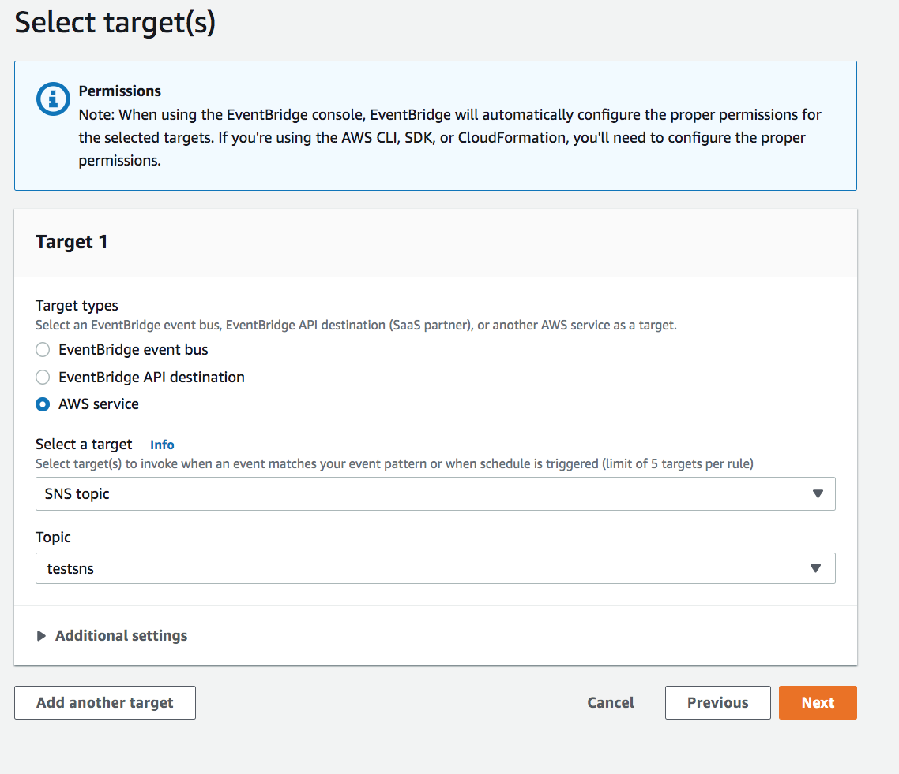

4. Rule created and enabled.

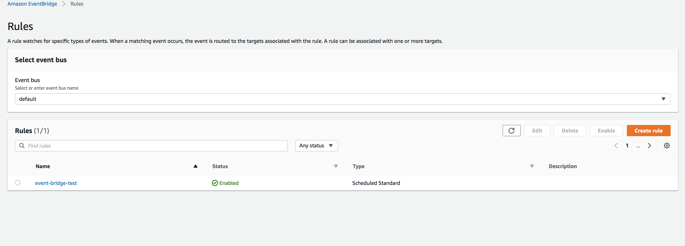

5. Message received from the event rule.

