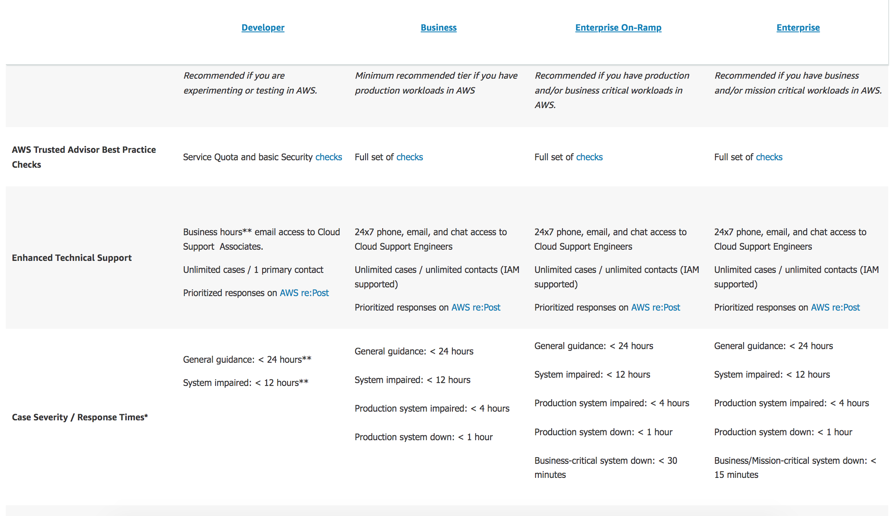
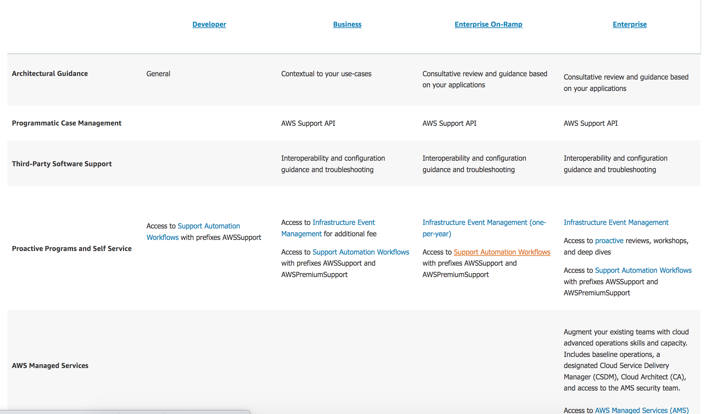
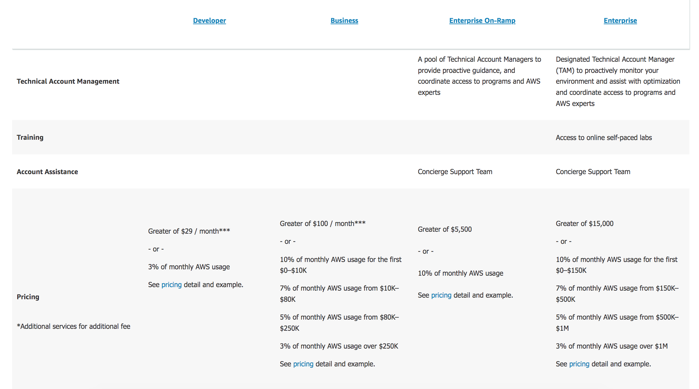

# Support Plans

 With hundreds of services and features, AWS provides a combination of various tools, technologies, programs and human resources to proactively help their customers. In this assignment, we will learn about the different support plans offered by AWS for their customers to choose based on their needs.

## Key terminology

N/A

### Exercise

Study : Support Plans

### Sources

- [Support plans aws](https://aws.amazon.com/premiumsupport/plans/)
- [Suuport plans](https://jayendrapatil.com/aws-support-plans/)

### Overcome challanges

I understood the concept by referring to the sources shared above.

### Results
 
AWS support plans are designed to give the right mix of tools and access to expertise for it's clients to optimize performance, manage risk, and keep costs under control which can also make the customer experience successful.

AWS provides 5 AWS support plans with additional features and extra costs based on the support plan chosen.

1. Basic
2. Developer
3. Business
4. Enterprise On-Ramp
5. Enterprise

1. Basic:

This basic support is included for all AWS customers and includes:

- Customer Service and Communities - 24×7 access to customer service, documentation, whitepapers, and support forums
- AWS Trusted Advisor - Access to 6 core Trusted Advisor checks and guidance to provision your resources following best practices to increase performance and improve security.
- AWS Personal Health Dashboard - Access to Personal Health Dashboard. A personalized view of the health of AWS services, and alerts when your resources are impacted.

The other 4 support plans are explained below:

