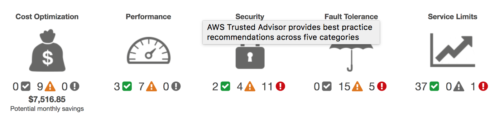
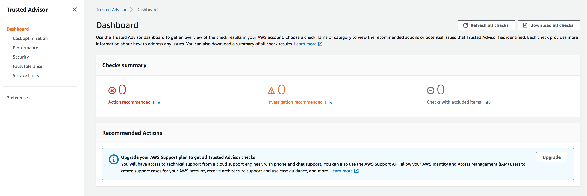

# Trusted Advisor

In this exercise, we are going to learn about the Trusted Advisor, which is a service offered by AWS to provide recommendations to it's customers with the helps of checks in order to follow the best practises and utilize their services effectively at optimal costs.

## Key terminology
n/a

### Exercise

Study : Trusted Advisor

### Sources

- [Trusted Advisor AWS documentation](https://docs.aws.amazon.com/awssupport/latest/user/trusted-advisor.html)
- [Trusted Advisor AWS](https://aws.amazon.com/premiumsupport/technology/trusted-advisor/)
- [trusted advisor - dashboard color meaning](https://www.hava.io/blog/what-is-aws-trusted-advisor)

### Overcome challanges

 I understood the concept by referring to the sources shared above.

### Results
 
AWS Trusted Advisor is a service that inspects all the resources present in AWS account and suggests improvements to bring them in line with AWS best practices. AWS evaluates Trusted Advisor evaluates your account by using checks. These checks identify ways to optimize the AWS infrastructure, improve security and performance, reduce costs, and monitor service quotas. Clients can follow the check recommendations to optimize their services and resources.

AWS Basic Support and AWS Developer Support customers can access core security checks and all checks for service quotas. AWS Business Support and AWS Enterprise Support customers can access all checks, including cost optimization, security, fault tolerance, performance, and service quotas. For a complete list of checks and descriptions, see the Trusted Advisor Best Practices.

Trusted Advisor checks five categories of best practice compliance being cost optimization, performance, security, fault tolerance and service limits.

*Trusted Advisor Dashboard*

The dashboard will also display recent changes in your findings and a what’s new section showing what new checks have been introduced the the service.

The findings on the trusted advisor dashboard are color coded with green meaning all is well, yellow meaning something isn’t quite right and needs attention and red meaning you need to take immediate action to resolve a potentially catastrophic config error.

Trusted advisor has saved AWS customers using the service many millions of dollars in unnecessary cloud spend by highlighting cost savings. These typically take the form of over provisioned instance sizes or under utilized resources like EBS volumes. Eliminating unused resources, suggesting more optimal configurations and right-sizing compute and storage is the methodology that trusted advisor uses to deliver the savings.

Trusted advisor will alert when problems are detected, however the service also integrates with Amazon CloudWatch event to trigger AWS Lambda functions to automate the resolution of the detected errors.

This is how the Trusted Advisor dashboard looks likw in an AWS console representing the checks summary:

