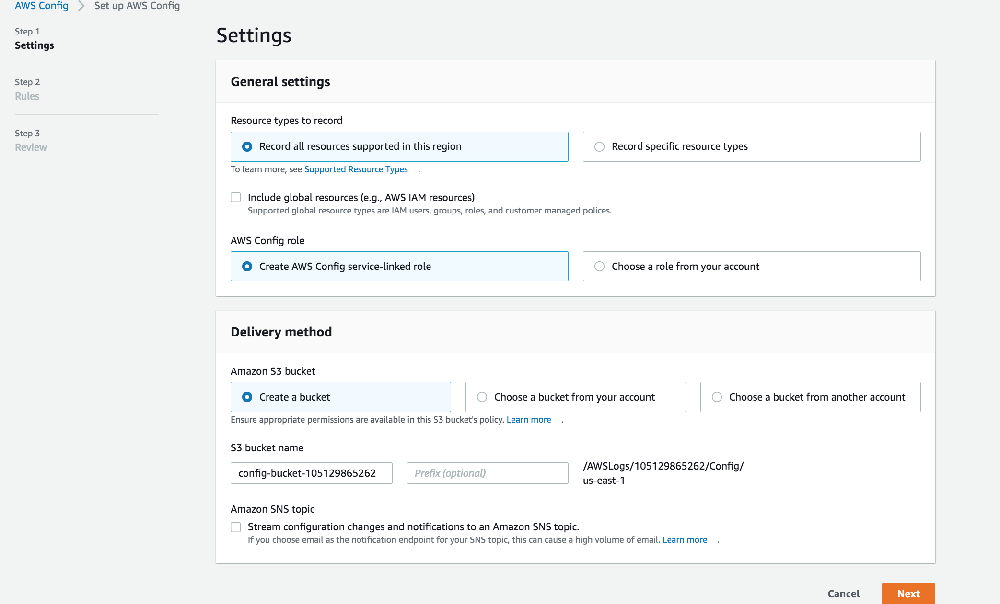
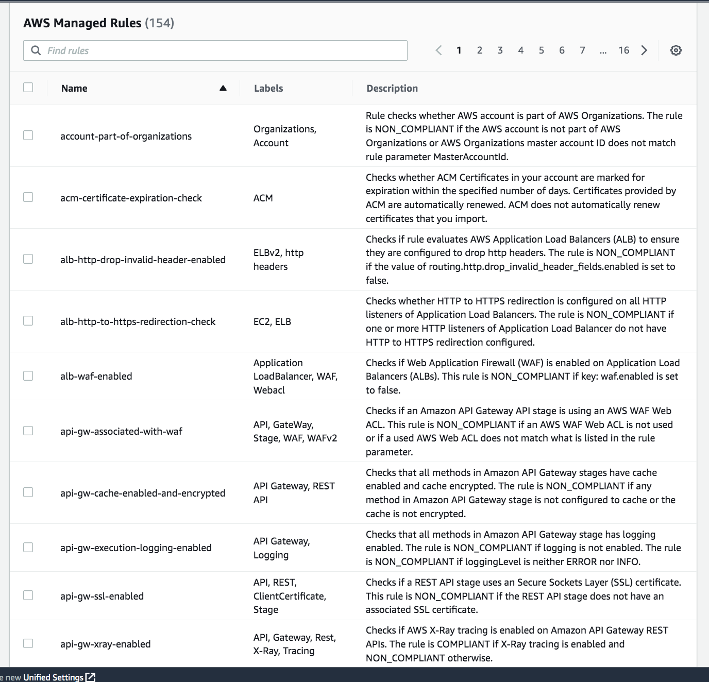
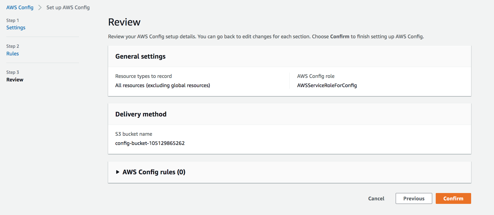

# AWS Config

We will be learning about AWS Config, which is a tool used to access, audit and evaluate the configurations of the AWS resources.

## Key terminology

- config rule - A Config Rule represents desired configurations for a resource and is evaluated against configuration changes on the relevant resources, as recorded by AWS Config. The results of evaluating a rule against the configuration of a resource are available on a dashboard. Using Config Rules, we can assess our overall compliance and risk status from a configuration perspective, view compliance trends over time and pinpoint which configuration change caused a resource to drift out of compliance with a rule.

- Configuration snapshots - The snapshot describes the configuration for the resources that AWS Config is recording in the current region for your AWS account, and it describes the relationships between these resources. The snapshot describes the configuration for the resources that AWS Config is recording in the current region for your AWS account, and it describes the relationships between these resources.

### Exercise

Study : AWS Config

### Sources

- [Config aws documentation](https://docs.aws.amazon.com/sdkref/latest/guide/creds-config-files.html)
- [AWS Config](https://aws.amazon.com/config/)

### Overcome challanges

 I understood the concept by referring to the sources shared above.

### Results
 
AWS Config is a fully managed service that provides it's client with an AWS resource inventory, configuration history, and configuration change notifications to enable security and governance. tracking, and troubleshooting.

Config continuously monitors and records the AWS resource configurations and allows the client to automate the evaluation of recorded configurations against desired configurations. With Config, you can review changes in configurations and relationships between AWS resources, dive into detailed resource configuration histories, and determine your overall compliance against the configurations specified in your internal guidelines.

With AWS Config, the client can discover existing AWS resources, export a complete inventory of their AWS resources with all configuration details, and determine how a resource was configured at any point in time. These capabilities enable compliance auditing, security analysis, resource change 

## Some of the key features of AWS Config are:

1. Configuration history of AWS resources - AWS Config provides a configuration history with all the changes made the AWS resource. AWS Config will also automatically deliver a configuration history file to the Amazon S3 bucket you specify.

2. Configuration history of software - AWS enables to record software configuration within your AWS instances and also the servers and VMs running in the environments provided by other cloud providers

3. Resource relationships tracking - AWS Config discovers, maps, and tracks AWS resource relationships in your account. For example, if a new Amazon EC2 security group is associated with an Amazon EC2 instance, AWS Config records the updated configurations of both the Amazon EC2 security group and the Amazon EC2 instance.

4. Conformance packs - Conformance packs help you manage compliance of your AWS resource configuration at scale--from policy definition to auditing and aggregated reporting--using a common framework and packaging model. 

5. Multi-account, multi-region data aggregation - this feature enables centralised auditing and governance

6. Configuration snapshots - AWS provides a point-in-time capture of all your resources and their configurations with the snapshot feature. 

7. Cloud governance dashboard - This feature is like visual dashboard that helps in spotting non-compliant resources and takes appropriate actions. This compliance posture can be accessed by Administrators, Security Experts, and Compliance Officers.

Shown below are images of how we can set up the AWS Config in the console:

