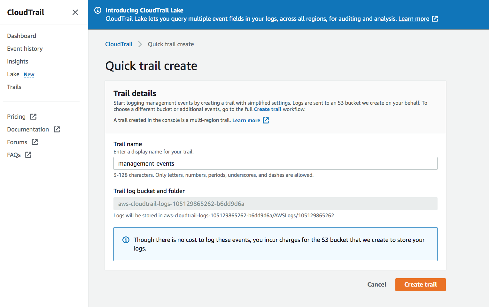

# AWS CloudTrail

In this exercise, we will learn about CloudTrail, which logs account activity and actions across the AWS infrastructure to help understand who did what within that environment. The data that is collected can be used to audit purposes.

## Key terminology

n/a

### Exercise

Study : AWS Cloud Trail

### Sources

- [CloudTrail aws documentation](https://docs.aws.amazon.com/config/latest/developerguide/security-logging-and-monitoring.html)
- [CloudTrail AWS](https://aws.amazon.com/cloudtrail/)
- [Cloudwatch VS Cloudtrail](hhttps://cloudcompiled.com/blog/cloudwatch-cloudtrail-difference/)
- [FAQ](https://aws.amazon.com/cloudtrail/faqs/)

### Overcome challanges

 I understood the concept by referring to the sources shared above.

### Results
 
AWS CloudTrail monitors and records account activity across the AWS infrastructure, giving it's client control over storage, analysis, and remediation actions. It tracks activities and events that happen from the AWS Management Console, AWS SDKs, command line tools, and other AWS services. This data can be used for risk auditing, compliance, security analysis and anomaly detection.  

## Some of the key Features of CloudTrail are:

CloudTrail records two types of events: Management events capturing control plane actions on resources such as creating or deleting Amazon Simple Storage Service (Amazon S3) buckets, and data events capturing data plane actions within a resource, such as reading or writing an Amazon S3 object.

1. It provides a 90-day event history for free. CloudTrail provides customer managed encrption keys and log validation file as part of it's core audit capabilities.

2. It can be used for troubleshooting. **CloudTrail** allows to check the event history to determine which resources recently created, deleted or modified as well as who made these changes, it can determine the cause for operational issues. This data can also help with risk auditing, security and compliance purposes. CloudTrails helps in protecting the organization from penalties using CloudTrail logs. 

3. It helps in anomaly detection with the use of **Cloud Insights** which will alert in case of detection of unusual activities.

### CloudWatch and CloudTrail:

Amazon Cloudwatch is a monitoring service that gives visibility into the performance and health of AWS resources and applications, whereas AWS Cloudtrail is a service that logs AWS account activity and API usage for risk auditing, compliance and monitoring.

Although, they are 2 different services, they integrate together by delivering management and data events captured by CloudTrail to a CloudWatch Logs log stream in the CloudWatch Logs log group you specify. For example, you can create CloudWatch alarms to monitor API calls that create, modify, and delete Security Groups and Network access control lists (ACLs). 

Shown below is the how a quick CloudTrail can be created in the AWS console:

