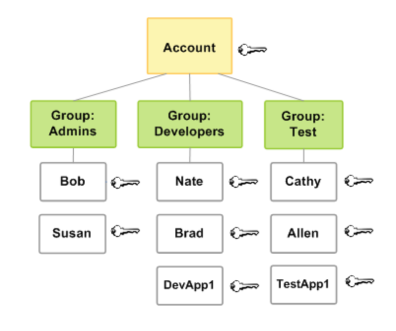
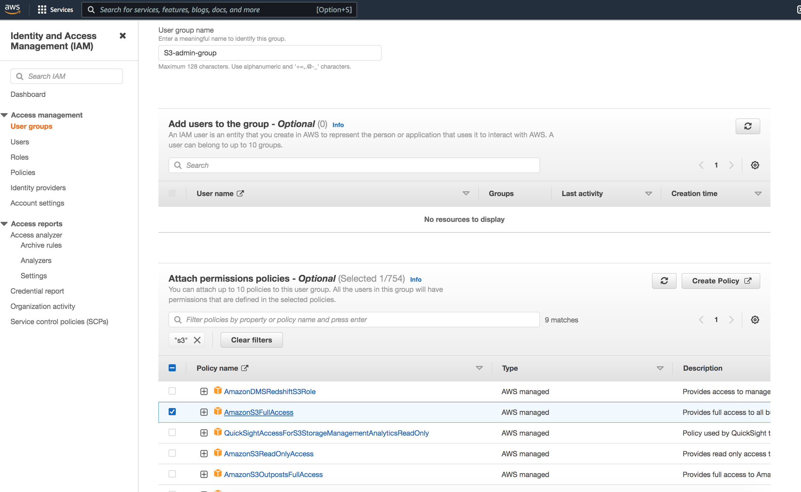
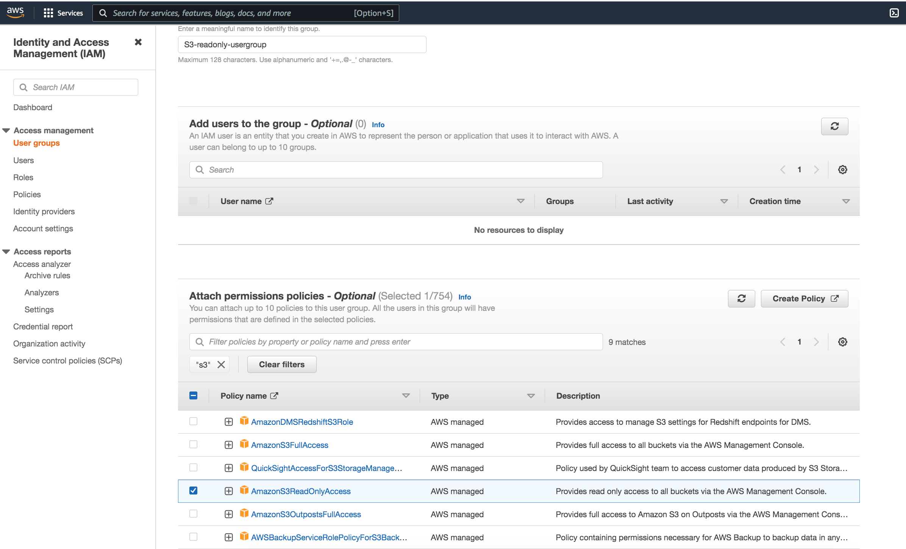
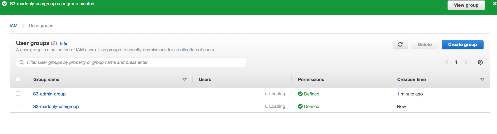
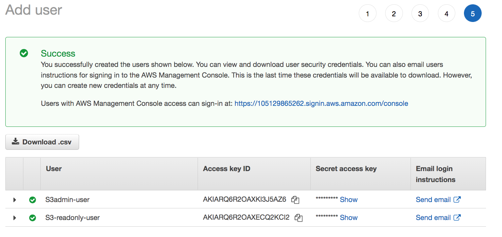
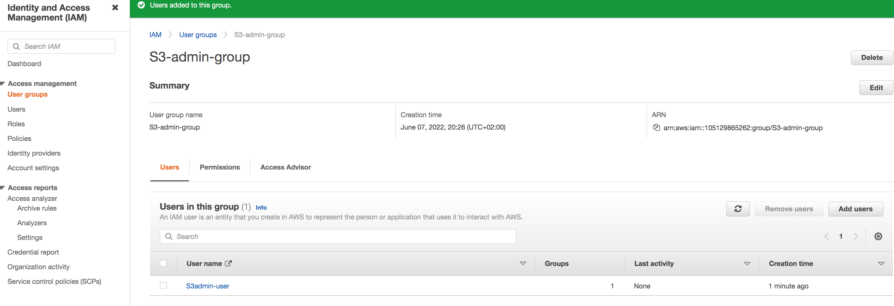
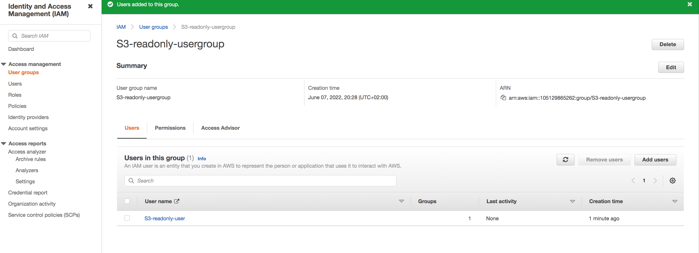
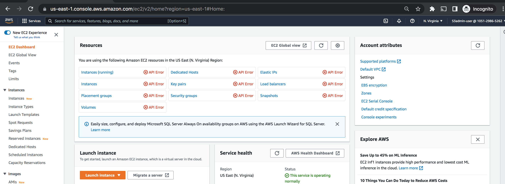
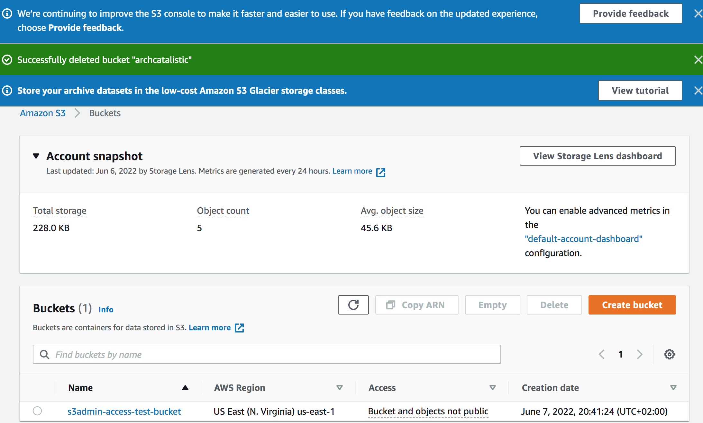
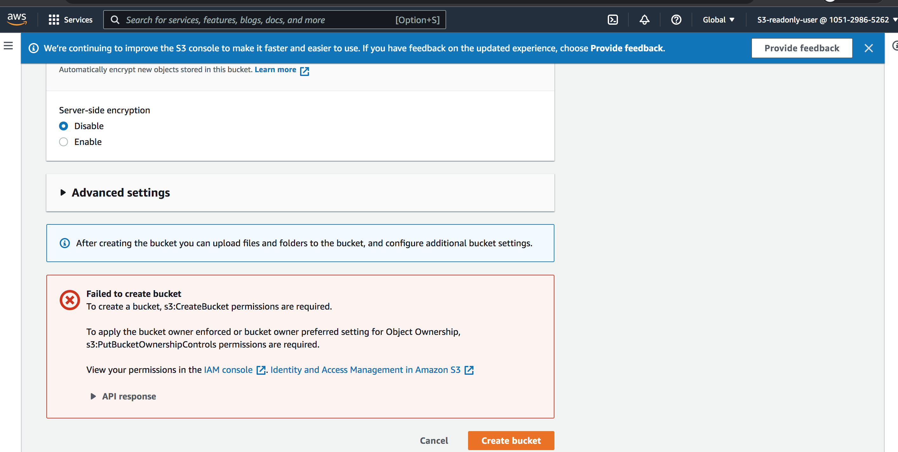

# Identity and Access Management (IAM)

In this exercise, we will learn about IAM, which ensures that the right people and job roles in an organization (identities) can access the tools they need to do their jobs. It enables organizations to manage employee apps without logging into each app as an administrator. 

## Introduction:

AWS Identity and Access Management (IAM) is a web service that helps you securely control access to AWS resources. You use IAM to control who is authenticated (signed in) and authorized (has permissions) to use resources.
IAM provides fine-grained access control across all of AWS. With IAM, you can control access to services and resources under specific conditions. Use IAM policies to manage permissions for your workforce and systems to ensure least privilege. Companies need IAM to provide online security and to increase employee productivity. IAM is offered at no additional charge.

## IAM service provides the following features:

1. With IAM, other people can be given access to administer and use resources without having to share password or access key.

2. Granular permissions feature can be used to grant different permissions to different people, so that the access to the resources can be restricted based on their work

3. IAM features are used to securely provide credentials for applications that run on EC2 instances. These credentials provide permissions for your application to access other AWS resources. Examples include S3 buckets and DynamoDB tables.

4.  AWS multi-factor authentication can be added for extra security. To log in with MFA means a password, security and a code from a specially configured device is neccessary to access their account.

5. With Identity federation, Users who already have passwords elsewhere—for example, in my corporate network or with an internet identity provider— can be given allowed to get temporary access to my AWS account.

6. CloudTrail sends log records about who already have passwords elsewhere—for example, in your corporate network or with an internet identity provider—to get temporary access to your AWS account.

7. PCI DSS Compliance - IAM supports the processing, storage, and transmission of credit card data by a merchant or service provider, and has been validated as being compliant with Payment Card Industry (PCI) Data Security Standard (DSS). 

8. IAM is integrated with many AWS services. There is a whole list of services that are associated with IAM because granting permission and setting policies is essential. 

Policies and groups :

As shown above, groups and users can be created and permissions can be granted.  In that case, individual users still have their own credentials, but all the users in a group have the permissions that are attached to the group. 

## Key terminology

- least-privilege permissions - When you set permissions with IAM policies, grant only the permissions required to perform a task. This practice is known as  granting least privilege. You can apply least-privilege permissions in IAM by defining the actions that can be taken on specific resources under specific conditions.

- - Identity management confirms that you are you and stores information about you. An identity management database holds information about your identity - for example, your job title and your direct reports - and authenticates that you are, indeed, the person described in the database.

- Access management uses the information about your identity to determine which software suites you're allowed access to and what you're allowed to do when you access them. For example, access management will ensure that every manager with direct reports has access to an app for timesheet approval, but not so much access that they can approve their own timesheets.

- Attribute-based access control (ABAC) - It is an authorization strategy that defines permissions based on attributes. In AWS, these attributes are called tags. You can attach tags to IAM resources, including IAM entities (users or roles) and to AWS resources. You can define policies that use tag condition keys to grant permissions to your principals based on their tags. When you use tags to control access to your AWS resources, you allow your teams and resources to grow with fewer changes to AWS policies. ABAC policies are more flexible than traditional AWS policies, which require you to list each individual resource. 

- Role-based access control (RBAC) - RBAC provides a way for you to assign permissions based on a person’s job function, known outside of AWS as a role. IAM provides RBAC by defining IAM roles with permissions that align with job functions. You then can grant individuals access to assume these roles to perform specific job functions. With RBAC, you can audit access by looking at each IAM role and its attached permissions.

- IAM Access Analyzer - Achieving least privilege is a continuous cycle to grant the right fine-grained permissions as your requirements evolve. IAM Access Analyzer helps you streamline permissions management in each step of this cycle. Policy generation with IAM Access Analyzer generates a fine-grained policy based on the access activity captured in your logs. This means that after you build and run an application, you can generate policies that grant only the required permissions to operate the application.

### Exercise

Study : IAM

### Sources

- [aws](https://aws.amazon.com/iam/)
- [aws doc](https://docs.aws.amazon.com/IAM/latest/UserGuide/introduction.html)
- [FAQ](https://aws.amazon.com/iam/faqs/?nc=sn&loc=5)
- [IAM](https://www.onelogin.com/learn/iam) 
### Overcome challanges

 I understood the concept by referring to the sources shared above.

### Results
 
Now, shown below are steps on how groups and users are created and granting different permissions.

1. Creating an S3 admin group.

2. Creating another group with S3 read-only access.

3. Creating user group.

4. 2 users created.

5. Admin user added to admin group.

6. Read-only user added to read-only user group.

7. We can see that S3 admin user cannot access EC2 resources as permission hasn't been given.

8. Admin is able to create S3 bucket.

9. Unable to create S3 bucket with read-only user because we havent given permissions.

