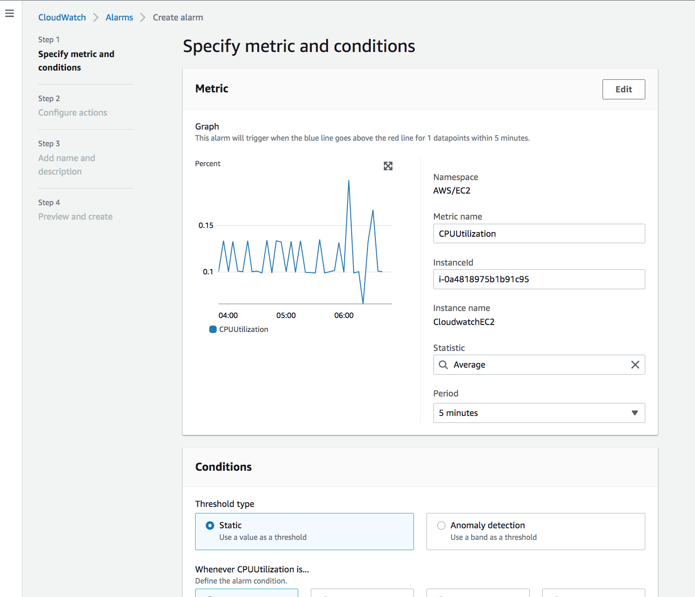
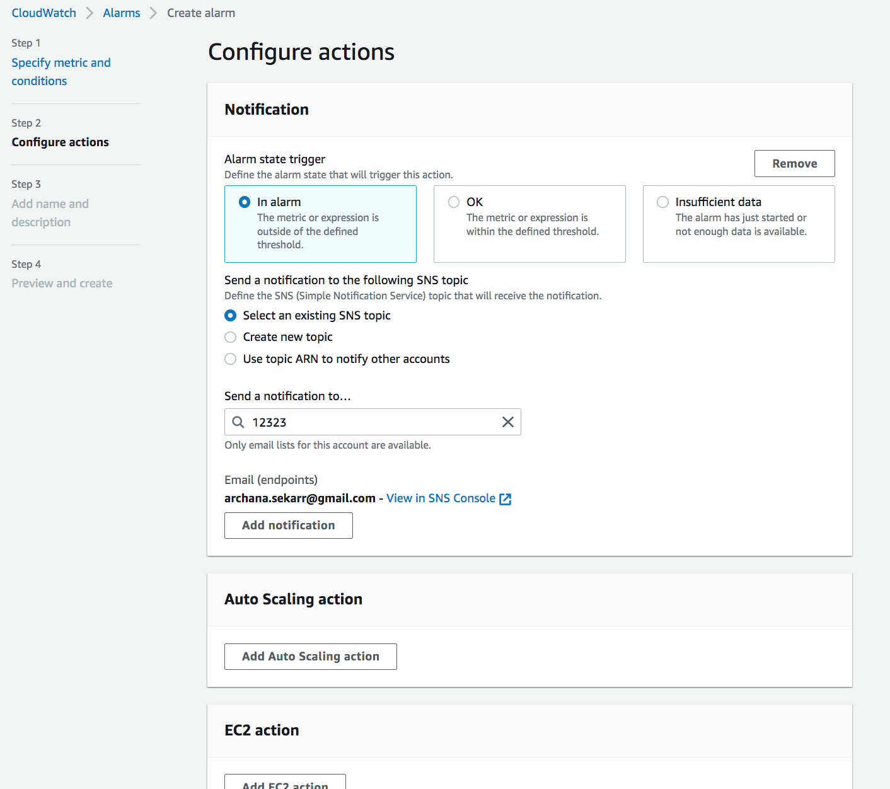
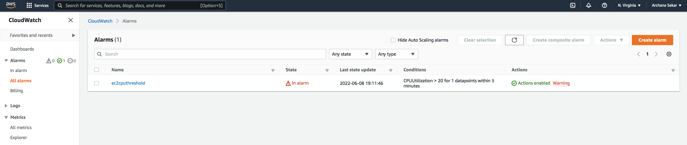
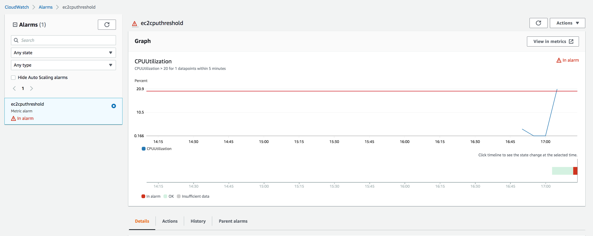
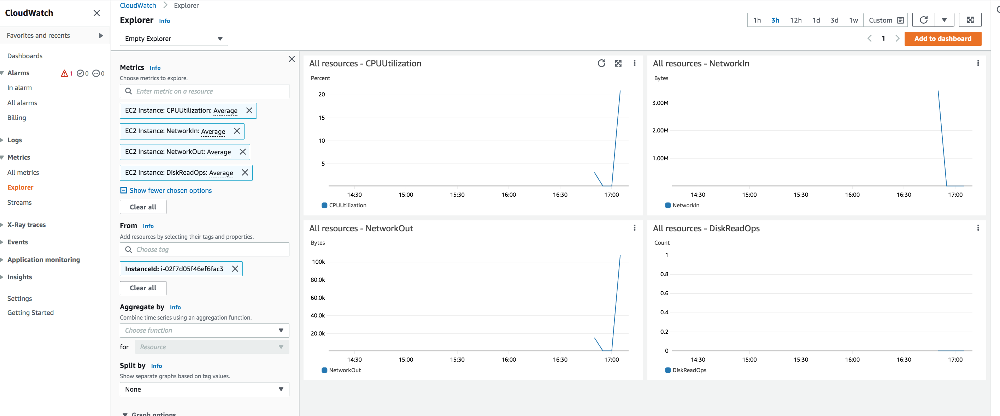
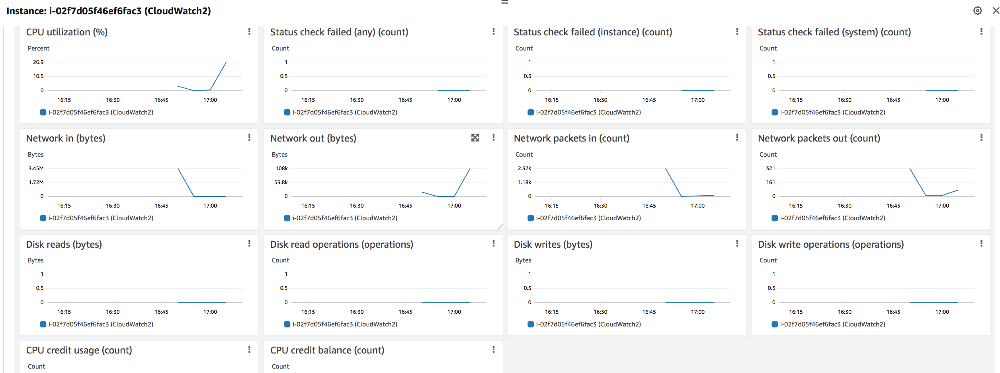

# CloudWatch 

In this exercise, we will learn about AWS Cloudwatch, which acts as a monitoring service that gives visibility in the form of metrics into the performance and health of the AWS resources and applications. 
# Introduction:

Cloudwatch provides metrics about the various AWS resources and allows us to monitor the performance and health of our applications. It collects data from our cloud resources in the form of logs or events and creates visualizations of these metrics so that we can see how all our resources are performing. This can allow us to detect spikes or anomalies within our infrastructure and help us determine which actions to take. Cloudwatch lets us create and set alarms so that we can be notified or trigger an automated response action when a certain metric reaches it's threshold. 

Cloudwatch basic monitoring records events at a 5-min frequency but can be switched to the detailed monitoring mode to collect data at 1-min intervals. 

To summarize, CloudWatch performs 4 actions normally, first it collects log and metric data, then monitors the applications, then acts according to the instructions, finally analyzes the collected log and metric data for further usage.

## CloudWatch integrated with IAM:

CloudWatch integrates with AWS Identity and Access Management (IAM) so that you can specify which CloudWatch actions a user in your AWS Account can perform. For example, you could create an IAM policy that gives only certain users in your organization permission to use GetMetricStatistics. They could then use the action to retrieve data about your cloud resources.

## CloudWatch and EC2:

CloudWatch provides all the necessary metrics for all the EC2 instances and should work with any operating system currently supported by the EC2 service.

## Key terminology

- CloudWatch Alarms - CloudWatch Alarms are used to monitor only metric data. You can set alarms in order to take actions by providing a condition in the metric data of a resource. Cloud watch sends notifications using SNS to an email address specified when the condition is met.

- SNS (simple notification service)  - CloudWatch uses SNS to send email. First, create and subscribe to an SNS topic. When you create a CloudWatch alarm, you can add this SNS topic to send an email notification when the alarm changes state.

- CloudWatch Logs - these logs are used to monitor and troubleshoot systems and applications and it helps in viewing the source of the problems. It also notifies with the alarm in case the threshold you set exceeds.

- CloudWatch Logs Insights - CloudWatch Logs Insights is an interactive, pay-as-you-go, and integrated log analytics capability for CloudWatch Logs. It helps developers, operators, and systems engineers understand, improve, and debug their applications, by allowing them to search and visualize their logs. 

- CloudWatch Anomaly Detection - Anomaly Detection applies machine-learning algorithms allows to create alarms that auto-adjust thresholds based on natural metric patterns, such as time of day, day of week, seasonality, or changing trends.

- CloudWatch Contributor Insights - It analyzes time-series data to provide a view of the top contributors influencing system performance. Once set up, Contributor Insights runs continuously without needing additional user intervention. This helps developers and operators more quickly isolate, diagnose, and remediate issues during an operational event.

- AWS X-ray - AWS X-Ray is a service that helps developers analyze and debug distributed applications. Customers use X-Ray to monitor application traces, including the performance of calls to other downstream components or services, in either cloud-hosted applications or from their own machines during development.

### Exercise

Study : CloudWatch

### Sources

- [aws](https://aws.amazon.com/cloudwatch/)
- [aws doc](https://docs.aws.amazon.com/cloudwatch/index.html)
- [Cloudwatch](https://cloudcompiled.com/blog/cloudwatch-cloudtrail-difference/)
- [Cloudwatch](https://intellipaat.com/blog/what-is-cloudwatch-in-aws/)
### Overcome challanges

I understood the concept by referring to the sources shared above.

### Results
 
With the help of the below exercise, we can see the cloudwatch metrics and how alarms are set to trigger notifications. 

1. I created an EC2 instance and I started a load test. 

2. Then i set an alarm stating that if the CPU loads increases beyond 20%, I will receive an alarm via the email address, mentioned.

3. Alarm has been activated and I received an email when the CPU threshold exceeded 20%

4. Below are the metrics for the instance with the load test;

