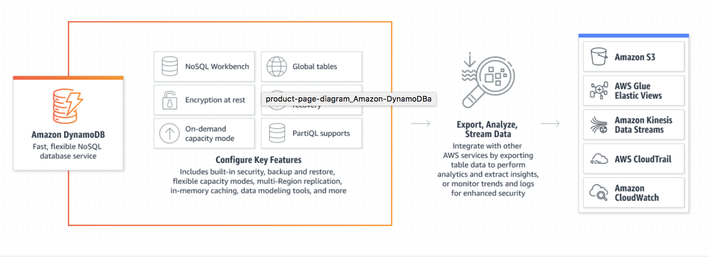
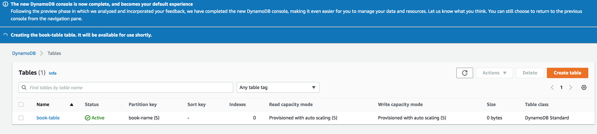
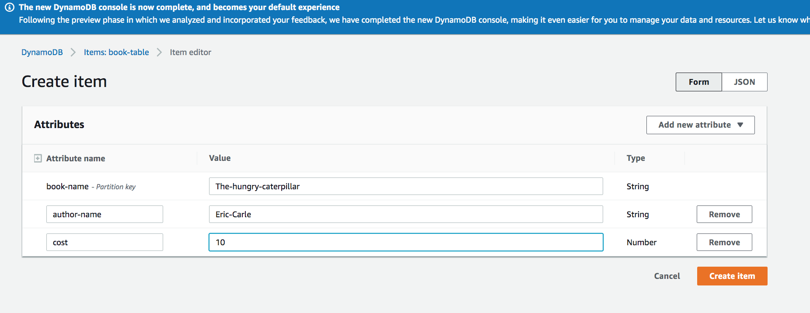
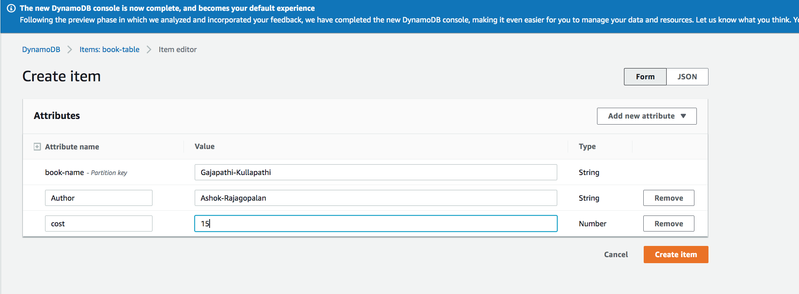
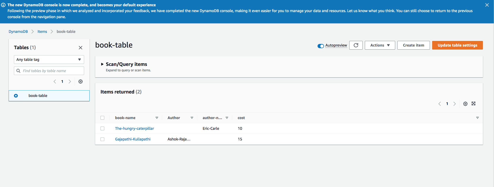
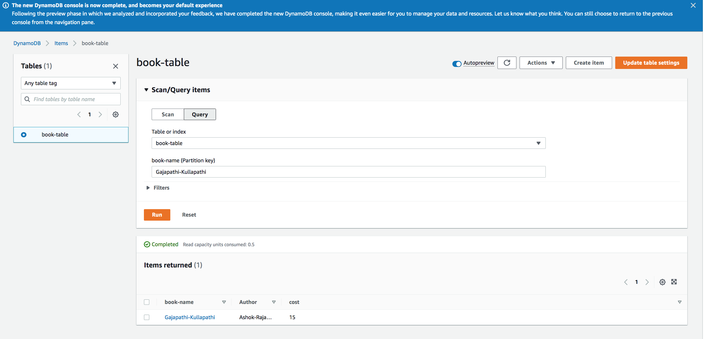

# DynamoDB

In this exercise, we will be understanding what DynamoDB is and how to create a fast and flexible database using this fully managed, serverless and key-value NoSQL database service.

### Introduction:

DynamoDB is a fast and flexible nonrelational database service for any scale. DynamoDB enables customers to offload the administrative burdens of operating and scaling distributed databases to AWS so that they don’t have to worry about hardware provisioning, setup and configuration, throughput capacity planning, replication, software patching, or cluster scaling.  

Some of the other key features of DynamoDB are :

1. With DynamoDB, we can create database tables that can store and retrieve any amount of data and serve any level of request traffic.

2. DynamoDB automatically scales throughput capacity to meet workload demands, and partitions and repartitions your data as your table size grows. It is possible to scale up or scale down your tables' throughput capacity without downtime or performance degradation. AWS Management Console can be used to monitor resource utilization and performance metrics.

3. DynamoDB provides on-demand backup capability. It allows to create full backups of the tables for long-term retention and archival for regulatory compliance needs. 

4. Deployment of nonrelational databases can be done in a matter of minutes. 

5. Also, DynamoDB synchronously replicates data across three facilities in an AWS Region, giving you high availability and data durability.

### No SQL database 

NoSQL is a term used to describe nonrelational database systems that are highly available, scalable, and optimized for high performance. They are non-tabular databases and store data differently than relational tables. Instead of the relational model, NoSQL databases (like DynamoDB) use alternate models for data management, such as key-value pairs or document storage.

*Features of NoSQL database are:*

1. Flexible schemas
2. Horizontal scaling
3. Fast queries due to the data model
4. Ease of use for developers

*Types of NoSQL databases:*

1. Document databases store data in documents similar to JSON (JavaScript Object Notation) objects. Each document contains pairs of fields and values. The values can typically be a variety of types including things like strings, numbers, booleans, arrays, or objects.

2. Key-value databases are a simpler type of database where each item contains keys and values.

3. Wide-column stores store data in tables, rows, and dynamic columns.

4. Graph databases store data in nodes and edges. Nodes typically store information about people, places, and things, while edges store information about the relationships between the nodes.

### SQL vs NOSQL:

1. SQL databases are relational, NoSQL databases are non-relational. Aurora is a relational database service and DynamoDB is a NoSQL database.

2. SQL databases use structured query language and have a predefined schema. NoSQL databases have dynamic schemas for unstructured data.

3. SQL databases are vertically scalable, while NoSQL databases are horizontally scalable. this means that DynamoDB can store huge amount of data as it can scale horizontally. 

4. SQL databases are table-based, while NoSQL databases are document, key-value, graph, or wide-column stores.

5. SQL databases are better for multi-row transactions, while NoSQL is better for unstructured data like documents or JSON.
## Key terminology

explained above.
### Exercise

Study : DynamoDB
### Sources

- [aws](https://aws.amazon.com/dynamodb/features/)
- [aws doc](https://docs.aws.amazon.com/amazondynamodb/latest/developerguide/Introduction.html)
- [DynamoDB YT](https://www.youtube.com/watch?v=sI-zciHAh-4)
- [NoSQL explained](https://www.mongodb.com/nosql-explained)
- [SQL and NOSQL](https://www.integrate.io/blog/the-sql-vs-nosql-difference//)
- [SQL vs NoSQL YT](https://www.youtube.com/watch?v=ruz-vK8IesE)
- [Aurora vs DynamoDB](https://dynobase.dev/dynamodb-vs-aurora/#:~:text=Shared%20Attributes%20for%20DynamoDB%20and%20Aurora&text=And%2C%20the%20most%20significant%20difference,seamlessly%20scales%20up%20or%20down.)
### Overcome challanges

I understood the concept by referring to the sources shared above.
### Results
 
In order to explore DynamoDB, I created a table, added items and attributes to it and queried using the console. Below are the steps involved in this process:

1. Creating a dynamodb table to create a book database:

2. Dynamodb table created:

3. Creating an item in the book table by specifying attritubtes such as author name and cost.

4. Adding one more item:

5. 2 items are successfully created:

6. Querying the created item using the book name which is the partition key:

