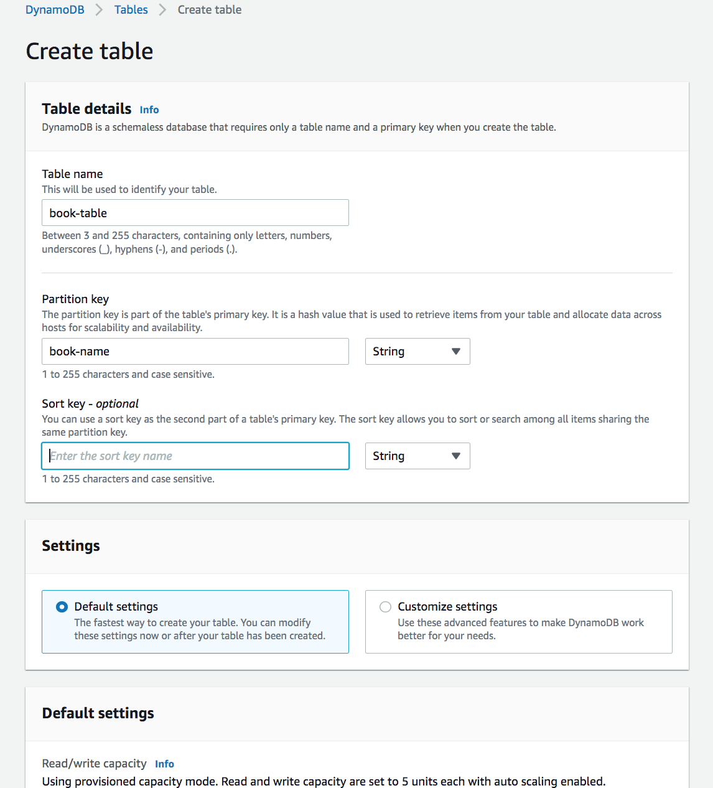

# DynamoDB

## Key terminology

### Exercise

Study : DynamoDB

### Sources

- [aws](https://aws.amazon.com/cloudwatch/)
- [aws doc](https://docs.aws.amazon.com/cloudwatch/index.html)
- [Cloudwatch](https://cloudcompiled.com/blog/cloudwatch-cloudtrail-difference/)
- [Cloudwatch](https://intellipaat.com/blog/what-is-cloudwatch-in-aws/)

### Overcome challanges

 I understood the concept by referring to the sources shared above.

### Results
 

