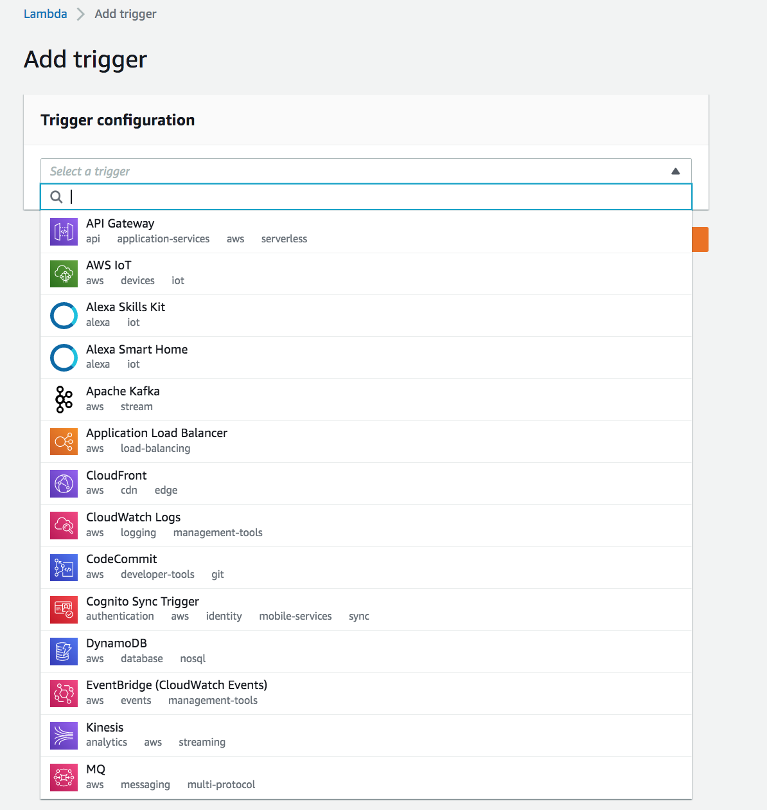
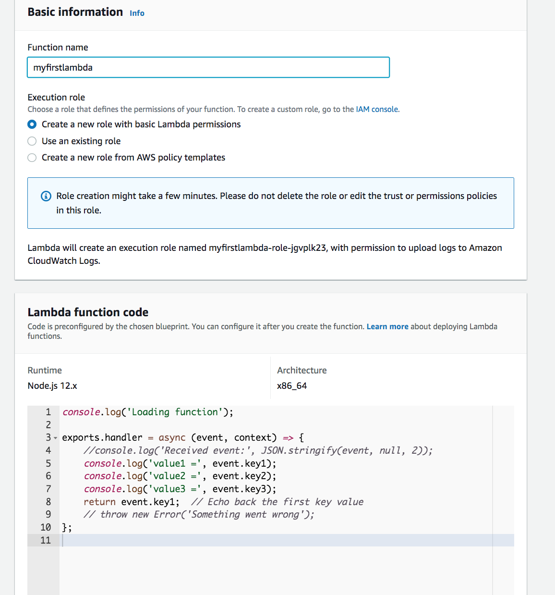
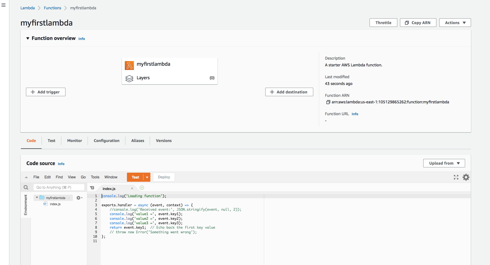
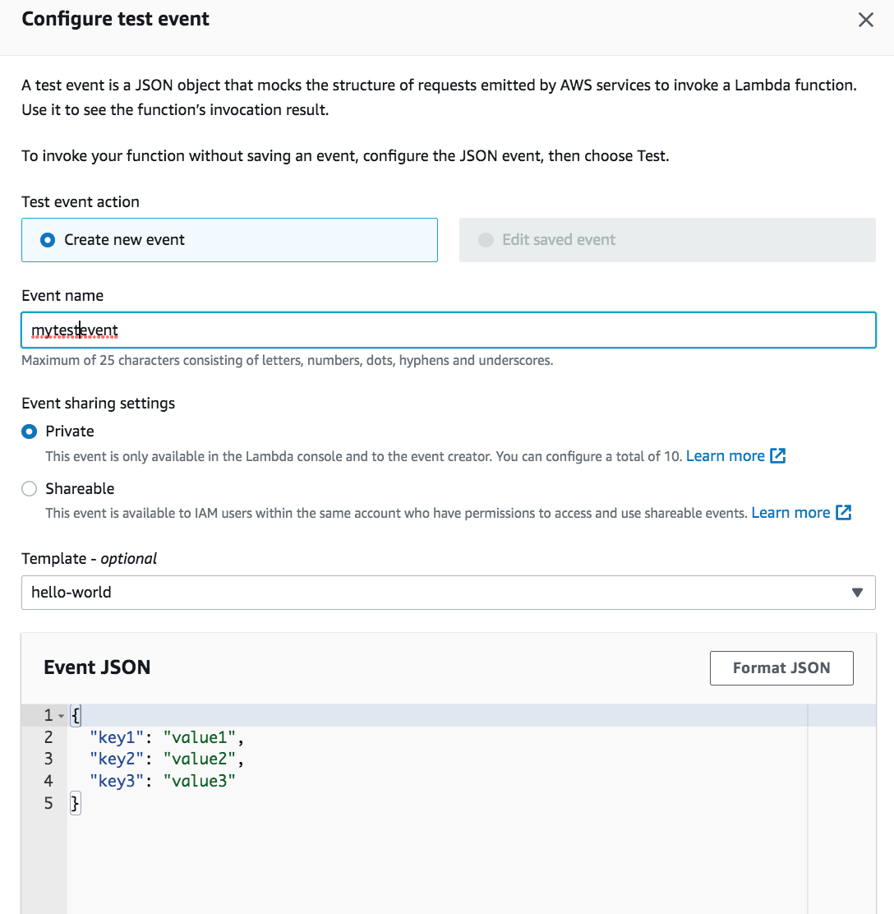
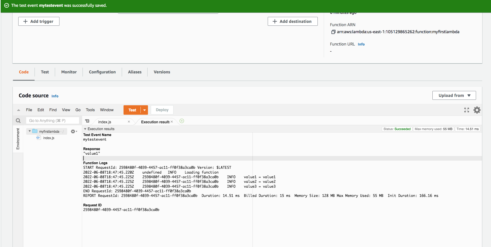

# AWS Lambda

In this exercise, will learn about AWS Lambda which is a serverless, event-driven computing service. All the backend services are managed by Lambda so codes can be run without having to provision/maintain servers.

Introduction:

Lambda is a serverless compute service. So when using Lambda, you are responsible only for supplying the code as the infrastructure is entirely managed by Lambda. Lambda performs all the other administrative services including server and operating system maintenance, capacity provisioning and automatic scaling, code monitoring and logging.  The codes are organized into Lambda functions. Lambda runs your function only when needed and scales automatically, from a few requests per day to thousands per second. 

Lambda functions can be invoked by using API functions and in response to events based on the triggers set. 

Lambda in association with other AWS services:

As shown below, these are the list of services that can trigger a lambda function:

You can trigger Lambda from over 200 AWS services and software as a service (SaaS) applications, and only pay for the compute time that you consume; there is no charge when your code is not running. 
## Key terminology

- Serverless computing - It allows to build and run applications and services without thinking about servers. With serverless computing, your application still runs on servers, but all the server management is done by AWS. At the core of serverless computing is AWS Lambda, which lets you run your code without provisioning or managing servers.

- Function blueprints - It provides sample code that shows how to use Lambda with other AWS services such as DynamoDB or S3 or third-party applications. 

### Exercise

Study : Lambda

### Sources

- [aws](https://aws.amazon.com/lambda/)
- [aws doc](https://docs.aws.amazon.com/lambda/latest/dg/welcome.html)
- [getting started](https://docs.aws.amazon.com/lambda/latest/dg/getting-started.html/)
- [YT](https://www.youtube.com/watch?v=eOBq__h4OJ4)

### Overcome challanges

I understood the concept by referring to the sources shared above.

### Results

We will see how we can execute a lambda using a test event:

1. Creating a lambda from blueprint:

2. Lambda function overview:

3. As seen in summary, various AWS services can be triggered using Lambda function. But in this exercise, I am going to be creating a test event to trigger the lambda:

4. Executing a lambda with a test event:

