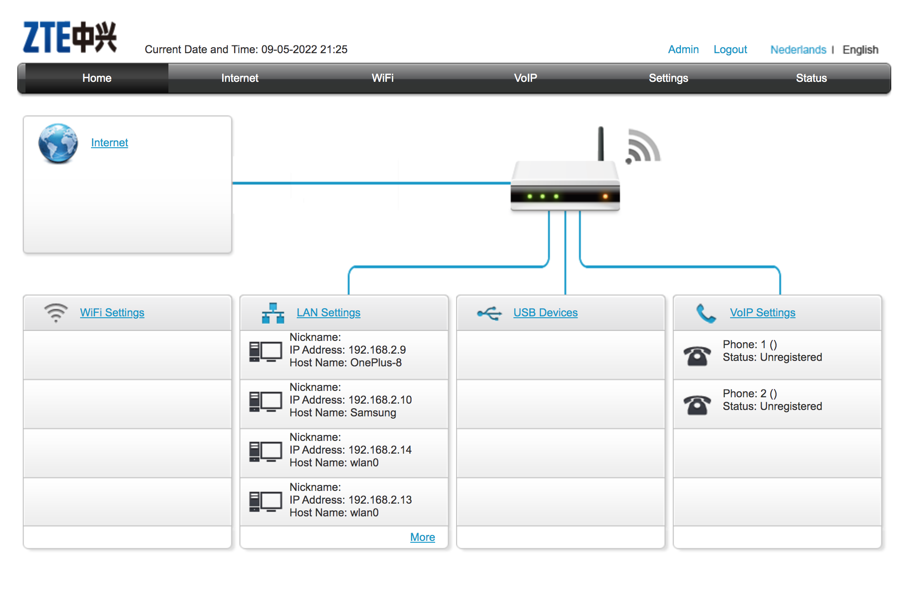
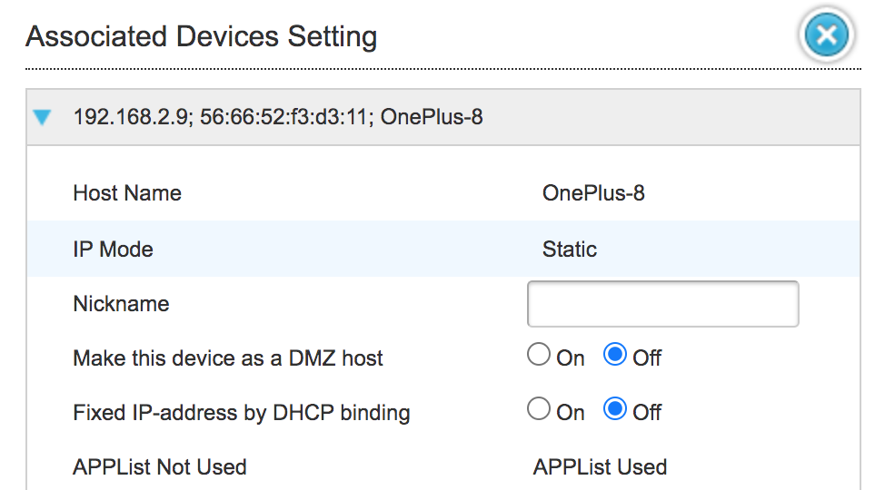
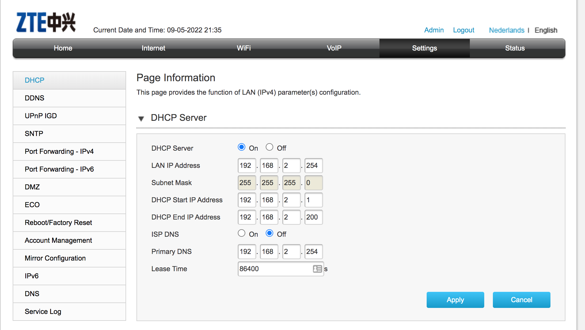

# Network Devices
Network devices, or networking hardware, are physical devices that are required for communication and interaction between hardware on a computer network.

Different types of network devices and it's working in relation to the OSI Model:

1. Hub - It is a Layer 1(physical layer of OSI Model) device and connects multiple network devices together on an internal network. They usually send data packets to all connected devices. It acts as a repeater it has multiple ports. The hub does not know where the destination device is located, it will send traffic out of all ports (except the receiving port) causing collisions and queues which results in packet loss and delays. Hubs waste bandwidth; risky as everyone receives the data and are replaced by switches.

2. Bridges - Bridges work only at the Physical and Data Link layers of the OSI model. It is a multiport device that improves network efficiency. It segments LAN into smaller sections so that traffic it identifies where traffic should be sent. It has 2 collision domains. This means data can be sent/received on each section of the network at the same time. Bridges will send traffic out all ports until it learns (using MAC address) where each port leads.

3. Switches - A switch is a Hub and a Bridge put together. A switch can work at either the Data Link layer or the Network layer of the OSI model. All Devices will connect to the switch and it is the switches job to send the traffic to the correct place. Now unlike a hub, a switch can learn the mac addresses of each port using a Mac Address Table and can also send and receive at the same tine which means no more collisions or delays. It saves bandwidth because it can learn MAC addresses and it is secure because only the destination host receives the data. 

4. Router - A router connects your LAN to other networks such as the internet. Eg; If house was a LAN network, then door would be the router. It is the way ‘outside’ of your internal network. It uses only MAC addresses but also IP addresses which means it is a Layer 3 device i.e, they normally work at the Network layer of the OSI model.. It has fewer(usually 2) ports and highly configurable with many features.

5.  Gateway - Gateways normally work at the Transport and Session layers of the OSI model. Gateways provide translation between networking technologies. Because of this, gateways connect two or more autonomous networks, each with its own routing algorithms, protocols, topology, domain name service, and network administration procedures and policies. The function that does the translation between different network technologies is called a protocol converter.

6.  Modem - Modems work on both the Physical and Data Link layers. Modems (modulators-demodulators) are used to transmit digital signals over telephone lines to connect to the internet

7. Repeater - It works on the Physical layer. It is an electronic device that amplies the signal it receives. 

8. Access Point(AP) - It works at the second OSI layer (Data link layer). An AP can involve both wired or wireless connection, but commonly a wireless device that is used to connect to the network. An access point is a device that creates a wireless local area network (WLAN). APs have several ports which enables to expand the network to support additional clients.

## Key terminology

- DHCP server - Dynamic Host Configuration Protocol (DHCP) is a client/server protocol that automatically provides an Internet Protocol (IP) host with its IP address and other related configuration information such as the subnet mask and default gateway.
Every device on a TCP/IP-based network must have a unique unicast IP address to access the network and its resources. Without DHCP, IP addresses for new computers or computers that are moved from one subnet to another must be configured manually; IP addresses for computers that are removed from the network must be manually reclaimed.

With DHCP, this entire process is automated and managed centrally. The DHCP server maintains a pool of IP addresses and leases an address to any DHCP-enabled client when it starts up on the network.

- Subnet mask/address mask - It is a 32-bit number used to differentiate the network component of an IP address by dividing the IP address into a network address and host address.

### Exercise
1. Name and describe the functions of common network equipment - Refer to the Summary(above).
2.  Most routers have an overview of all connected devices, find this list. What other information does the router have about connected equipment?
3. Where is your DHCP server located on your network? What are the configurations of this?

### Sources

- [Network devices](https://blog.netwrix.com/2019/01/08/network-devices-explained/)
- [Network Devices Explained](https://www.youtube.com/watch?v=eMamgWllRFY)
- [DHCP server](https://docs.microsoft.com/en-us/windows-server/networking/technologies/dhcp/dhcp-top)
- [How to view the connected device information?](https://consumer.huawei.com/sa-en/support/content/en-us00728122/)
- [How to access my home(KPN) router](https://forum.kpn.com/internet-9/inloggen-op-experia-box-v10a-506872#:~:text=Start%20een%20browser%20zoals%20Internet,een%20nieuw%20wachtwoord%20aangemaakt%20worden.)

### Overcome challanges

For exercise 2, To had to access my home router, I had to find my internet provider (KPN in this case), then based on the instructions from KPN, I learnt that i could access the router following this IP address ==> (http://192.168.2.254/ ).

For exercise 3, I learnt that I can get the DHCP server settings in the Admin page of my home router.

### Results

- List of connected devices to my router:

- Other information about a connected device:

- DHCP server and configurations:

