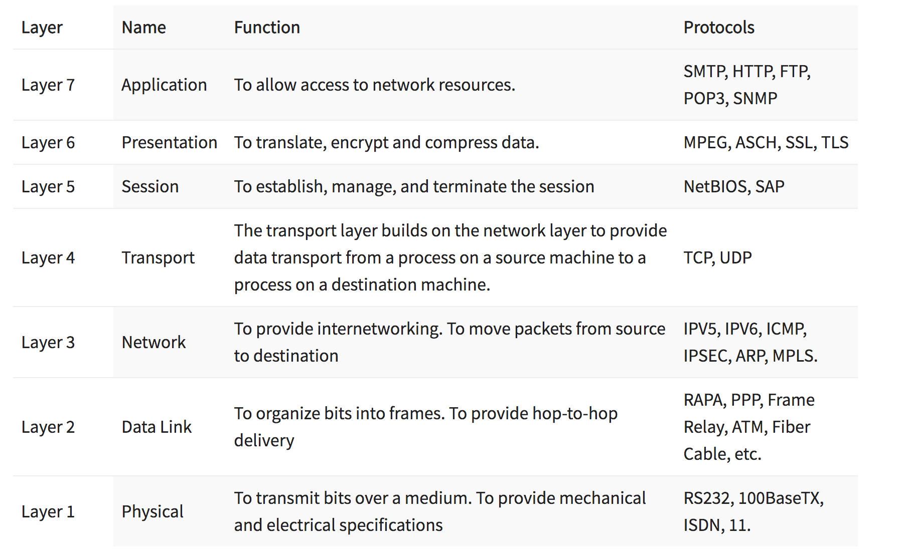
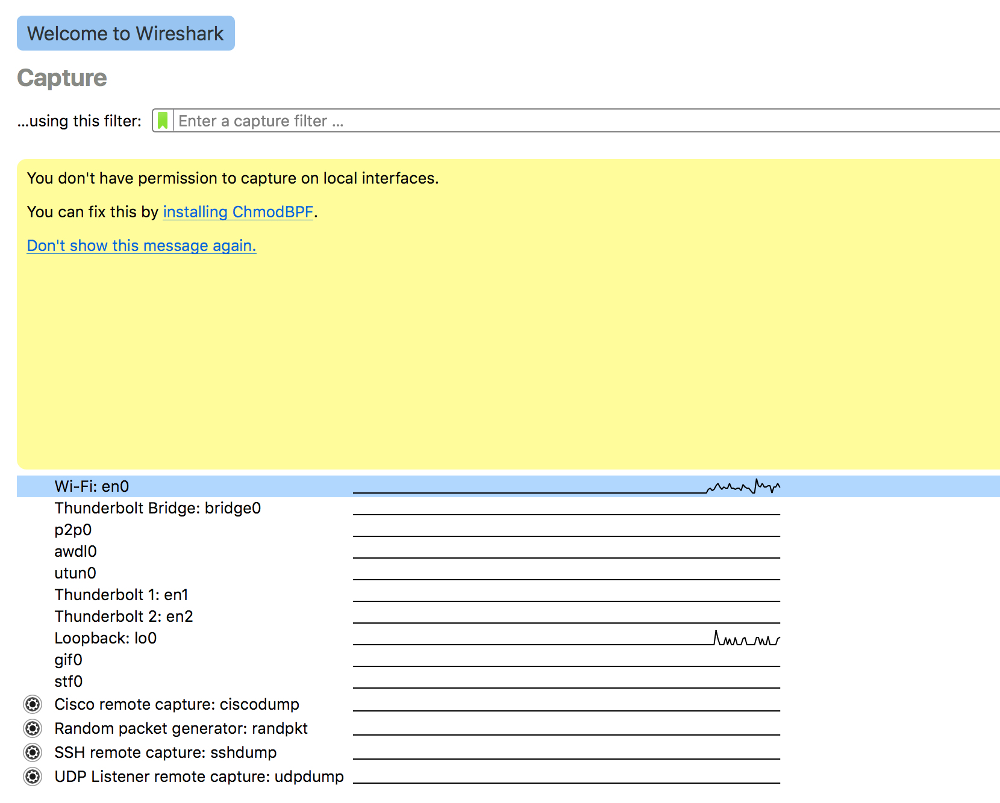
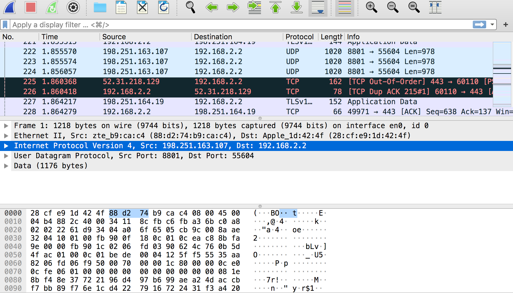

# Protocols
A network protocol is an established set of rules that determine how data is transmitted between different devices in the same network; like an agreement about how to communicate. Every layer of the OSI stack follows a specific protocol. 

Similar to the way that speaking the same language simplifies communication between two people, network protocols make it possible for devices to interact with each other because of predetermined rules built into devices’ software and hardware.  

## Key Terminology
- Protocol suite - a set of smaller network protocols working in conjunction with each other.

- Troubleshooting protocol - allows network administrators to identify errors affecting the network, evaluate the quality of the network connection, and determine how administrators can fix any issues.

- Transmission Control Protocol (TCP) - TCP is a transport-layer protocol. It provides a reliable virtual-circuit connection between applications before data transmission begins. TCP is used for error handling and sequencing to ensure no data is lost.

- Three-way handshake - To establish a reliable connection between two devices, TCP uses a method called a three-way handshake which involves 3 steps. It is a back and forth communication between the sender and receiver to ensure smooth delivery of data. 

- User Datagram Protocol (UDP) - UDP is also a transport-layer protocol and is an alternative to TCP. It is a connectionless protocol, meaning that it does not establish a connection beforehand like TCP does with its three-way handshake. It provides an unreliable datagram connection between applications. Data is transmitted link by link; there is no end-to-end connection. The service provides no guarantees and data can be lost or duplicated. UDP is less reliable than TCP, but is much simpler and faster. UDP is used for situations where some data loss is acceptable, like live video/audio, or where speed is a critical factor like online gaming.

-  Fire-and-forget protocol - UDP doesn't guarantee that all data is successfully transferred. With UDP, data is sent to any device that happens to be listening, but it doesn't care if some of it is lost along the way. This is one of the reasons why UDP is also known as the "fire-and-forget" protocol.

- Internet Protocol (IP) - In terms of the OSI model, IP is a network-layer protocol. It provides a datagram service between applications, supporting both TCP and UDP. It allows data to be sent between devices via the internet. IP are required for the internet to operate. 

- WireShark - It is a free and open-source network protocol analyzer, or an application that captures packets from a network connection, such as from your computer to your home office or the internet. Packet is the name given to a discrete unit of data in a typical Ethernet network. It helps to capture, interpret, filter, inspect and visualize data packets to effectively troubleshoot.

### Exercise
1. Identify several other protocols and their associated OSI layer. Name at least one for each layer.
2. Figure out who determines what protocols we use and what is needed to introduce your own protocol.
3. Look into wireshark and install this program. Try and capture a bit of your own network data. Search for a protocol you know and try to understand how it functions.

### Sources
- [Meaning and working of network protocol](https://www.comptia.org/content/guides/what-is-a-network-protocol)
- [TCP/IP TCP, UDP, and IP protocols](https://www.ibm.com/docs/en/zos/2.2.0?topic=internets-tcpip-tcp-udp-ip-protocols)
- [fire-and-forget and three-way handshake explained](https://www.freecodecamp.org/news/tcp-vs-udp/)
- [Protocols associated with each layer of OSI stack?](https://www.guru99.com/layers-of-osi-model.html)
- [Wireshark](https://www.comptia.org/content/articles/what-is-wireshark-and-how-to-use-it)
- [How to install Wireshark on Mac terminal](https://www.geeksforgeeks.org/how-to-install-wireshark-on-macos/#:~:text=Step%201%3A%20Visit%20the%20official,your%20system%20and%20run%20it.)
- [Wireshark](https://www.comptia.org/content/articles/what-is-wireshark-and-how-to-use-it)
- [What do the diff colours mean in Wireshark](https://www.quora.com/What-do-the-different-colours-mean-in-the-Wireshark-log)

### Overcome challanges
First, i had to understand the meaning of protocols and then the different protocols associated with each layer. 
Learnt to install the right Wireshark version suitable for my older MAC version. Then i had to search more to understand how the IP protocol works. 

### Results

1. List of protocols associated with each layer of OSI Stack:

2. Network protocols are typically created according to industry standard by various networking or information technology organizations.

The following groups have defined and published different network protocols:

The Institute of Electrical and Electronics Engineers (IEEE)
The Internet Engineering Task Force (IETF)
The International Organization for Standardization (ISO)
The International Telecommunications Union (ITU)
The World Wide Web Consortium (W3C)

While network protocol models generally work in similar ways, each protocol is unique and operates in the specific way detailed by the organization that created it.

What is needed to introduce our own protocol?

The first thing is to decide what layer your protocol is targeting. If you are trying for a low level protocol, then it would be best to study other protocols at that level. For example, if you want to replace TCP or UDP, then study those and determine what changes you intend to make. Put out an RFC to explain your implementation and pitch it to others since you’ll need buy in from the Internet community in order for it to be used.

3. Installation of Wireshark and capturing some of my own network data. 

Wireshark uses colors to help you identify the types of traffic at a glance. By default, green is TCP traffic, dark blue is DNS traffic, light blue is UDP traffic, and black identifies TCP packets with problems — for example, they could have been delivered out-of-order. To know more, refer to the source link above to understand what the different colours mean in Wireshark.

I am familiar with User Datagram Protocol (UPD) and I have learnt about it's working as explained in the Key terminologies column, above.

