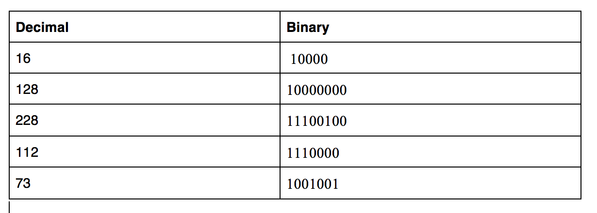
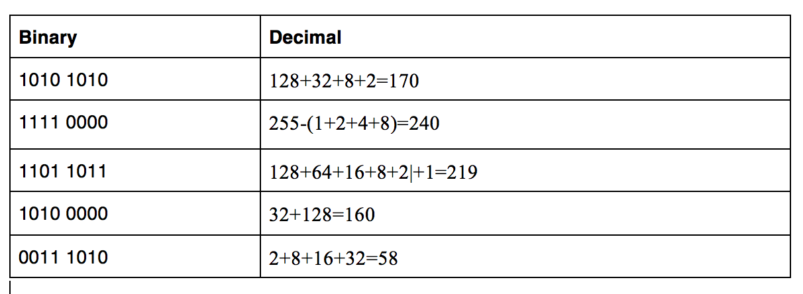
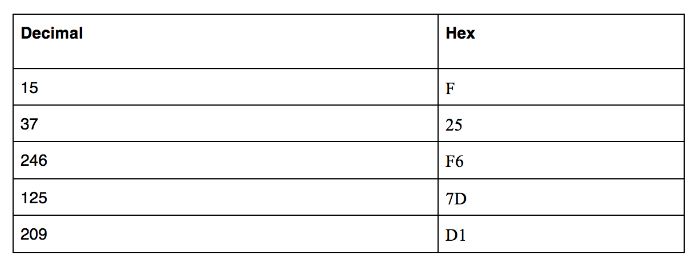
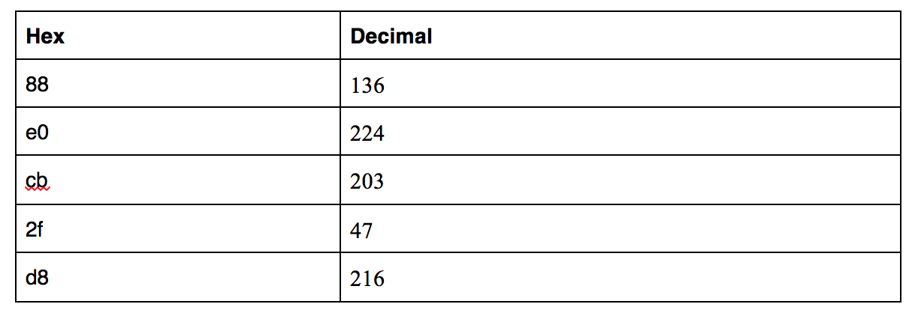

# Counting in Binary & Hex
Learning about Binary, decimal and hexadecimal and how to convert from one to another. 

## Key terminology

- Binary - A Binary Number is made up of only 0s and 1s. A computer can only detect whether or not there is an electrical signal present. When the signal is present, it is represented by 1 and the absence is represented by 0. 
- Bit - A bit is a binary digit, the smallest increment of data on a computer. One physical unit that can contain (or not contain) electricity is called a bit. A bit can hold only one of two values: 0 or 1, corresponding to the electrical values of off or on, respectively.   
- Byte - A byte is a collection of 8 bits. 1 byte = 8 bits; The highest possible decimal value of a byte is 255 (1111 1111).
- Decimal - Decimal system uses numbers from 0-9 i.e. 0, 1, 2, 3, 4, 5, 6, 7, 8, & 9. If you start counting from 0, you eventually run out of symbols to use (at 9), so you have to add another digit (10). Binary works in the same way. The only difference is that you run out of symbols very quickly (at 1), so you have to add a new digit (10) to represent the binary number 2.
- Hexadecimal - The word hexadecimal can be divided into 'Hexa' and 'deci', where 'Hexa' means 6 and 'deci' means 10. The hexadecimal number system is described as a 16 digit number representation of numbers from 0 - 9 and digits from A - F. The 16 digits are 1, 2, 3, 4, 5, 6, 7, 8, 9, A, B, C, D, E, F. Instead of subtracting symbols like in binary, you can also add symbols. Hex is useful because the highest value possible with 2 digits (ff) is 255, which is the same as the highest value of a byte. 
- Base 2, Base 10 and Base 16 - a Base or radix is the number of different digits or combination of digits and letters that a system of counting uses to represent numbers. It is the number of symbols available in a counting system. 
Binary uses base 2, decimal uses base 10, and hexadecimal uses base 16.

### Exercise

Answers to the exercises/conversions are shown in results.

### Sources
- [Bit & Byte explained](https://www.scaleyourapp.com/what-is-a-bit-a-byte-a-deep-dive/)
- [Counting in binary](https://learn.sparkfun.com/tutorials/binary/counting-and-converting)
- [Counting in binary - practical youtube link](https://www.youtube.com/watch?v=gGiEu7QTi68)
- [Decimal number system](https://www.cuemath.com/numbers/decimal-number-system/)
- [Hexadecimal number system](https://www.cuemath.com/numbers/hexadecimal-number-system/)
- [Decimal to hexadecimal conversion tutorial](https://www.youtube.com/watch?v=4um7-QbpAQ8)

### Overcome challanges
I had to learn what is binary, bit, byte, decimal and hexadecimal counting systems. After looking at videos, I was able to do the conversions.

### Results

- Translate the following decimal numbers into binary:

- Translate the following binary numbers into decimal:

- Translate the following decimal numbers into hexadecimal:

- Translate the following hexadecimal numbers into decimal:

