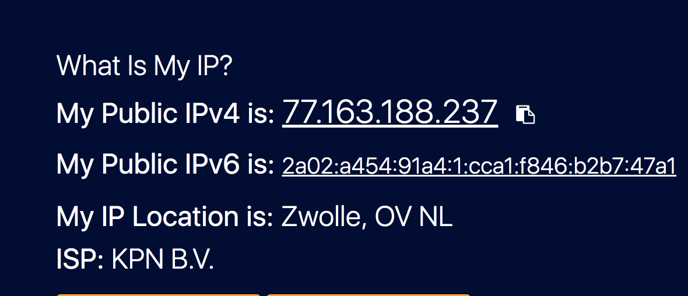

# IP Addresses

An IP address, or Internet Protocol address, is a series of numbers that identifies any device on a network. It is a logical address that can be assigned to a network device. The network devices can then find each other on the network with this IP address. Computers use IP addresses to communicate with each other both over the internet as well as on other networks.

## Key terminology

- IPv4 (Internet Protocol version 4) - comprises four sets of numbers; i.e. 32 bits(4 bytes), each ranging from 0 to 255, which are usually written in decimals. Eg: 104.103.88.45. IPv4 has a theoretical limit of 4.3 billion addresses and the internet has been running out of IPv4 addresses since the 1990s.

- IPv6 (Internet Protocol version 6) - It uses 128-bit addresses formatted as eight groups of four hexadecimal numbers separated by colons. Eg; 2002:0de6:0001:0042:0100:8c2e:0370:7234. The number of addresses possible with IPv6 is very large that it makes possible to have a unique IPv6 address for every device on the internet. 

- DNS (Domain Name System) - The Internet uses DNS to enable people to use words instead of numbers for Internet addresses. You can think of DNS as an Internet address book, mapping domain names to IP addresses.

- Public IP Address - It can be accessed directly over the internet and is assigned to your network router by your internet service provider (ISP). It helps you connect to the internet from inside your network, to outside your network.Your personal device also has a private IP that remains hidden when you connect to the internet through your router’s public IP. Public IP addresses are easily traceable by everyone.

- Private IP Address - A private IP address is the address your network router assigns to your device. Each device within the same network is assigned a unique private IP address. Private IP addresses let devices connected to the same network communicate with one another without connecting to the entire internet. Private IP addresses are traceable, but only by other devices on your local network.

- NAT (network address translation) - It’s a way to map multiple local private addresses to a public one before transferring the information. Organizations that want multiple devices to employ a single IP address use NAT, as do most home routers. NAT keeps track of which connections the devices in your private network make to the public internet and then ensures that data is sent to the correct computers in response. NAT transfers packets of data from public to private addresses.

- DHCP (Dynamic Host Configuration Protocol) - is a protocol that provides quick, automatic, and central management for the distribution of IP addresses within a network. It's also used to configure the subnet mask, default gateway, and DNS server information on the device. A DHCP server issues unique IP addresses and automatically configures other network information. In most homes and small businesses, the router acts as the DHCP server. In large networks, a single computer might take on that role.

- Static addresses - A static IP address is an IP address that was manually configured for a device instead of one that was assigned by a DHCP server. It's called static because it doesn't change. This might be done through the device giving out IP addresses (like the router) or by manually typing the IP address into the device from the device itself.

- Dynamic addresses - Most devices use dynamic IP addresses, which are assigned by the network when they connect and change over time. A dynamic IP address is an IP address that's automatically assigned to each connection, or node, of a network, like your smartphone, desktop PC, or wireless tablet. This automatic assignment of IP addresses is accomplished by what's called a DHCP server. In a local network like in your home or place of business, where you use a private IP address, most devices are probably configured for DHCP, meaning that they're using dynamic IP addresses.

### Exercise

1. Find out what your public IP address is for your laptop and mobile on WiFi. 

2. Are the addresses the same or not? Explain why. 

3. Find out what your private IP address is of your laptop and mobile on WiFi. 

4. Are the addresses the same or not? Explain why. 

5. Change the private IP address of your mobile to that of your laptop. What happens then?

6. Try changing your mobile's private IP address to an address outside your network. What happens then?

### Sources

- [What is an IP Address?](https://www.avast.com/c-what-is-an-ip-address#:~:text=An%20IP%20address%2C%20or%20Internet,well%20as%20on%20other%20networks.)
- [What is NAT?](https://www.comptia.org/content/guides/what-is-network-address-translation)
- [Public and private IPs](https://www.avast.com/c-ip-address-public-vs-private#:~:text=A%20public%20IP%20address%20identifies,a%20unique%20private%20IP%20address.)
- [Static/Dynamic addresses](https://www.lifewire.com/what-is-a-dynamic-ip-address-2625857)

### Overcome challanges
I had to understand what are IP addresses and how they work. I faced challenges in understanding questtions 5 and 6 and I need more learning to solve the problem because I don't see any significant change when I manually change the IP address in my phone.

### Results

1. Find out what your public IP address is for your laptop and mobile on WiFi.
 I found it out by just googling my Public address using the link mentioned below.
https://www.whatismyip.com/

2. Are the addresses the same or not? Explain why. 
Yes, the public IP address of my PC and mobile are the same because all the devices in the home network are connected to the internet via Router(which has only one public IP address) from home. 

Public IP address of my PC and mobile:

3. Find out what your private IP address is of your laptop and mobile on WiFi. 
I found it out by logging in using admin access to my router (same as done in NTW-02). 

4. Are the addresses the same or not? Explain why. 
No, they are not the same. Every device in the local network has been assigned a unique Private IP address by the router which has the public IP address to connect to the internet.

5. Change the private IP address of your mobile to that of your laptop. What happens then?

In the above case, I noticed that while changing private IP address, there were some temporary network glitches with the web browsers I was accessing on my device similar to what happens when the wifi signal is lost for sometime because the router gets confused to which device the packet information should be sent within the network.

6. Try changing your mobile's private IP address to an address outside your network. What happens then?

It was able to connect to outside the network to another public IP address but I was not able to access the internet. 

