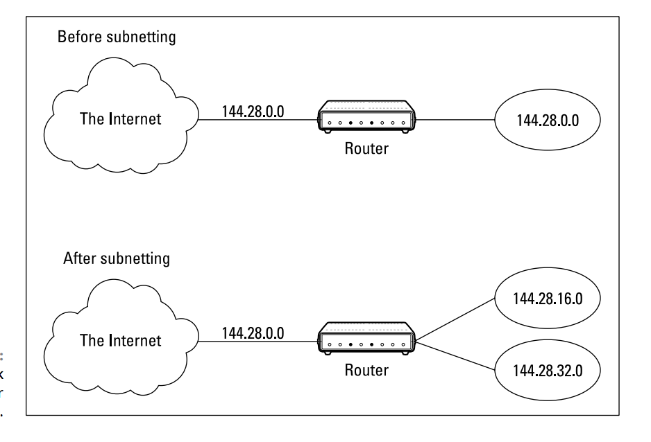
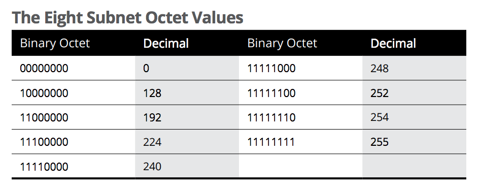
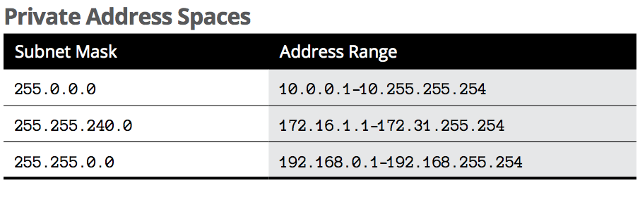
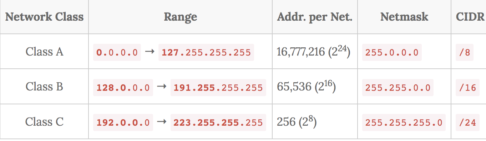
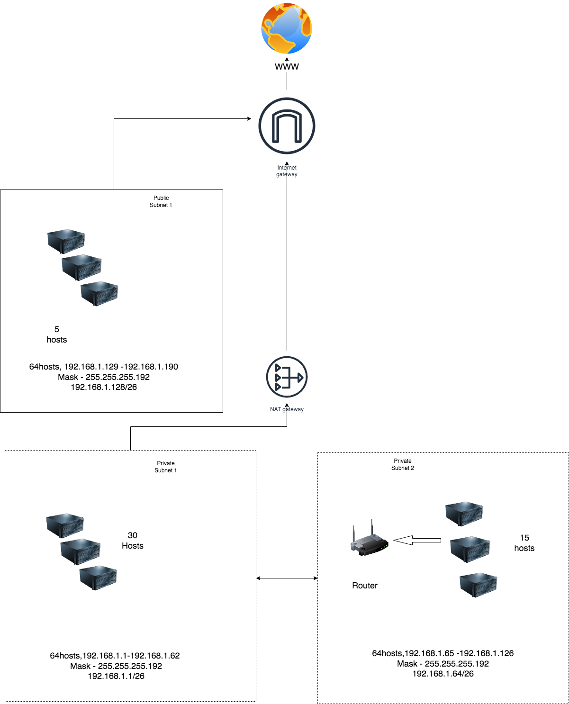

# Subnetting

Subnetting is the strategy used to partition a single physical network into more than one smaller logical sub-networks (subnets) enabling organization, security and efficiency.
Through subnetting, network traffic can travel a shorter distance without passing through unnecessary routers to reach its destination. 

When a network receives data packets from another network, it will sort and route those packets by subnet so that the packets do not take an inefficient route to their destination.

For example, a 20-bit subnet mask would be represented as 
255.255.240.0:
Subnet mask: 11111111 11111111 11110000 00000000
255 . 255 . 240 . 0

Few restrictions placed on subnet mask are:

» The minimum number of network ID bits is eight. As a result, the first octet of a subnet mask is always 255.

» The maximum number of network ID bits is 30. You have to leave at least two bits for the host ID portion of the address, to allow for at least two hosts. If you used all 32 bits for the network ID, that would leave no bits for the host ID. Obviously, that doesn’t work. Leaving just one bit for the host ID doesn’t work, either. That’s because a host ID of all ones is reserved for a broadcast address — and all zeros refers to the network itself. Thus, if you used 31 bits
for the network ID and left only one for the host ID, host ID 1 would be used for the broadcast address and host ID 0 would be the network itself, leaving no room for actual hosts. That’s why the maximum network ID size is 30 bits.

» Because the network ID is always composed of consecutive bits set to 1, only nine values are possible for each octet of a subnet mask (including counting 0). For your reference, these values are listed below:

## Key terminology

- LAN (local area network) - A network is a group of two or more connected computers, and a LAN is a network contained within a small geographic area, usually within the same building. Home WiFi networks and small business networks are common examples of LANs. LANs can also be fairly large, although if they take up multiple buildings, it is usually more accurate to classify them as wide area networks (WAN) or metropolitan area networks (MAN).

- Internet gateway — An Internet gateway is a network "node" that connects two different networks that use different protocols (rules) for communicating and send data back and forth with each other. Routers are often Internet gateways. If your Internet gateway is a computer server, which is more likely in an office or business situation, it acts as a firewall keeping away unwanted traffic out of a private network

- NAT Gateways - A NAT gateway is a Network Address Translation (NAT) service. It enables instances where private subnet can connect to internet but prevents the internet from initiating a connection with those instances.

- Public subnet and private subnet - If a subnet is associated with a route table that has a route to an internet gateway, it's known as a public subnet. Contrast that with a private subnet which, if it needs to talk to the internet, must do so through a Network Address Translation (NAT) gateway. If you run a wireless router, the router itself does network address translation. Importantly a NAT won’t allow inbound traffic from the internet — that’s what makes a private subnet, a private one.

- Subnet mask - A subnet mask is like an IP address, but for only internal usage within a network. Routers use subnet masks to route data packets to the right place. Subnet masks are not indicated within data packets traversing the Internet — those packets only indicate the destination IP address, which a router will match with a subnet.

- Virtual private cloud (VPC) - A virtual isolated network dedicated to AWS account.

- Route table — A set of rules, called routes, that are used to determine where network traffic is directed.

- Octet - Each of the decimal numbers in an IP address is called an octet. The term octet is just a vendor-neutral term instead of byte. So, for an IP address of 168.1.1.1, the first octet is 168, the second octet is 1, and so on. The range of decimal numbers numbers in each octet is between 0 and 255,

- CIDR notation( Classless Inter-Domain Routing) notation is a compact method for specifying IP addresses and their routing suffixes.

For example, we can express the idea that the IP address 192.168.0.1 is associated with the netmask 255.255.255.0 by using the CIDR notation of 192.168.0.1/24, where 24 represents the number of network bits in the IP address (IPv4 address has 32 bits, so the network can be between 0 and 32).

- Subnet calculator - The subnet calculator is a handy tool for finding the number of possible subnets for any given network address block. You can choose the combination of subnets and number of hosts per subnet that suits your network and get the host address range and broadcast address for any given subnet mask.

- Network Classes - Currently, there are three classes of TCP/IP networks based on the leading four address bits.

Classes A, B, and C had provided unicast addresses for networks of three different network sizes

### Exercise

1. Create a network architecture that meets the following requirements:
-	1 private subnet that can only be reached from within the LAN. This subnet must be able to accommodate at least 15 hosts.
-	1 private subnet that has internet access through a NAT gateway. This subnet must be able to place at least 30 hosts (the 30 hosts does not include the NAT gateway).
-	1 public subnet with an internet gateway. This subnet must be able to place at least 5 hosts (the 5 hosts is excluding the internet gateway).

2. Post the architecture you created, including a short explanation, in the Github repository you shared with the learning coach.

### Sources

-[Networking explained](https://www.youtube.com/channel/UC9x0AN7BWHpCDHSm9NiJFJQ)

- [Networking explained](https://www.youtube.com/results?search_query=Beer%3A30+-+Network+Architecture)

- [Networking explained](https://edu.anarcho-copy.org/TCP%20IP%20-%20Network/Networking%20For%20Dummies.pdf)  ---> Great resource referred by a teammate to understand subnetting and subnet masking!

- [What is subnetting and why to subnet?](https://www.youtube.com/watch?v=-yz3FV8WliU&t=9s)

- [Subnetting and it's working explained](https://www.cloudflare.com/en-gb/learning/network-layer/what-is-a-subnet/)

- [LAN](https://www.cloudflare.com/learning/network-layer/what-is-a-lan/)

- [NAT Gateways](https://docs.aws.amazon.com/vpc/latest/userguide/vpc-nat-gateway.html)

- [What’s the Difference Between a Public and Private Subnet](https://chrisguitarguy.com/2017/09/28/public-private-subnet-differences-aws-vpc/)

-  [What’s the Difference Between a Public and Private Subnet 2](https://www.avast.com/c-ip-address-public-vs-private)

- [Basic components of VPC](https://www.1cloudhub.com/aws-vpc-101-creation-of-public-subnet-and-private-subnet-in-vpc-and-test-connectivity/)

- [Subnet calculator](https://www.subnet-calculator.com/)

- [CIDR notation and network class](https://www.shellhacks.com/cidr-notation-explained-examples/)

- [Subnet calculator](https://www.subnet-calculator.com/)

- [Subnet/cidr calculator](https://cidr.xyz/)

- [Subnet mask cheatsheet](https://dnsmadeeasy.com/support/subnet)

### Overcome challanges

1. Firstly, I had to learn what is subnetting and how IP addresses are assigned to each.
2. How the subnets function and what is needed if a private subnet requires access to the internet(NAT).
3. Initially i understood that public subnets can have only public IP to access internet but later figured out that every device within the network will be using a private IP address.
4. Learnt to understand the subnet and CIDR calculations.
5. Learnt what each corter in an IP address mean and how it can be distinguised under different network classes.

Extensive learning involved in this particular exercise. Thanks to my learning coaches and fellow teammates, I am able to have a better understanding of how subnetting works :)

### Results

Within a network, each device will be using a private IP address, whether it is a private or public subnet. Only when a certain resource requires access to the internet, we put it inside a public subnet and attach an internet gateway to it.

- Creating network architure using different cidr prefix:

Based on the number of hosts required for each subn, I used different cidr prefixes to get the desired host count in the subnets.

- Creating network architure using same cidr prefix:

According to my understanding, we can adapt different strategies while creating subnets. In the network architecture 2 shown below; I tried to experiment using the same cidr prefix ( /26)  so that I get 4 subnets with 64 ip address in each of them.

