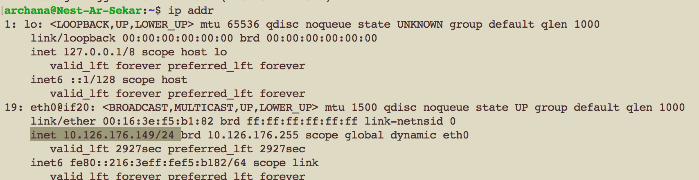

# Network detection

Network detection is the practice of analyzing the entirety of a security ecosystem to identify any malicious activity that could compromise the network. In order to prevent or stop attacks on a network, you must be able to analyse your network. If a threat is detected, then mitigation efforts must be enacted to properly neutralize the threat before it can exploit any present vulnerabilities.

Nmap (Network Mapper) is a tool that scans a network to find information about it. For example, what ports are open in a host in your network.

Wireshark is a protocol analyzer. It looks at network traffic and shows information about packets like protocol and destination (among other things).

## Key terminology

- sudo apt  install nmap - to install nmap in linux
- ip addr - to view IP address of your computer
- sudo nmap -sP (IP address) - to scan the network to view all the connected hosts
or sudo nmap -sn (IP address - scans the list of all the devices connected to the network, together with their IP address
- sudo nmap -v (IP address) - to scan network to view open ports
- sudo nmap -sV (IP address) - This command allows the user to check the services run on the target
- sudo nmap -p (port) (IP address) - to scan for port
 
### Exercise

1. Scan the network of your Linux machine using nmap. What do you find?
2. Open Wireshark in Windows/MacOS Machine. Analyse what happens when you open an internet browser. (Tip: you will find that Zoom is constantly sending packets over the network. You can either turn off Zoom for a minute, or look for the packets sent by the browser between the packets sent by Zoom.)

### Sources

- [Network detection and response](https://www.vectra.ai/learning/ndr)
- [Threat detection](https://www.rapid7.com/fundamentals/threat-detection/)
- [Finding devices connected to your network using nmap](https://vitux.com/find-devices-connected-to-your-network-with-nmap/)
- [nmap on linux](https://www.howtoforge.com/tutorial/nmap-on-linux/)

### Overcome challanges
I had to learn what is network detection and what are it's threats. I also learnt about nmap scanning.

### Results

1. - Installing nmap in linux

- Searching ip address for scanning

- list of all the devices connected to the network using nmap 
The output shows that 13 devices are connected to the network.

2. I refreshed my browser window and I noticed that wireshark was capturing the ongoing network traffic. 

