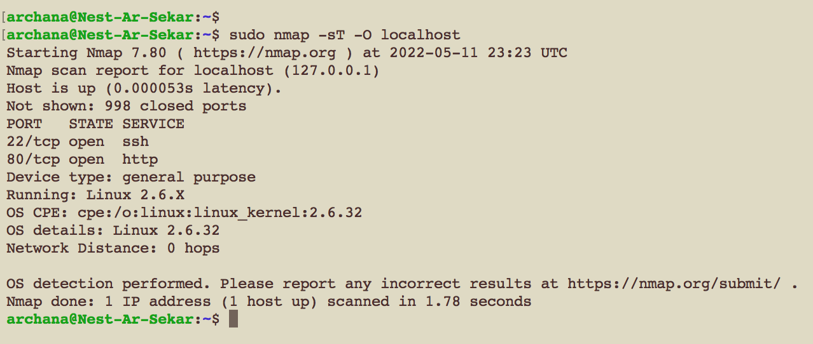
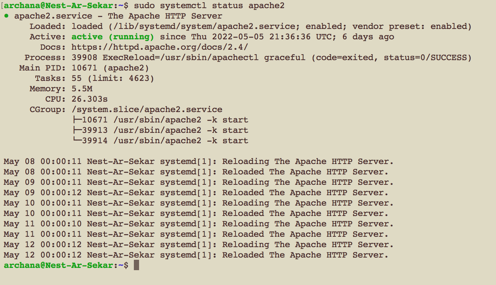
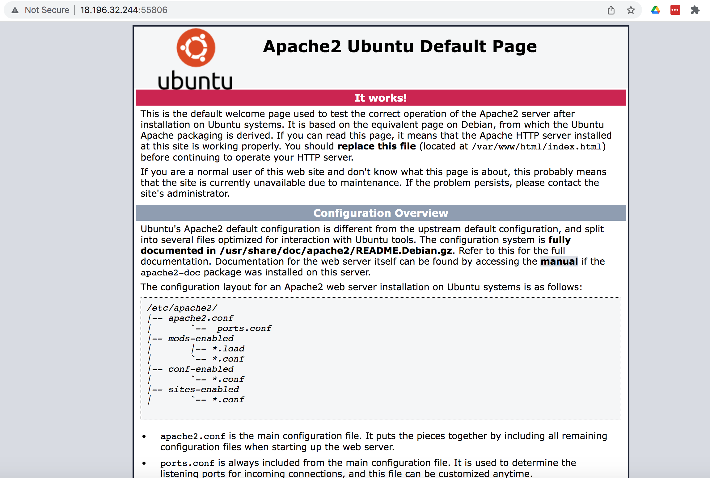
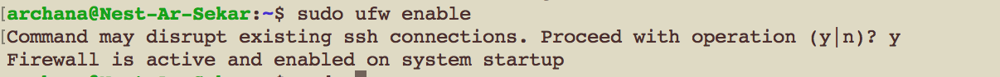
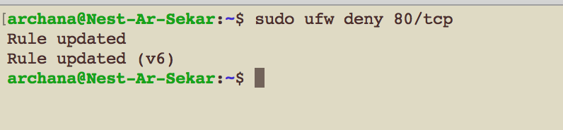
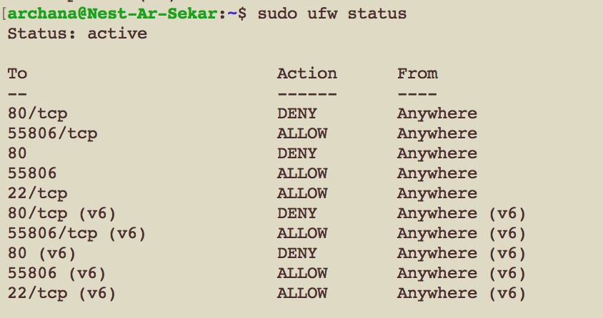
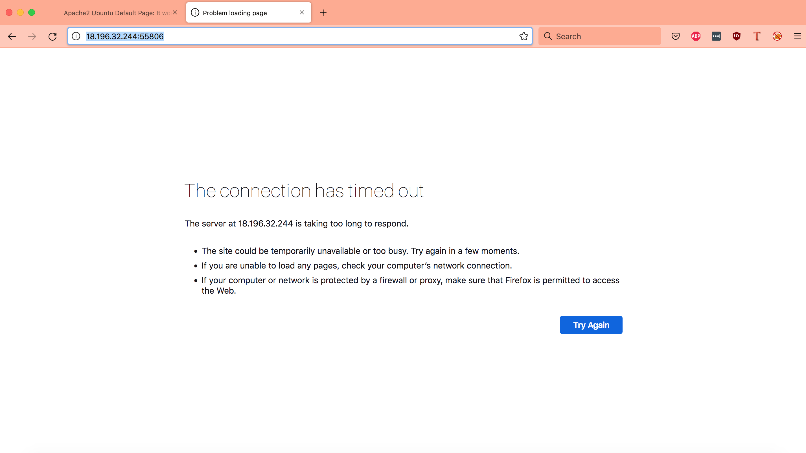

# Firewalls

A firewall is a network security device that monitors incoming and outgoing network traffic and permits or blocks data packets based on a set of security rules. Its purpose is to establish a barrier between your internal network and incoming traffic from external sources (such as the internet) in order to block malicious traffic like viruses and hackers. Firewalls filter network traffic. A firewall can filter this traffic by protocol, port number, source and destination of a packet.

Types of firewalls:

Firewalls can either be software or hardware, though it’s best to have both. A software firewall is a program installed on each computer and regulates traffic through port numbers and applications, while a physical firewall is a piece of equipment installed between your network and gateway.

## Key terminology

- port - Firewalls guard traffic at a computer’s entry point, called ports, which is where information is exchanged with external devices. The state of a port is either open, filtered, closed, or unfiltered. A port is said to be open if an application on the target machine is listening for connections/packets on that port.

- Established/listen port - Both are opened ports but one is waiting for a connection to be made while the other has a connection already made. In the following case, The HTTP protocol (typically port 80) is on LISTEN mode until somebody actually goes to the server. The moment somebody visits the page, then it will be in ESTABLISHED mode.

- ufw - It is the default firewall tool for Ubuntu 

- Packet-filtering firewalls - the most common type of firewall, examine packets and prohibit them from passing through if they don’t match an established security rule set. This type of firewall checks the packet’s source and destination IP addresses. If packets match those of an “allowed” rule on the firewall, then it is trusted to enter the network.
Packet-filtering firewalls are divided into two categories: stateful and stateless.

- Stateless firewalls - Stateless firewalls examine packets independently of one another and lack context, making them easy targets for hackers.

- Stateful firewalls - In contrast, stateful firewalls remember information about previously passed packets and are considered much more secure.

- sudo nmap -n -PN -sT -sU -p- localhost or sudo nmap -sT -O localhost - Either of these commands can be used to find the unique port number for http traffic.

- sudo systemctl status apache2 - To check the status of apache2, whether it is active and running.

### Exercise

1. Install a web server on your VM.

2. View the default page installed with the web server.

3. Set the firewall to block web traffic, but allow ssh traffic.

4. Check if the firewall is doing its job.
### Sources

- [Firewalls explained](https://www.forcepoint.com/cyber-edu/firewall)

- [Finding listening ports in linux](https://www.tecmint.com/find-listening-ports-linux/)

- [Finding open ports in linux using nmap](https://www.linuxandubuntu.com/home/what-are-ports-how-to-find-open-ports-in-linux)

- [Installing apache](https://ubuntu.com/tutorials/install-and-configure-apache#2-installing-apache)

- [FAllow or deny a port UFW](https://my.esecuredata.com/index.php?/knowledgebase/article/7/allow-or-deny-a-port-ufw-ubuntu)

### Overcome challanges

1. I had to learn what are firewalls and the different types of ports.

2. Then while trying to view the default page installed with the web server, I realized that I had to use the web port number to use web applications instead of the SSH-port to check if it's working.

3. I also learnt that I had to deny port 80 for tcp protocol which is the unique port number for http traffic instead of port 80 to block web traffic. 
### Results

1. Install a web server on your VM and 2. View the default page installed with the web server.

- Finding my unique port number for http traffic:

- Apache2 was installed earlier so to check the status of already installed Apache2, I followed the path below:

- Viewing the Apache2 server's default page hosted on my virtual machine with web browser. It shows Apache2 server works on my local machine:

3. Set the firewall to block web traffic, but allow ssh traffic.

- Enabling firewall:

- Denying port 80 for tcp protocol:

- fire wall status after denying port 80:

4. Check if the firewall is doing its job.
Yes, the connection was timed out after blocking the port in firewall as shown below:

