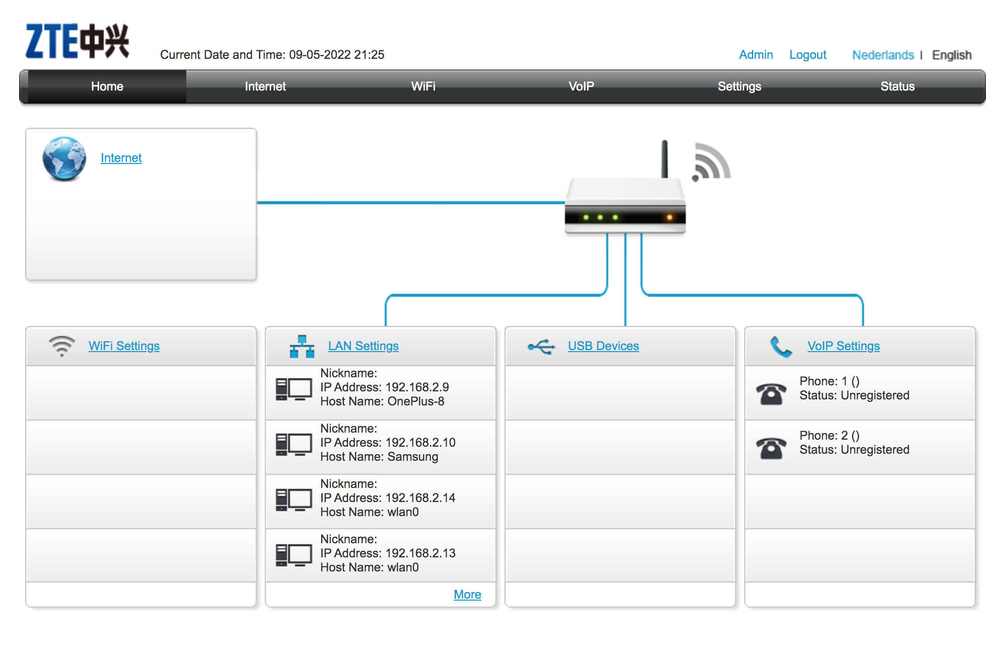
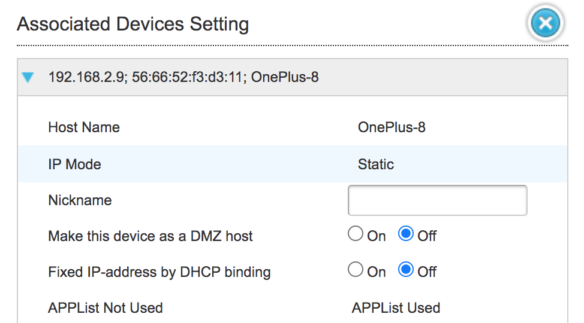
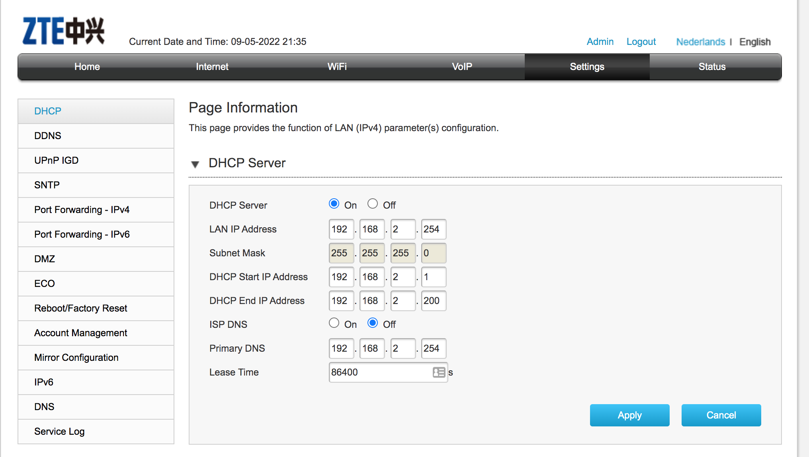

# Subnetting
Subnetting is the strategy used to partition a single physical network into more than one smaller logical sub-networks (subnets).

## Key terminology

- 
### Exercise
1. Create a network architecture that meets the following requirements:
-	1 private subnet that can only be reached from within the LAN. This subnet must be able to accommodate at least 15 hosts.
-	1 private subnet that has internet access through a NAT gateway. This subnet must be able to place at least 30 hosts (the 30 hosts does not include the NAT gateway).
-	1 public subnet with an internet gateway. This subnet must be able to place at least 5 hosts (the 5 hosts is excluding the internet gateway).

2. Post the architecture you created, including a short explanation, in the Github repository you shared with the learning coach.

### Sources
- [What is subnetting and why to subnet?](https://www.youtube.com/watch?v=-yz3FV8WliU&t=9s)
- [Network Devices Explained](https://www.youtube.com/watch?v=eMamgWllRFY)
- [DHCP server](https://docs.microsoft.com/en-us/windows-server/networking/technologies/dhcp/dhcp-top)
- [How to view the connected device information?](https://consumer.huawei.com/sa-en/support/content/en-us00728122/)
- [How to access my home(KPN) router](https://forum.kpn.com/internet-9/inloggen-op-experia-box-v10a-506872#:~:text=Start%20een%20browser%20zoals%20Internet,een%20nieuw%20wachtwoord%20aangemaakt%20worden.)

### Overcome challanges
For exercise 2, To had to access my home router, I had to find my internet provider (KPN in this case), then based on the instructions from KPN, I learnt that i could access the router following this IP address ==> (http://192.168.2.254/ ).

For exercise 3, I learnt that I can get the DHCP server settings in the Admin page of my home router.

### Results

- List of connected devices to my router:

- Other information about a connected device:

- DHCP server and configurations:

