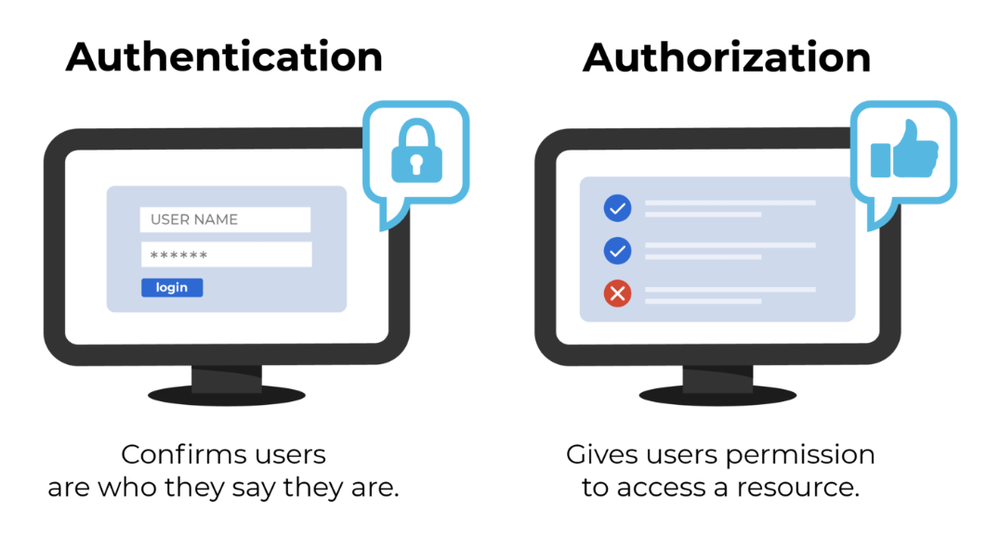
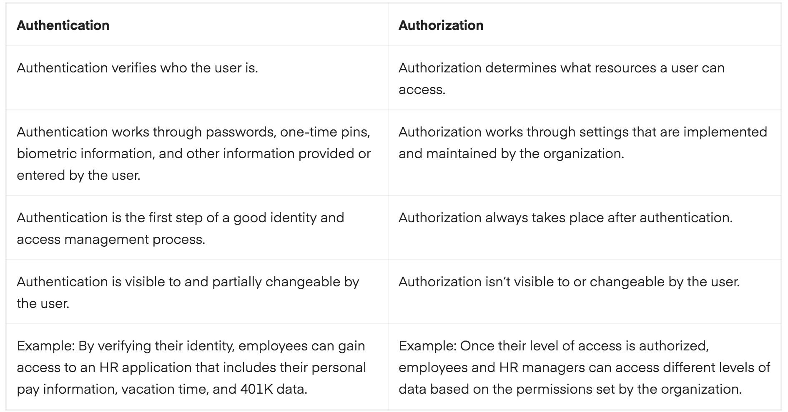

# Identity and Access Management (IAM)

This exercise is learning about IAM, Authentication and Authorization and understanding its differences and functionality.

Identity and Access Management (IAM):

This ensures that the right people and entities with digital identities have the right level of access to business resources, such as networks and databases. User roles and access rights are defined and managed via an IAM system. With an IAM solution, IT administrators can securely and effectively manage users' digital identities and related access rights. Administrators can set and customize user roles, track and report user activity, and enforce corporate and regulatory compliance policies to ensure data security and privacy.

## Key terminology

- Authentication: It is the act of validating that users are whom they claim to be. This is the first step in any security process. 

Complete an authentication process with:
1. Passwords: Usernames and passwords are the most common authentication factors. If a user enters the correct data, the system assumes the identity is valid and grants access.
2. One-time pins: Grant access for only one session or transaction.
3. Authentication apps: Generate security codes via an outside party that grants access.
4. Biometrics: A user presents a fingerprint or eye scan to gain access to the system. 

In some instances, systems require the successful verification of more than one factor before granting access. This multi-factor authentication (MFA) requirement is often deployed to increase security beyond what passwords alone can provide.

Authorization : Authorization in system security is the process of giving the user permission to access a specific resource or function. This term is often used interchangeably with access control or client privilege. Giving someone permission to download a particular file on a server or providing individual users with administrative access to an application are good examples of authorization. In secure environments, authorization must always follow authentication. Users should first prove that their identities are genuine before an organization’s administrators grant them access to the requested resources.

- Multi-Factor Authentication (MFA) : It is an authentication method that requires the user to provide two or more verification factors to gain access to a resource such as an application, online account, or a VPN. MFA is a core component of a strong identity and access management (IAM) policy. Rather than just asking for a username and password, MFA requires one or more additional verification factors, which decreases the likelihood of a successful cyber attack.  

- Principle of least privilege (POLP) : The principle of least privilege is the idea that at any user, program, or process should have only the bare minimum privileges necessary to perform its function. It refers to an information security concept in which a user is given the minimum levels of access – or permissions – needed to perform his/her job functions. It is widely considered to be a cybersecurity best practice and is a fundamental step in protecting privileged access to high-value data and assets. Least privilege extends beyond human access. The model can be applied to applications, systems or connected devices that require privileges or permissions to perform a required task.
For example, a user account created for pulling records from a database doesn’t need admin rights, while a programmer whose main function is updating lines of legacy code doesn’t need access to financial records. 

### Exercise

1. The difference between authentication and authorization.
2. The three factors of authentication and how MFA improves security.
3. What the principle of least privilege is and how it improves security.

### Sources

- [Authentication and Authorization explained](https://www.okta.com/identity-101/authentication-vs-authorization/)

- [IAM explained](https://www.cisco.com/c/nl_nl/products/security/identity-services-engine/what-is-identity-access-management.html)

- [Authentication vs Authorization](https://www.sailpoint.com/identity-library/difference-between-authentication-and-authorization/#:~:text=Simply%20put%2C%20authentication%20is%20the,a%20user%20has%20access%20to.)

- [Multi factor authentication (MFA) explained](https://www.onelogin.com/learn/what-is-mfa)

- [Principle of least privilege (POLP) explained](https://digitalguardian.com/blog/what-principle-least-privilege-polp-best-practice-information-security-and-compliance)

- [Principle of least privilege (POLP) explained](https://www.cyberark.com/what-is/least-privilege/)

### Overcome challanges

1. Firstly, I had to learn the concept of IAM, Authorization and Authentication.
2. Then, I understood its differences.
3. Learnt how security can be improved with MFA and POLP.

### Results

1. Authentication vs Authorization:

Authentication is the process of verifying who someone is, whereas authorization is the process of verifying what specific applications, files, and data a user has access to.

2. Three Main Types of MFA Authentication Methods and how it improves security:

While user identity has historically been validated using the combination of a username and password, today’s authentication methods commonly rely upon three classes of information:

- What you know: Most commonly, this is a password. But it can also be an answer to a security question or a one-time pin that grants user access to just one session or transaction. 
- What you possess: This could be a mobile device or app, a security token, or digital ID card.
- What you are: This is biometric data such as a fingerprint, retinal scan, or facial recognition.

The main benefit of MFA is it will enhance your organization's security by requiring your users to identify themselves by more than a username and password. While important, usernames and passwords are vulnerable to brute force attacks and can be stolen by third parties. Enforcing the use of an MFA factor like a thumbprint or physical hardware key means increased confidence that your organization will stay safe from cyber criminals. MFA works by requiring additional verification information (factors). One of the most common MFA factors that users encounter are one-time passwords (OTP).

3. POLP improves security by allowing only enough access to perform the required job. In an IT environment, adhering to the principle of least privilege reduces the risk of attackers gaining access to critical systems or sensitive data by compromising a low-level user account, device, or application. Implementing the POLP helps contain compromises to their area of origin, stopping them from spreading to the system at large. (Refer to Key terminologies for more explanation on POLP)

