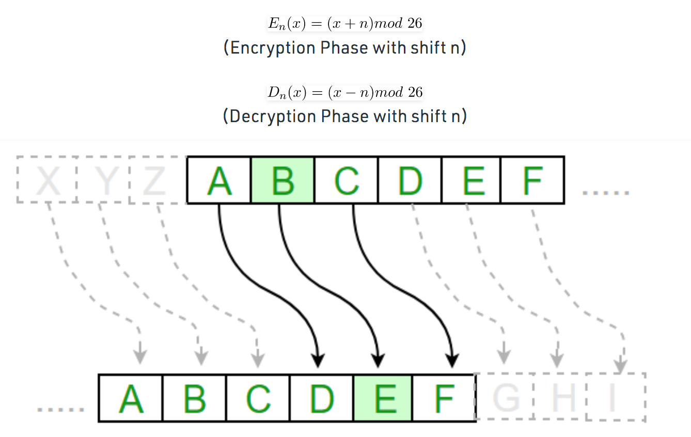

# Symmetric Encryption  

This exercise helps in understanding what is encryption and the basis of cryptography followed by symmetric encryption.

## Key terminology

- Cryptography - Cryptography is the science of concealing messages using secret codes. The objective of cryptography is to provide methods to protect information and secure communications through encryption and related techniques. So, cryptography is the study of concepts like encryption, whereas encryption is a technique used to conceal messages using algorithms.

- Encryption - Encryption is a fundamental application of cryptography which encodes a message with an algorithm. Encryption uses an algorithm to encrypt the data and a secret key to decrypt it. It is a way of scrambling data so that only authorized parties can understand the information. Encryption scrambles plain text into a type of secret code that hackers, cybercriminals, and other online snoops can't read, even if they intercept it before it reaches its intended recipients. When the message does get to its recipients, they have their own key to unscramble the information back into plain, readable text. 

- Encryption key - An encryption key is a series of numbers used to encrypt and decrypt data. Encryption keys are created with algorithms. Each key is random and unique. 

- ciphertext - Encryption takes plain text, like a text message or email, and scrambles it into an unreadable format — called “cipher text.” In other words, it is the process of converting human-readable plaintext to incomprehensible text. This helps protect the confidentiality of digital data either stored on computer systems or transmitted  through a network like the Internet. 

- Decryption - When the intended recipient accesses the message, the information is translated back to its original form. This is called decryption. To unlock the message, both the sender and the recipient have to use a “secret” encryption key.

- Symmetric encryption - Symmetric encryption uses a single password to encrypt and decrypt data. So, there is only one key, and all communicating parties use the same (secret) key for both encryption and decryption.       

- Caesar cipher - The Caesar Cipher technique is one of the earliest and simplest method of encryption technique. It’s simply a type of substitution cipher, i.e., each letter of a given text is replaced by a letter some fixed number of positions down the alphabet. For example with a shift of 1, A would be replaced by B, B would become C, and so on. The method is apparently named after Julius Caesar, who apparently used it to communicate with his officials. Thus to cipher a given text we need an integer value, known as shift which indicates the number of position each letter of the text has been moved down. 
The encryption can be represented using modular arithmetic by first transforming the letters into numbers, according to the scheme, A = 0, B = 1,…, Z = 25. Encryption of a letter by a shift n can be described mathematically as. 

- Monoalphabetic Ciphers - A cipher that uses a single alphabet and is usually a simple transposition. For example, the the letter A will be represented by the letter F. These are easily cracked. Caesar cipher is an example of Monoalphabetic cipher.

- Polyalphabetic Ciphers - This is a transpositional cipher, but unlike the monoalphabetic ciphers, more than one alphabet is used. Polyalphabetic ciphers allow the use of many alphabets during encryption, which greatly increases the key space of the ciphertext. There are signals embedded in the ciphertext which tell the recipient when the alphabet has changed. Some examples of Polyalphabetic ciphers are Alberti cipher and Vigenère cipher

### Exercise

1. Find two more historic ciphers besides the Caesar cipher.
2. Find two digital ciphers that are being used today.
3. Send a symmetrically encrypted message to one of your peers via the public Slack channel. They should be able to decrypt the message using a key you share with them. Try to think of a way to share this encryption key without revealing it to everyone. 
You are not allowed to use any private messages or other communication channels besides Slack. Analyse the shortcomings of this method.

### Sources

- [Encryption explained](https://us.norton.com/internetsecurity-privacy-what-is-encryption.html)

- [Encryption and cryptography](http://www.differencebetween.net/technology/difference-between-encryption-and-cryptography/)

- [Caesar cipher](https://www.geeksforgeeks.org/caesar-cipher-in-cryptography/)

- [Famous codes and ciphers through history and their role in modern encryption](https://www.comparitech.com/blog/information-security/famous-codes-and-ciphers-through-history-and-their-role-in-modern-encryption/#:~:text=Vigen%C3%A8re%20%E2%80%93%201553&text=This%20is%20one%20of%20the,use%20for%20over%20three%20centuries.)

- [Advanced Encryption Standard (AES)](https://www.geeksforgeeks.org/advanced-encryption-standard-aes/)

- [Public Key Cryptography - Computerphile](https://www.youtube.com/watch?v=GSIDS_lvRv4)

### Overcome challanges

1. I had to learn the meaning of cryption, encryption and different types to understand how the process works.

2. I also learnt some of the interesting methods of encryption used in the past and present.

### Results

1.  Some more historic ciphers used in olden times:

- Vigenère – 1553 - 

Originally described by Giovan Bellaso in 1553, the Vigenère cipher has been recreated a few times, most recently by Blaise de Vigenère in the 19th century. This is one of the first polyalphabetic ciphers. It is still symmetrical in nature, but it was tough enough to crack that it remained in use for over three centuries.

Polyalphabetic ciphers allow the use of many alphabets during encryption, which greatly increases the key space of the ciphertext. Earlier versions of polyalphabetic ciphers required rigid adherence to the spots at which the alphabet would change. Bellaso’s implementation of this cipher allowed the sender to change alphabets at arbitrary spots in the encryption process. The signal of an alphabet change had to be agreed upon in advance between the sender and receiver, therefore this is still a symmetrical method of encryption.

- One time pads (OTP) – 1882

A One Time Pad (OTP) refers to a symmetric encryption system using keys that are changed with every single message. If the keys truly are one time, then ciphertext would be extremely resistant to cryptanalysis. These keys were literally written on pads of paper originally and since each key is only used once, the name One Time Pad stuck.

In practice, OTP is hard to deploy properly. As a symmetrical system, it requires the sender and all the recipients to have the same OTP book. It also has a significant disadvantage in that a message cannot be longer than the pad in use. If it were, then parts of the pad would have to be re-used, which significantly weakens the ciphertext to cryptanalysis. OTPs are still in use today in some militaries for quick, tactical field messages.

- Engima – 1914

Created by German citizen Arthur Scherbius after WW1 for commercial purposes, the Enigma machine is a polyalphabetic stream cipher machine. The machine consisted of a keyboard, a light panel and some adjustable rotors. Operators would set the position of the rotors and then type a message on the keypad. As each letter was typed, a corresponding letter would illuminate on the light pad. This was the encrypted letter that formed the ciphertext. Receivers would have to know the correct rotors settings to use, and then they perform the same process. However, as the receiver typed in each letter of ciphertext, the corresponding letter that would illuminate would be the plaintext letter.

2. Two digital ciphers that are being widely used today:

- The Advanced Encryption System (AES)

It is the current encryption standard for most government and private sector IT security purposes. AES uses a symmetric algorithm, which means the same key is applied for both encryption and decryption. AES is a block cipher. The algorithm provides 128-bit block encryption and has been designed to supports key sizes of 128, 192 and 256 bits. AES 256-bit encryption is the strongest and most robust encryption standard that is commercially available today. While it is theoretically true that AES 256-bit encryption is harder to crack than AES 128-bit encryption, AES 128-bit encryption has never been cracked.

- RSA (Rivest, Shamir, Adleman) 

The Rivest-Shamir-Adleman (RSA) encryption algorithm is an asymmetric encryption algorithm that is widely used in many products and services. Asymmetric encryption uses a key pair that is mathematically linked to encrypt and decrypt data. A private and public key are created, with the public key being accessible to anyone and the private key being a secret known only by the key pair creator. With RSA, either the private or public key can encrypt the data, while the other key decrypts it. This is one of the reasons RSA is the most used asymmetric encryption algorithm.

- Public Key Cryptography

Public Key Cryptography is an asymmetrical system in wide use today by people and computers alike. The key used to encrypt data but not decrypt it is called the public key. Every recipient has their own public key which is made widely available. Senders must use the public key of the intended recipient to encode the message. Then the recipient can use their companion secret key called the private key to decrypt the message. RSA is the underlying cipher used in Public Key cryptography. 

3. Symmetric encryption calls for  giving the key to decrypt a message in person with a piece of paper. This was practised in olden times and it's not a secure method. This exercise asks for sharing the key in a public channel which may increase the possibility for anyone to decrypt the message in the group to decrypt the message if they knew the username. So this is not a ideal way to share an encrypted message. 

