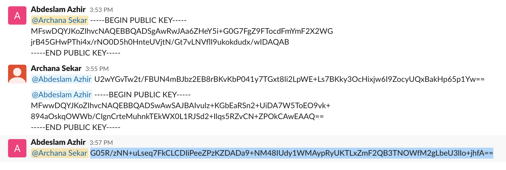
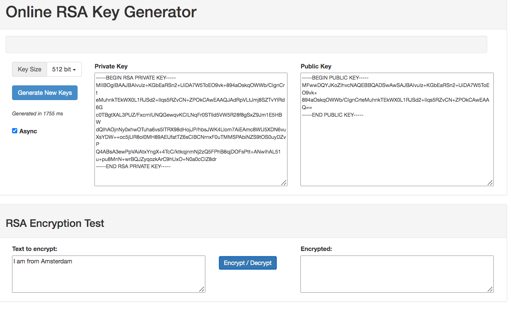

# Asymmetric encryption

Asymmetric Encryption uses two distinct, yet related keys. One key, the Public Key, is used for encryption and the other, the Private Key, is for decryption. As implied in the name, the Private Key is intended to be private so that only the authenticated recipient can decrypt the message whereas the public key may be known to others. The main difference between a symmetric encryption and asymmetric encryption is that asymmetric encryption consists of a public and private key; where the private key does not have to be shared with anyone and only the public key is shared to encrypt the message. This eliminates security threats. 

## Key terminology

Explained above.
### Exercise

1. Generate a key pair.

2. Send an asymmetrically encrypted message to one of your peers via the public Slack channel. They should be able to decrypt the message using a key you share with them. The recipient should be able to read the message, but it should remain a secret to everyone else.
You are not allowed to use any private messages or other communication channels besides Slack. Analyse the difference between this method and symmetric encryption.

### Sources

- [Asymmetric Encryption](https://cheapsslsecurity.com/blog/what-is-asymmetric-encryption-understand-with-simple-examples/)

- [Online RSA Key Generator](https://travistidwell.com/jsencrypt/demo/)

- [Public Key Cryptography - Computerphile](https://www.youtube.com/watch?v=GSIDS_lvRv4)

- [Pubic key encryption explained](https://www.cloudflare.com/learning/ssl/how-does-public-key-encryption-work/)

- [FAllow or deny a port UFW](https://my.esecuredata.com/index.php?/knowledgebase/article/7/allow-or-deny-a-port-ufw-ubuntu)

### Overcome challanges

1.
### Results

1. These are the steps i followed to send an asymmetric encrypted message to my teammate.  

My teammate Abd, shared his public key with me on a public channel(Slack). Using this public key, I encrypted my message and shared it with him again on Slack. Then Abd, decrypted my message for him on his computer.  

Since I encrypted my message based on my private key and Abd's public key, he was able to encrypt the message with his private key and my public key. Despite posting it in a public channel like slack, none of my teammates could guess because others dont know the private keys we used to decrypt it.

