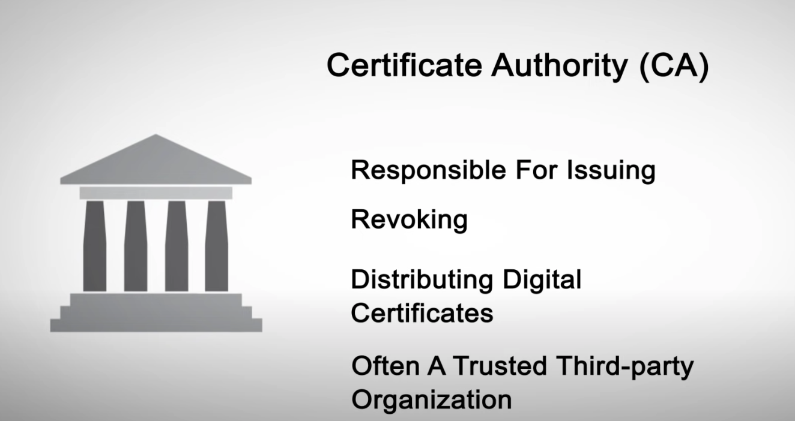
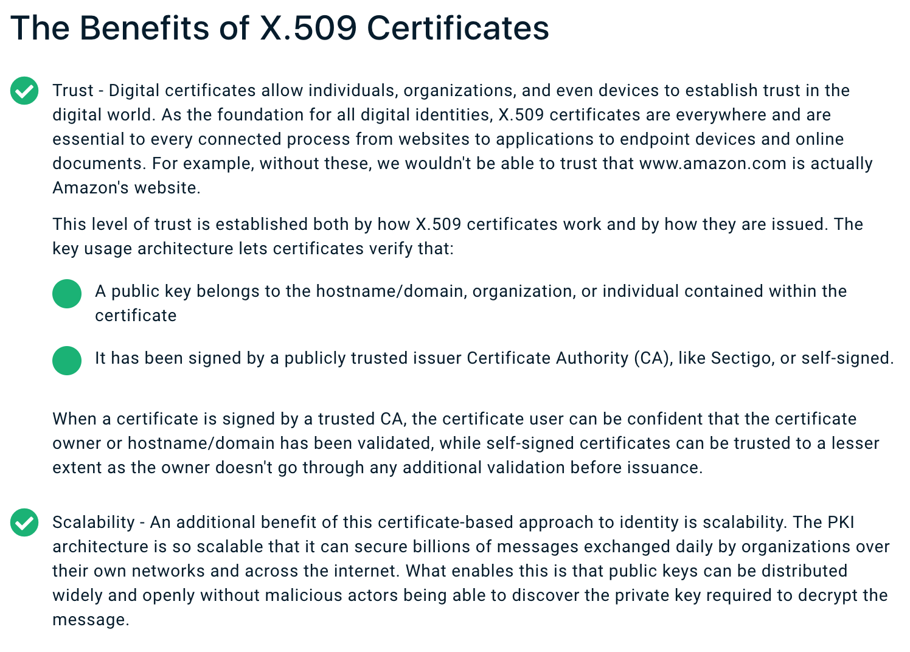
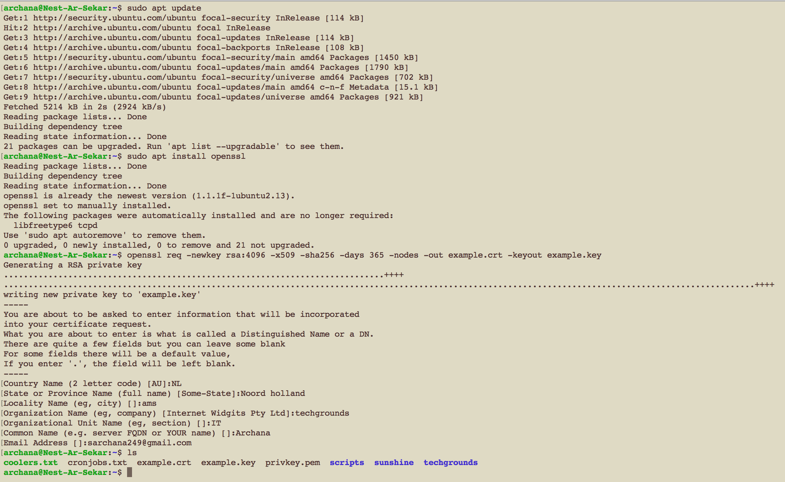
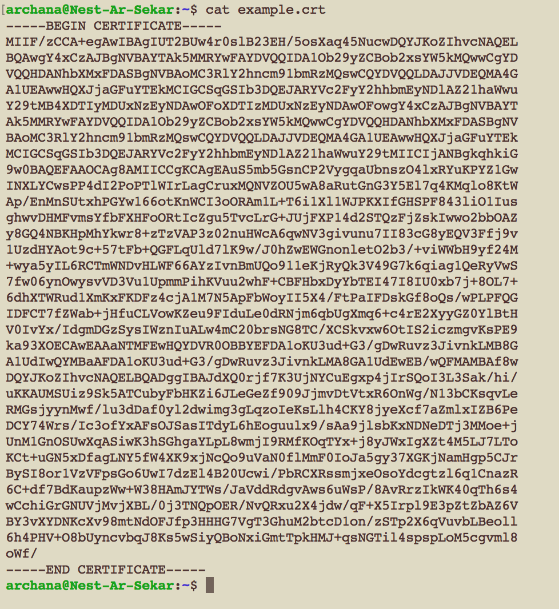
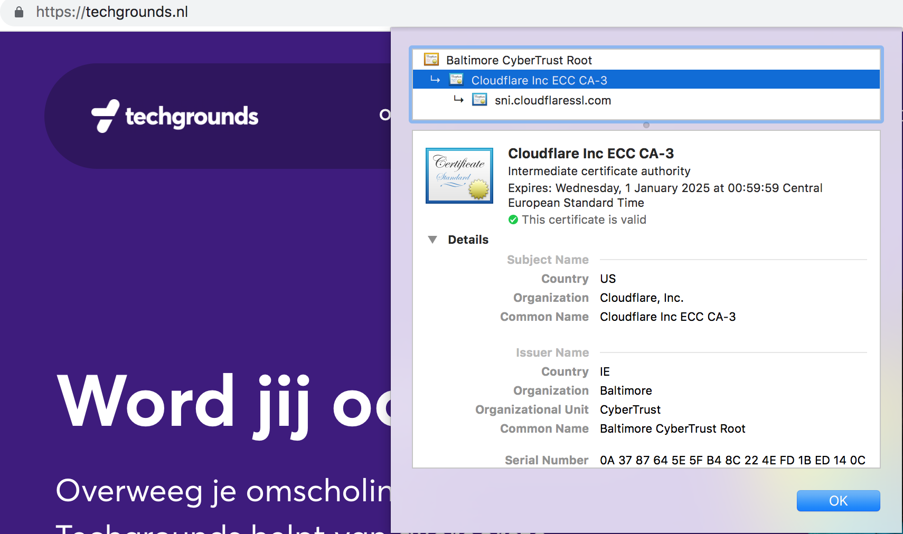
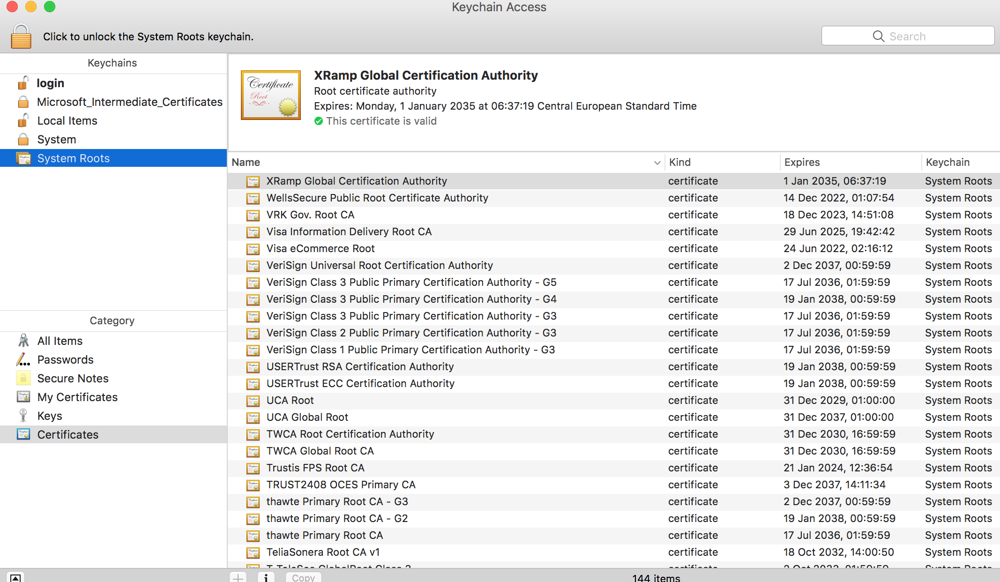

# Public Key Infrastructure (PKI)

I learnt what PKI is and how the certification works.

## Key terminology

- Public key infrastructure (PKI) - A public key infrastructure (PKI) is a set of roles, policies, hardware, software and procedures needed to create, manage, distribute, use, store and revoke digital certificates and manage public-key encryption. The purpose of a PKI is to facilitate the secure electronic transfer of information for a range of network activities such as e-commerce, internet banking and confidential email. It is required for activities where simple passwords are an inadequate authentication method and more rigorous proof is required to confirm the identity of the parties involved in the communication and to validate the information being transferred.

In cryptography, a PKI is an arrangement that binds public keys with respective identities of entities (like people and organizations). The binding is established through a process of registration and issuance of certificates at and by a certificate authority (CA). Depending on the assurance level of the binding, this may be carried out by an automated process or under human supervision.

PKI consists of three entities also known as CIA:

Confidentiality: Assurance that no entity can maliciously or unwittingly view a payload in clear text. Data is encrypted to make it secret, such that even if it was read, it appears as gibberish. Perhaps the most common use of PKI for confidentiality purposes is in the context of Transport Layer Security (TLS). TLS is a capability underpinning the security of data in transit, i.e. during transmission. A classic example of TLS for confidentiality is when using an internet browser to log on to a service hosted on an internet based web site by entering a password.

Integrity: Assurance that if an entity changed (tampered) with transmitted data in the slightest way, it would be obvious it happened as its integrity would have been compromised. Often it is not of utmost importance to prevent the integrity being compromised (tamper proof), however, it is of utmost importance that if integrity is compromised there is clear evidence of it having done so (tamper evident).

Authenticity: Assurance that you have certainty of what you are connecting to, or evidencing your legitimacy when connecting to a protected service. The former is termed server-side authentication - typically used when authenticating to a web server using a password. The latter is termed client-side authentication - sometimes used when authenticating using a smart card (hosting a digital certificate and private key).

- Certificate authority (CA) - It is an entity that stores, signs, and issues digital certificates. A digital certificate certifies the ownership of a public key by the named subject of the certificate. This allows others (relying parties) to rely upon signatures or on assertions made about the private key that corresponds to the certified public key. A CA acts as a trusted third party—trusted both by the subject (owner) of the certificate and by the party relying upon the certificate. The format of these certificates is specified by the X.509 or EMV standard.

One particularly common use for certificate authorities is to sign certificates used in HTTPS, the secure browsing protocol for the World Wide Web.

- X.509 - An X.509 certificate is a digital certificate based on the widely accepted International Telecommunications Union (ITU) X.509 standard, which defines the format of public key infrastructure (PKI) certificates. X.509 standard defines the format of public key certificates. X.509 certificates are used in many Internet protocols, including TLS/SSL, which is the basis for HTTPS, the secure protocol for browsing the web. They are also used in offline applications, like electronic signatures. An X.509 certificate binds an identity to a public key using a digital signature. 

- Self-Signed SSL Certificate - A self-signed SSL certificate is a certificate that is signed by the person who created it rather than a trusted certificate authority. Self-signed certificates can have the same level of encryption as the trusted CA-signed SSL certificate. Web browsers do not recognize the self-signed certificates as valid. When using a self-signed certificate, the web browser shows a warning to the visitor that the web site certificate cannot be verified. Typically, the self-signed certificates are used for testing purposes or internal usage. You should not use a self-signed certificate in production systems that are exposed to the Internet.

### Exercise

1. Create a self-signed certificate on your VM.

2. Analyze some certification paths of known websites (ex. techgrounds.nl / google.com / ing.nl).

3. Find the list of trusted certificate roots on your system (bonus points if you also find it in your VM).

### Sources

- [What is Public Key Infrastructure (PKI)](https://www.youtube.com/watch?v=i-rtxrEz_E8) ----> Great resource for learning how PKI works! (suggested by a teammate)

- [PKI explained](https://en.wikipedia.org/wiki/Public_key_infrastructure)

- [PKI explained](https://en.wikipedia.org/wiki/Public_key_infrastructure)

- [Certificate authority(CA)](https://en.wikipedia.org/wiki/Certificate_authority)

- [X.509 certificate](https://sectigo.com/resource-library/what-is-x509-certificate)

- [How to create a self-signed SSL certificate](https://linuxize.com/post/creating-a-self-signed-ssl-certificate/)

- [How to create a self-signed SSL certificate - shorter command](https://websiteforstudents.com/how-to-create-self-signed-certificates-on-ubuntu-linux/)

- [How Can I Tell if a Site Has SSL?](https://www.venafi.com/education-center/ssl/how-to-check-ssl-certificate#:~:text=For%20most%20browsers%2C%20look%20to,to%20view%20the%20certificate%20information)

- [How to find list of certificates in my MAC](https://support.apple.com/en-gb/guide/keychain-access/kyca15178/mac)

### Overcome challanges

1. I had to understand the asymmetric encryption process better to further learn about PKI.
2. Then learnt about CA and how to create a self-signed certificate on my VM
3. I also learnt to find the certification path for websites which I have never thought about all these years - very interesting learning indeed!

### Results

1. Create a self-signed certificate on your VM.

- To create a new Self-Signed SSL Certificate, using the openssl req command:

- Self-signed SSL certificate

2. Analyze some certification paths of known websites (ex. techgrounds.nl / google.com / ing.nl).

 To check if a site has an SSL certificate, the URL will usually begin with “https” instead of “http,”. A padlock icon displayed in a web browser also indicates that a site has a secure connection with an SSL certificate. SSL protocol ensures that data on that site is secured through SSL/TLS encryption and verification. It’s important to make sure that any website where sensitive data may be transferred uses SSL. Sites that don’t are vulnerable to attack by hackers or identity thieves, or may be fraudulent themselves.

- When I open techgrounds website and click on the padlock icon next to the URL, the certificate path is seen. I understand that Cloudfare has issued the certificate for techgrounds. 

3. Find the list of trusted certificate roots on your system (bonus points if you also find it in your VM).

- In order to find the list of certificates in Mac, I had to use Use Keychain Access to view the information contained in a certificate. 

- After selecting the system root and clicking on certificates, the list of certificates in my MAC were displayed.

