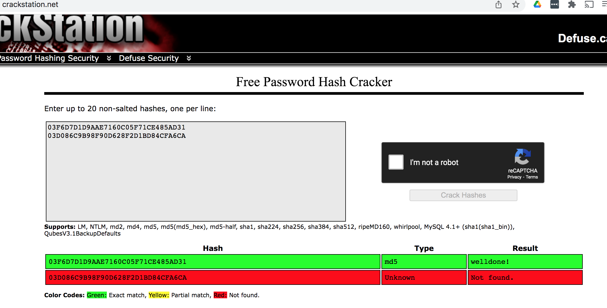
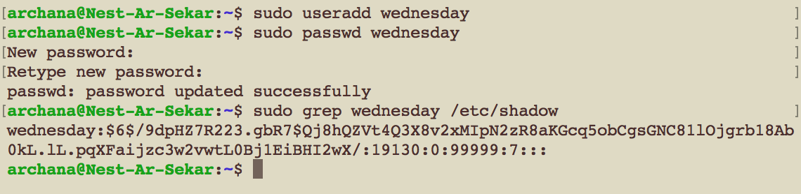
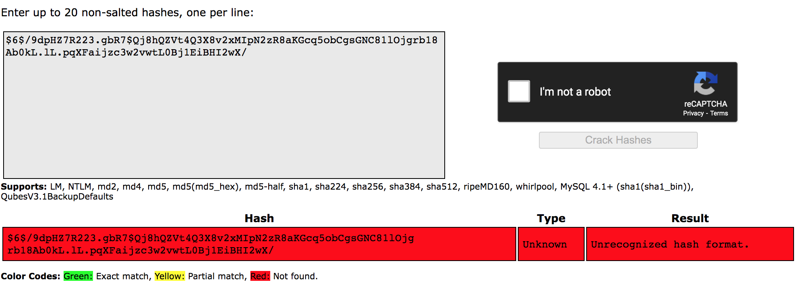

# Passwords

In terms of factors of authentication, passwords fall into the ‘something you know’ category.
On the front-end, passwords can be guessed. This can be made harder with the following strategies:
	- Not using common passwords
	- Using longer passwords
	- Using special characters like @,*,%, etc.
	- Using a mixture of CAPITAL and small letters
	- Not using easily deducible passwords like birthdates or pet names
	- Using a different password for every login
	- Using a sentence

Of course, these strategies make it harder to remember your own passwords. Password managers were created to solve this problem.
On the back-end, passwords need to be stored securely. If your database (or /etc/shadow file in Linux) gets leaked or stolen, you don’t want anyone to just be able to read passwords in plaintext. This is why most stored passwords are hashed. Hackers will try to use a Rainbow Table to crack hashed passwords.

## Key terminology

- Hashing - During the Hashing process, you take an input (file) and using an algorithm you generate a hash string. You will then send the file and the hash string to the recipient. The recipient will take the input, apply the hashing algorithm that is agreed between both the parties and will generate a  hash string. Then, he will compare the generated hash against the sender's hash string. If both the hash strings match, then it means the file integrity is not compromised. 

Hashing is the process of changing a plain text or a key to a hashed value by applying a hash function. Usually, the input length is greater in size than the output hash value. Hashing is a one-way encryption process such that a hash value cannot be reverse engineered to get to the original plain text. Hashing is used in encryption to secure the information shared between two parties. The passwords are transformed into hash values so that even if a security breach occurs, PINs stay protected.

- Rainbow table - A rainbow table is a precomputed compilation of plaintexts and matching ciphertexts (typically passwords and their matching hashes). Rainbow tables greatly speed up many types of password cracking attacks, often taking minutes to crack where other methods (such as dictionary, hybrid, and brute-force password cracking attempts) may take much longer.

- MD5 - The MD5 message-digest algorithm is a cryptographically broken but still widely used hash function producing a 128-bit hash value. Although MD5 was initially designed to be used as a cryptographic hash function, it has been found to suffer from extensive vulnerabilities. It can still be used as a checksum to verify data integrity, but only against unintentional corruption. It remains suitable for other non-cryptographic purposes, for example for determining the partition for a particular key in a partitioned database, and may be preferred due to lower computational requirements than more recent Secure Hash Algorithms algorithms.

- Salting - Password salting is a technique of adding a random sequence of data (approximately 32 characters) to each password and then hashing it. Password hashing means turning your password into a string of random numbers by using a mathematical algorithm. 

For instance, when salting, a password R&A*nD0m is written like R&A*nD0m3s2#$%^&. That is, a suffix, let’s say “3s2#$%^&” is added to your actual password before hashing it. This protects the password from being reverse-engineered by hackers. 

If a platform stored your password in plaintext, then during a data breach, the hacker could easily access it, steal it, and use it against you. If a platform only hashed your password, hackers could still reveal the password by figuring out the encryption key (or hash) used. One of the ways this is achieved is with a rainbow table attack that cracks the hashes.
If the platform salted and only then hashed the password, they then ensured your password is extra difficult to expose. 
Hashing plaintext passwords is not enough. Without adding a “salt”, passwords are still vulnerable. 
### Exercise

1. Find out what hashing is and why it is preferred over symmetric encryption for storing passwords.

2. Find out how a Rainbow Table can be used to crack hashed passwords.

3. Below are two MD5 password hashes. One is a weak password, the other is a string of 16 randomly generated characters. Try to look up both hashes in a Rainbow Table.
03F6D7D1D9AAE7160C05F71CE485AD31
03D086C9B98F90D628F2D1BD84CFA6CA

4. Create a new user in Linux with the password 12345. Look up the hash in a Rainbow Table.

5. Despite the bad password, and the fact that Linux uses common hashing algorithms, you won’t get a match in the Rainbow Table. This is because the password is salted. To understand how salting works, find a peer who has the same password in /etc/shadow, and compare hashes.

### Sources

- [Hashing explained](https://www.youtube.com/watch?v=2BldESGZKB8)

- [Hashing explained](https://www.youtube.com/watch?v=--tnZMuoK3E)

- [hashing](https://www.clickssl.net/blog/difference-between-hashing-vs-encryption)

- [Hashing](https://www.youtube.com/watch?v=b4b8ktEV4Bg&t=161s)

- [Hashing vs Encryption](https://cheatsheetseries.owasp.org/cheatsheets/Password_Storage_Cheat_Sheet.html)

- [An online Rainbow Table](https://crackstation.net/)

- [Rainbow Table](https://www.sciencedirect.com/topics/computer-science/rainbow-table)

- [How password hashing works on Linux](https://www.networkworld.com/article/3629440/how-password-hashing-works-on-your-linux-system.html)

### Overcome challanges

I had to learn what hashing is and how it is different from encryption.  Then I learnt about rainbow table and what salting is. 

### Results

1. Find out what hashing is and why it is preferred over symmetric encryption for storing passwords.

Hashing and encryption both provide ways to keep sensitive data safe. However, in almost all circumstances, passwords should be hashed, NOT encrypted.

Hashing is a one-way function (i.e., it is impossible to "decrypt" a hash and obtain the original plaintext value). Hashing is appropriate for password validation. Even if an attacker obtains the hashed password, they cannot enter it into an application's password field and log in as the victim.

Encryption is a two-way function, meaning that the original plaintext can be retrieved. Encryption is appropriate for storing data such as a user's address since this data is displayed in plaintext on the user's profile. Hashing their address would result in a garbled mess.

For eg: if the company uses encryption to store the users passwords, it is possible to see the actual password by decrypting it since encryption is a 2-way process where you can encrypt and decrypt. Whereas in the case of hashing, you only store the hash generated for the password since hashing is not a reversible process, you cannot use the hash to know the actual password.Instead of storing the actual password, the hash of the password is stored, when a user enters that password at login, it is hashed and compared to the hash in the database. If they are the same, then the login is successful. This way if an attacker gains access to the database, they'll only have the hashed passwords which is not going to be useful, as they wont be able to go backwards and figure out the passwords. So hashing is preferred over encryption for storing passwords.

2. A Rainbow Table is a precomputed table for reversing cryptographic hash functions, usually for cracking password hashes. It is a database containing common passwords and their hashes. 

3. Below are two MD5 password hashes cracked using a Rainbow Table.

4. Passwords are hashed on Linux systems, and the hashes are stored in the restricted access /etc/shadow file.

- Created new user in linux with the salted password:

- Looked up the salted hashed password for the new user ID I created:

5.  Despite the bad password, and the fact that Linux uses common hashing algorithms, I was not able to get a match in the Rainbow Table because the password was salted(refer to key terminologies section to understand what salting is).

