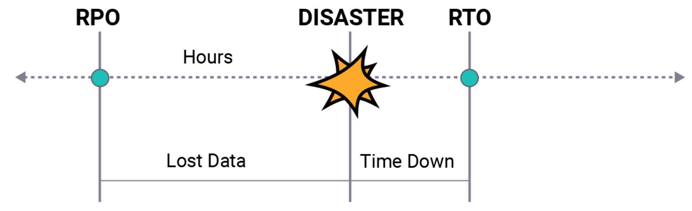

# Detection, response and analysis

We have seen about the different preventive measures to control attacks. While we want to prevent as many attacks as possible, some attacks will slip through our prevention systems. The most common method of getting malicious software (malware) into a network is through social engineering.

When getting hit with an attack, there are usually three steps to follow: Detection, response, and analysis.

Response, and analysis are part of a disaster recovery plan. This plan is an important part of a bigger business continuity plan. When a disaster strikes and infrastructure goes offline, a business could be done for. There are many strategies when it comes to mitigating a disaster. From just having a cold backup, to a redundant site.
For these strategies it is always important to keep track of the following metrics: How much data is lost on incident (Recovery Point Objective; RPO), how long it takes to be back online (Recovery Time Objective; RTO), and cost.

## Key terminology

- Detection - Detecting an (attempted) attack is the first step to stopping it and to preventing future attempts. Tools like Wireshark can help analyse a network to detect anomalies. Intrusion detection systems (IDS) and intrusion prevention systems (IPS) are also used for this purpose.

- Response - The first thing to do in response to a detected attack is trying to contain the damage. Depending on the kind of attack, the way you do this might differ. After the attack is contained, you can try to figure out the root cause of the attack, so that you can stop it. 

- Analysis - Finally, you enter the recovery phase, where you try to get all systems back online and you take stock of the damage done. It is vitally important to have a plan in place for how to respond when an attack happens. In the analysis phase, you document what you learned and harden your systems so that such an attack cannot happen again. Sometimes this can be as simple as updating the OS on a server.

- social engineering - Social engineering is the art of manipulating people so they give up confidential information. The types of information these criminals are seeking can vary, but when individuals are targeted the criminals are usually trying to trick you into giving them your passwords or bank information, or access your computer to secretly install malicious software–that will give them access to your passwords and bank information as well as giving them control over your computer.

Criminals use social engineering tactics because it is usually easier to exploit your natural inclination to trust than it is to discover ways to hack your software.  For example, it is much easier to fool someone into giving you their password than it is for you to try hacking their password (unless the password is really weak).

- Malware - Malware, short for “malicious software,” refers to any intrusive software developed by cybercriminals (often called “hackers”) to steal data and damage or destroy computers and computer systems. Examples of common malware include viruses, worms, Trojan viruses, spyware, adware, and ransomware. Recent malware attacks have exfiltrated data in mass amounts.

- Intrusion Detection System (IDS) - An intrusion detection system (IDS) is a device or software application that monitors a network for malicious activity or policy violations. Any malicious activity or violation is typically reported or collected centrally using a security information and event management system. Some IDS’s are capable of responding to detected intrusion upon discovery. These are classified as intrusion prevention systems (IPS).

- Intrusion Prevention System (IPS) - An intrusion prevention system (IPS) is a network security tool (which can be a hardware device or software) that continuously monitors a network for malicious activity and takes action to prevent it, including reporting, blocking, or dropping it, when it does occur. The IPS reports these events to system administrators and takes preventative action, such as closing access points and configuring firewalls to prevent future attacks. IPS solutions can also be used to identify issues with corporate security policies, deterring employees and network guests from violating the rules these policies contain.

It is more advanced than an intrusion detection system (IDS), which simply detects malicious activity but cannot take action against it beyond alerting an administrator. 

- Recovery Point Objective (RTO) - How much data is lost on incident; Recovery point objectives refer to your company’s loss tolerance: the amount of data that can be lost before significant harm to the business occurs. The objective is expressed as a time measurement from the loss event to the most recent preceding backup.

If you back up all or most of your data in regularly scheduled 24-hour increments, then in the worst-case scenario you will lose 24 hours’ worth of data. 

- Recovery Time Objective (RTO) - how long it takes to be back online; RTO refers to how much time an application can be down without causing significant damage to the business. Some applications can be down for days without significant consequences. Some high priority applications can only be down for a few seconds without incurring employee irritation, customer anger and lost business.

### Exercise

1. A Company makes daily backups of their database. The database is automatically recovered when a failure happens using the most recent available backup. The recovery happens on a different physical machine than the original database, and the entire process takes about 15 minutes. What is the RPO of the database?

2. An automatic failover to a backup web server has been configured for a website. Because the backup has to be powered on first and has to pull the newest version of the website from GitHub, the process takes about 8 minutes. What is the RTO of the website?

### Sources

- [Social engineering](https://www.webroot.com/us/en/resources/tips-articles/what-is-social-engineering)

- [Malware](https://www.cisco.com/c/en/us/products/security/advanced-malware-protection/what-is-malware.html)

- [Intrusion Detection System (IDS)](https://www.barracuda.com/glossary/intrusion-detection-system)

- [Intrusion Prevention System (IPS)](https://www.forcepoint.com/cyber-edu/intrusion-prevention-system-ips)

- [Hack response strategies](https://securityboulevard.com/2019/11/5-tips-for-responding-to-cyber-attacks/)

- [System hardening](https://www.trentonsystems.com/blog/system-hardening-overview)

- [Top 4 Types of Disaster Recovery Plans](https://solutionsreview.com/backup-disaster-recovery/top-three-types-of-disaster-recovery-plans/)

- [RTO vs RPO](https://www.youtube.com/watch?v=PurBJoYkh-I)

- [RTO vs RPO](https://www.enterprisestorageforum.com/management/rpo-and-rto-understanding-the-differences/)
### Overcome challanges

I learnt about disaster recovery plans and strategies and the steps to follow in case of cyberattacks. I also understood what is system hardening and the function of RTO and RPO.

### Results

1. Hack response strategies:

Recovering from a hacking attack can be expensive, complicated, and time-consuming. With that in mind, it’s smart for companies to prepare on the front end, rather than merely responding once the attack happens. If a hacking attack catches you unaware, here are five response tips:

i. Follow a communication plan.
Figuring out who to inform after a hacking attack is critical. What does the attack mean? Who should you tell? How do you tell them? When do you tell them? Implement a communication plan before the hacking attack occurs to carry it out once the attack takes place. 

ii. Secure IT systems.
As soon as you realize the breach, secure your IT systems to limit the scope of the attack. 

iii. Launch backups.
Hopefully, you’ve developed a good crash plan for your website. Now is the time to launch that crash plan and deploy your backups to protect your data from further harm. 

iv. Notify authorities.
Let the authorities know about the cyber attack on your organization. This will help protect your customers and make a record of the attack so that authorities can respond. 

v. Create redundancy in your data.
This is a critical part of data security and protecting your assets. Data redundancy is a condition created within a database or data storage technology where the same piece of data is held in two separate places.

2. System hardening:

 System hardening is the process of securing a server or computer system by minimizing its attack surface, or surface of vulnerability, and potential attack vectors. It’s a form of cyberattack protection that involves closing system loopholes that cyberattackers frequently use to exploit the system and gain access to users’ sensitive data. 

Part of the system hardening elimination process involves deleting or disabling needless system applications, permissions, ports, user accounts, and other features so that attackers have fewer opportunities to gain access to a mission-critical or critical-infrastructure computer system's sensitive information.

System hardening involves securing not only a computer’s software applications, including the operating system, but also its firmware, databases, networks, and other critical elements of a given computer system that an attacker could exploit.

There are five main types of system hardening:

Server hardening
Software application hardening
Operating system hardening
Database hardening
Network hardening

3. Disaster recovery (DR) 

It is an essential part of keeping data safe and maintaining business continuity.Different disaster recovery options:

With so many different options of disaster recovery plans that a business can implement out there, the process of finding the best fit can be overwhelming. Each business is different, so it’s important to understand all of the choices available to you. This way, you can pick which plan best suits your needs. To help you out, here’s what you should consider about four types of disaster recovery plans:

i. Data Center Disaster Recovery
In this approach, the disaster recovery plan is not just limited to the computing facility it’s housed in. The entire building plays a large role in data center DR. Features and tools within the building, such as physical security, support personnel, backup power, HVAC, utility providers, and fire suppression all have an effect on data center DR.

ii. Cloud-Based Disaster Recovery
When using a cloud-based approach, you’re able to cut costs by using a cloud provider’s data center as a recovery site, rather than spending more on your own data center’s facilities, personnel, and systems. Users also benefit from the competition between cloud providers, as they continue to attempt to best each other in the market.

iii. Virtualization Disaster Recovery
Virtualization negates the need to reconstruct a physical server in the event of a disaster. You are also able to achieve your targeted recovery time objectives (RTO) more easily by placing a virtual server on reserve capacity or the cloud.

iv. Disaster Recovery as a Service
While Disaster Recovery as a Service (DRaaS) is often based in the cloud, it is not strictly cloud-based. Some DRaaS providers offer their solutions as a site-to-site service, in which they host and run a secondary hot site. Additionally, providers can rebuild and ship servers to an organization’s site as a server replacement service.

4. A Company makes daily backups of their database. The database is automatically recovered when a failure happens using the most recent available backup. The recovery happens on a different physical machine than the original database, and the entire process takes about 15 minutes. What is the RPO of the database?

The company makes daily backups so the RPO could be a maximum of 24 hours loss of data and a minimum of 15 minutes of data.

5. An automatic failover to a backup web server has been configured for a website. Because the backup has to be powered on first and has to pull the newest version of the website from GitHub, the process takes about 8 minutes. What is the RTO of the website?

There was a downtime in the website for about 8 minutes so the RTO of the website is also about 8 minutes.

