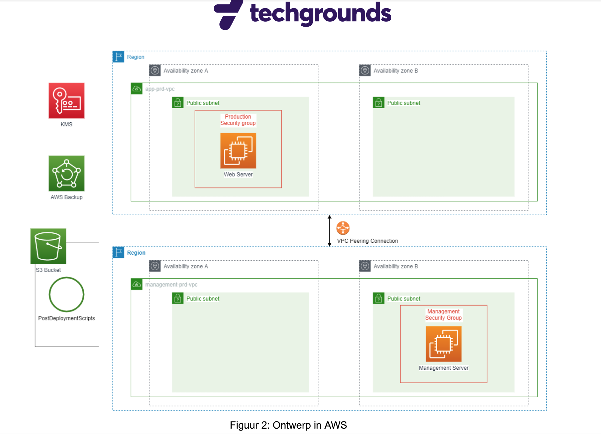

# Overall Project Requirements

A company wants to transition to cloud. I am responsible for moving the current servers to the cloud and for automating the deployment of it's infrastructure. This document shows the requirements of the project and as a Junior engineer, what is expected from me to complete this project in time and within the budget specified.

The current architecture of the application as analyzed by a previous team is shown below.

## Project requirements:

I have to build the Infrastructure as Code app using AWS CDK to move the design shown above to cloud. 

When developing the CDK app, I should add small changes incrementally and always have a commit / branch to fall back on with a working version of my application. 

Below list shows the essential requirements:

1. All VM disks must be encrypted.

2. The web server must be backed up daily. The backups must be kept for 7 days.

3. The web server must be installed in an automated manner.

4. The admin/management server must be reachable with a public IP.

5. The admin/management server should only be reachable from trusted locations (office/admin's home)

6. The following IP ranges are used: 10.10.10.0/24 & 10.20.20.0/24

7. All subnets must be protected by a firewall at the subnet level.

8. SSH or RDP connections to the web server may only be established from the admin server.

9. Improvements to the current architecture can be proposed and implemented, but keep in mind the deadline.

10. Budget given for the entire project is maximum 150 euros. 

## Deliverables expected in my GitHub repository at the end of the project:

1. A working CDK app from the MVP (Minimum viable product)

The working CDK application must successfully complete a build and deployment. A version of my MVP can be done with a tag, or a release. I can use Git Tag to label commits that are easily found in GitHub. If my code is complete with the above requirements, I can use the tag 'v1.0'. 

In addition, my repository should also contain documentation of how to use the application. The documentation should indicate how I call the app, the arguments that are needed, and which rights it needs in AWS to deploy.

2. Design Documentation

As mentioned earlier, i will be using the existing architecture but I can implement changes whenever required. I will have to fill in the gaps in the current architecture and list them in GitHub with my own diagrams in V1.1 for the adjustments and substantiate the improvements. 

3. Decision Documentation

This document will contain information about the services that i will be using along with the substantiations for considering that particular service; It will also contain all my assumptions and improvements.

4. Time logs

This file is used to keep track of the day and what obstactles I faced along with the solutions indicated in a single sentence(as shown in the template below).

5. Final presentation

Interim presentations will be made at the end of each sprint and on the last friday entire project is presented to each other.

