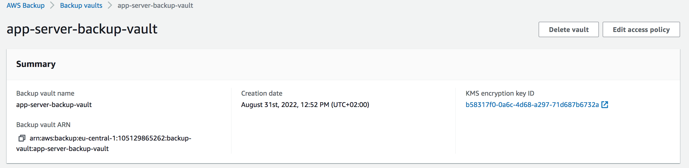

# Design Documentation

For version 1.1, the project is extended from the version 1.0 to meet the additional project requirements.

AWS services used for this project based on the requirements:

- A VPC
- AutoScaling Group 
- Application Load balancer (ALB)
- Listener configuration in ALB and health checks
- S3 for storage of the user data. The user data contains the script to install the apache when the ec2 instance boots up
- AWS Backup for making daily backups. Back up retained up to 7 days
- EBS volumes are created and attached to the EC2 instances and are also encrypted
- Security groups and NACLs are made in such a way that the application server can be reached via the management server only

Based on the requirements, the following architecture is made.

## VPC's

- 2 vpcs are created. An application VPC with CIDR 10.20.20.0/24 and a management VPC with CIDR 10.10.10.0/24 within the same region. 
- Application Servers vpc spans across 3 Availablity zones
    - 3 public subnets (1 per AZ) are created per vpc.
    - 3 private subnets (1 per AZ) are created.
- Management server vpc spans across 2 AZ's.
- VPC peering connection is created between the application and the management vpcs. 
- The route tables of each vpc is configured to have the routing information of the other VPC.

## AutoScaling Group (ASG)

- In application server -> To scale the Ec2 instances based on the application demand AutoScaling group is used.
    - Launch template is defined for the ASG during the scaling.
    - Ec2 instance configuration from version 1 is used in the launch template configuration.
- Scaling trigger is configured to follow the cpu utilisation of the ec2 instances.

## Load Balancer

- Load balancer is created to distribute the traffic among the ec2 instances created by the ASG.
- A listener is configured for port 443 and a self signed certificate is used to have the https connection.
- The target group for the listener is the AutoScaling group.
- Health check is configured for port 80.

## Security groups and NACLs

- Security groups and NACLs are configured such that the web server is reachable from the internet.
- The management server is reachable from the admin's home IP and the application server is reachable on port 22 from the management server.

## Storage

- S3 bucket is created to store the userdata script. The apache web server index.html file is also stored in S3.
- EBS volumes are created and attached to the EC2 instances and are also encrypted.

## Backup 

- Used the AWS back up service to create the backup plan for 7 days on the application server. 

- The back up is scheduled to be created at 08.00 CET everyday and a vault is created to store the backups. 

- The vault uses the default KMS key to encrypt the backups.

