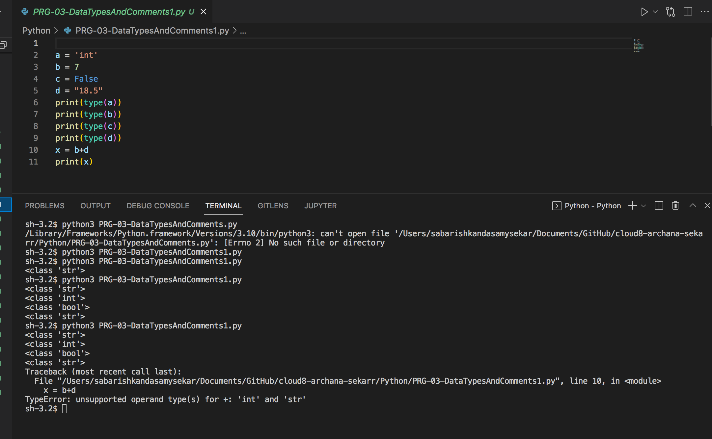

# data type of a is a string
a = 'int'
# data type of b is an integer
b = 7
# data type of c is a boolean
c = False
# data type of d is a floating-point number aka decimal number 
d = 18.5
# print the data type of the variable a
print(type(a))
# print the data type of the variable b
print(type(b))
# print the data type of the variable c
print(type(c))
# print the data type of the variable d
print(type(d))
# creating a new variable x
x = b+d
# printing the variable x (I had to change the variable d to 18.5 instead of "18.5", in order to print a floating number and not a string (error shown in the image below before making the change). --> 

print(x)

