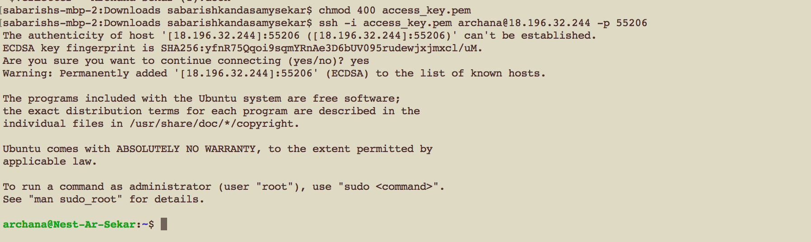
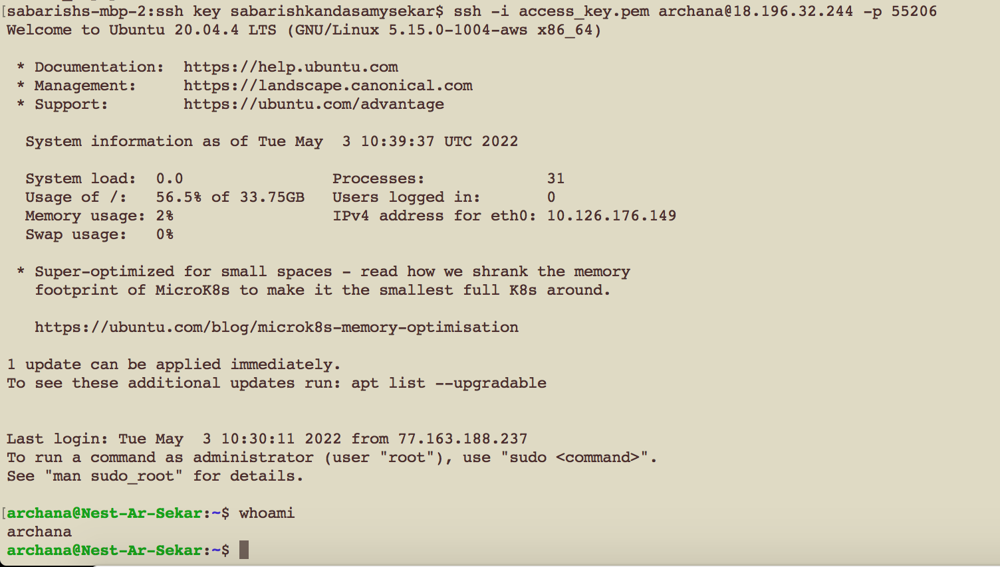

# LINUX
- LINUX is an operating system like Windows or Mac 
- Linux can be run in your own computer using a virtual machine (VM)

## Key terminology
- Hypervisor
- Ubuntu
- SSH - Secure shell protocol - secure authentication
- Remote server/client
- Public key/private key

## Exercise
- Make an SSH-connection to your machine. SSH requires the key file to have specific permissions, so you might need to change those.
- When the connection is successful, type whoami in the terminal. This command should show your username.

### Sources
- [Basics of SSH](https://www.youtube.com/watch?v=qWKK_PNHnnA&t=6s)
- [Basics of SSH](https://www.youtube.com/watch?v=lRMAJwMQ0Vc)

### Overcome challanges
- I learnt what is Linux, hypervisor, ssh key to understand about the secure authentication process
- Initially I didnt use private key. Then with the help of my team members, I learnt that i had to use the private key file sent to us via email.

### Results
I was eventually able to log in to the virtual machine.

