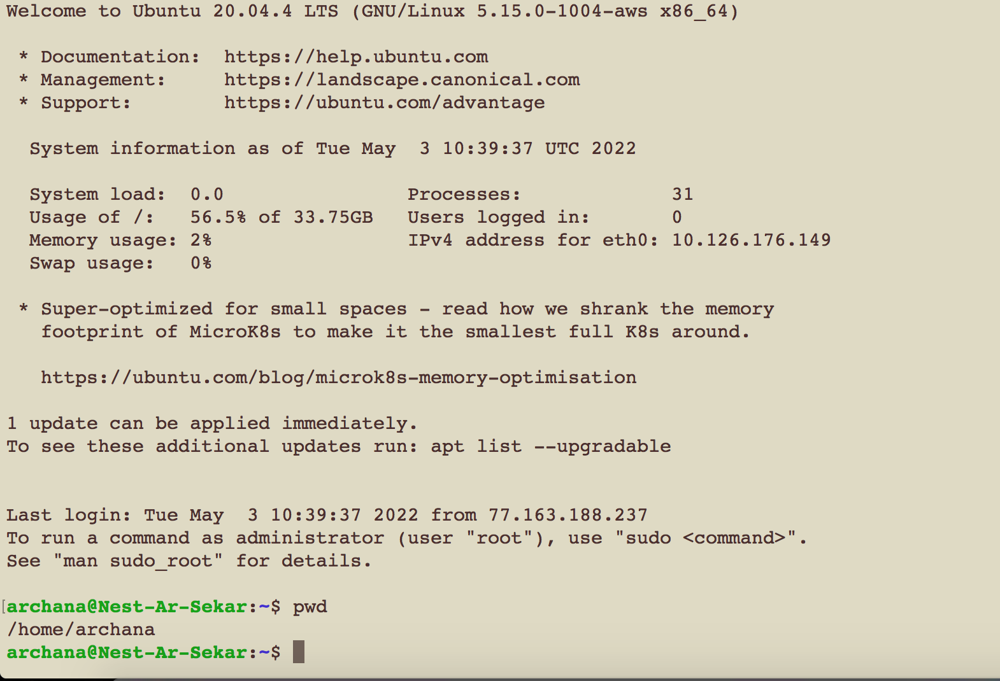
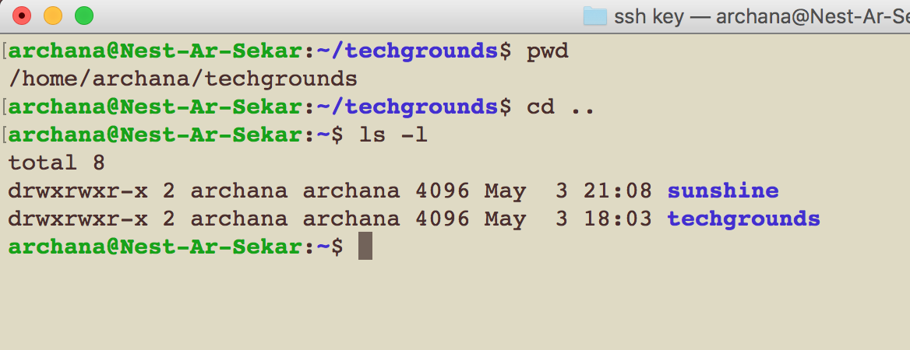
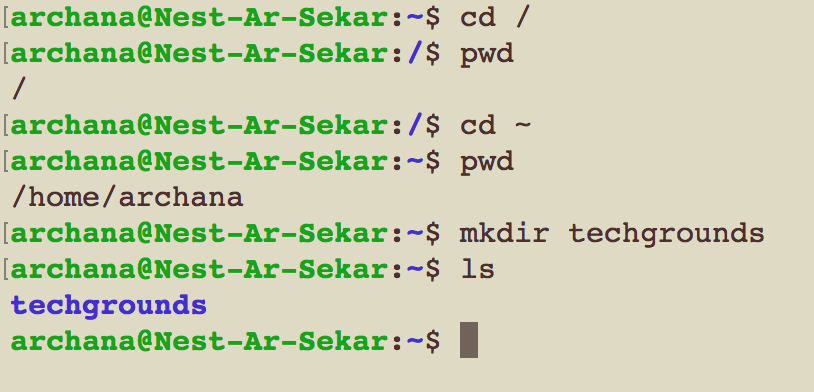
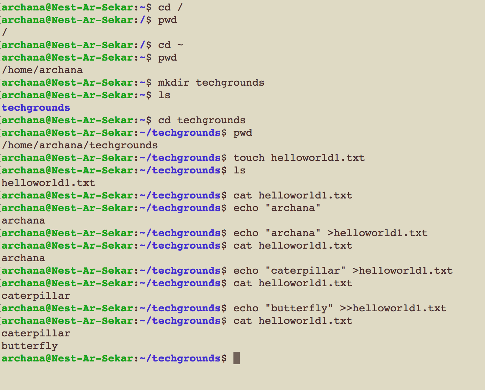
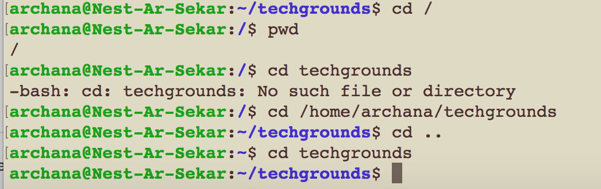

# LINUX Files and directories
- Everything in Linux is based on the file system
- These files/folders in Linux are called as directories
- Linux filesystem starts at the root directory  

## Key terminology/commands used in LNX
- cd (change directory)
- pwd (print/current working directory)
- cd .. (change directory to parent directory of the pwd)
- root directory (/)
- tilda ~ (to navigate to home directory)
- mkdir (make directory)
- touch (create file)
- echo - displaying a line of string/text
- cat (print) - to read the file and print the content
- grep - used to search for a string of characters 
- pipe (|) to combine two or more commands at the same time
- List (ls) to list files or directories
- ls -1 (shows the list in a long list format)
- ls -a (long list of current directory incl. hidden files)
- absoulte path - complete path starting from the root directory
- relative path - begins from the current working directory
 

## Exercise

### Sources
- [Linux Commands](https://www.hostinger.com/tutorials/linux-commands)
- [Linux Tutorial](https://www.w3cschoool.com/linux-tutorial)
- [Linux Tutorial](https://www.tutorialspoint.com/unix/index.htm)
- [Creating files](https://linuxize.com/post/create-a-file-in-linux/#:~:text=To%20create%20a%20new%20file%20run%20the%20cat%20command%20followed,D%20to%20save%20the%20files.)
- [Linux paths](https://www.linux.com/training-tutorials/absolute-path-vs-relative-path-linuxunix/)

### Overcome challanges
I had to learn the different commands and initially it was confusing. But after trying multiple commands and after many attempts, I was able to understand it's function

### Results
 Upon using the commands mentioned above, I was able to attain the below results.

