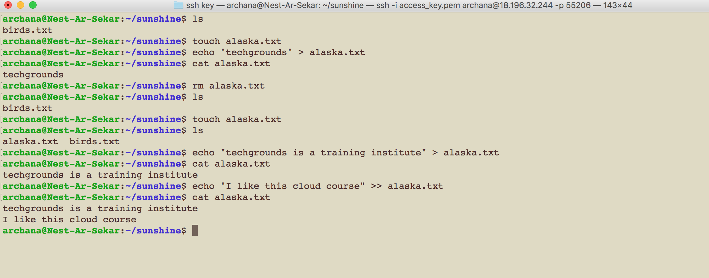
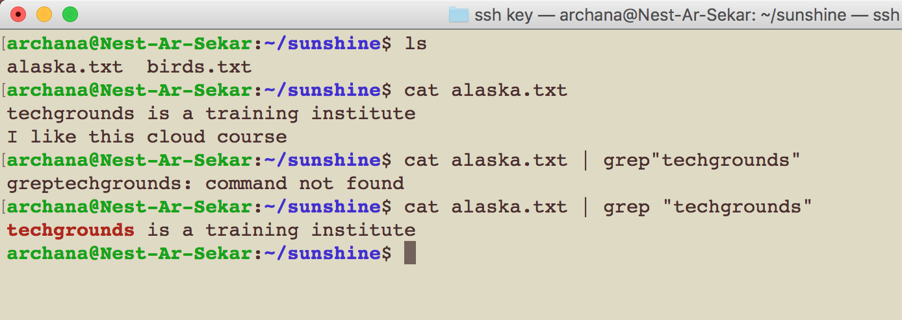
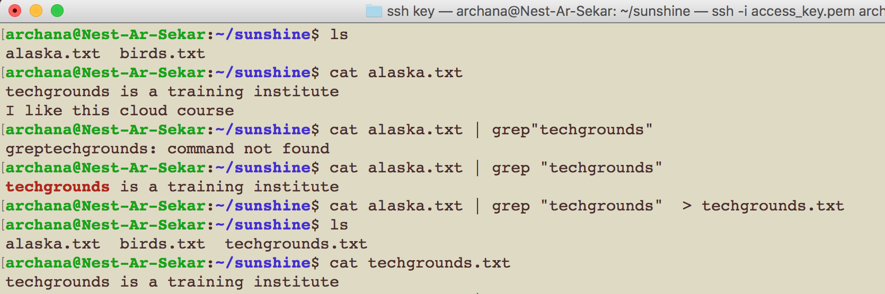

# LINUX Working With Text (CLI)
- Everything in Linux is based on the file system
- These files/folders in Linux are called as directories
- Linux filesystem starts at the root directory  

## Key terminology/commands used in LNX
- cd (change directory)
- pwd (print/current working directory)
- cd .. (change directory to parent directory of the pwd)
- root directory (/)
- tilda ~ (to navigate to home directory)
- mkdir (make directory)
- touch (create file)
- echo - displaying a line of string/text
- cat (print) - to read the file and print the content
- grep - used to search for a string of characters in a specified line
- pipe (|) to combine two or more commands at the same time
- List (ls) to list files or directories
- ls -1 (shows the list in a long list format)
- ls -a (long list of current directory incl. hidden files)

## Exercise

### Sources
- [Basics of SSH](https://www.youtube.com/watch?v=qWKK_PNHnnA&t=6s)
- [Basics of SSH](https://www.youtube.com/watch?v=lRMAJwMQ0Vc)

### Overcome challanges
- 

### Results

