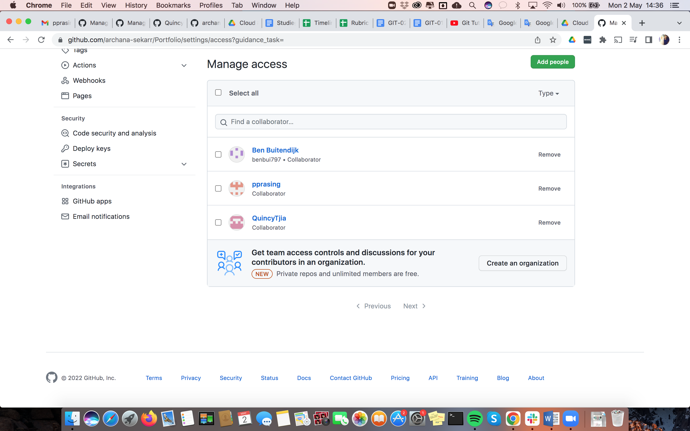
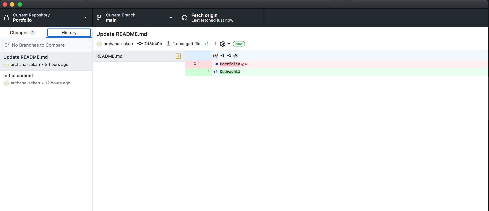
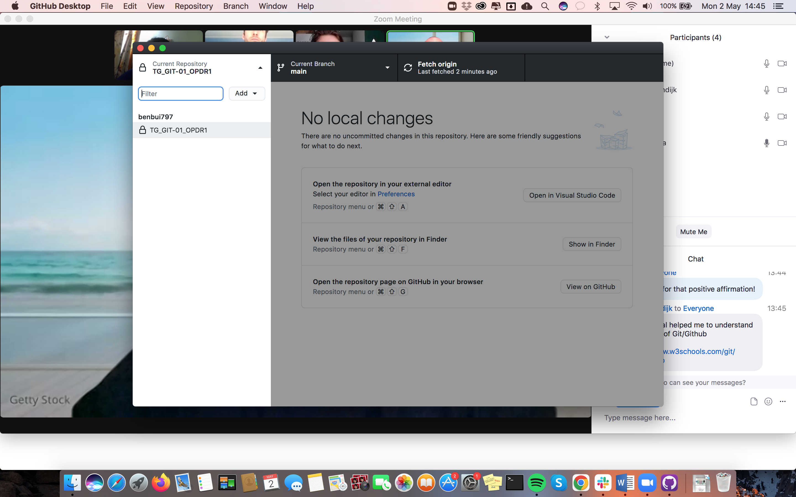

# Git and Git Hub
### What is Git?
Git is like a content tracker. And Git can be used to store source codes of software programs. 
Typically when developing software, many developers collaborate together and add codes in parellel. So a Version Control System helps in handling this by maintaining a history of what changes have happened. Git is a distributed version control system. 

### What is Github?
GitHub is a cloud-based service that offers Git as a service. Git Repositories can be created and shared with other developers to collaborate efficiently

## Key terminology
- Version Contorl System
- Centralised vs Distributed Version control
- Source Code
- Git
- GitHub
- repository
- branch
- main/master
- merge
- fork

### Git commands
- clone (clones the repository from github)
- init (initializes a repository)
- add (adds files to the repository)
- commit (commits the changes to the file into the repository)
- push (push the local changes to the remote repository(github))

## Exercise
### Sources
- https://www.freecodecamp.org/news/what-is-git-and-how-to-use-it-c341b049ae61/
- https://www.w3schools.com/whatis/whatis_github.asp
- https://www.w3schools.com/git/default.asp
- https://www.youtube.com/watch?v=hwP7WQkmECE

### Overcome challanges
I had to familiarize with Git and github concepts inorder to understand what value it adds for software development.
### Results
- I created a private repository and shared it with my teammates(collaborators)
  
- I added a commit to the private repository
  
- I cloned the repository created by my teammate Ben 
 
- I cloned my repository from Techgrounds and committed the changes in this exercise file.

