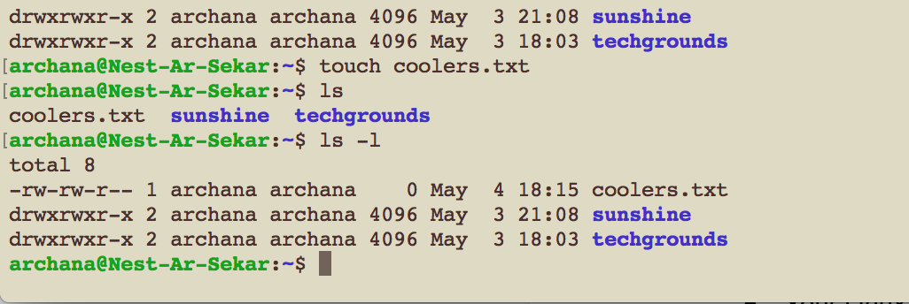
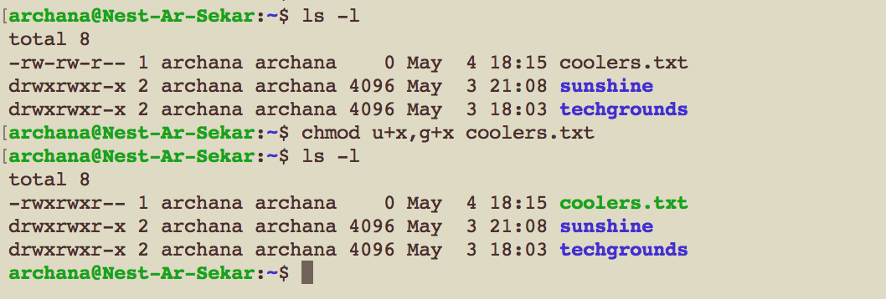
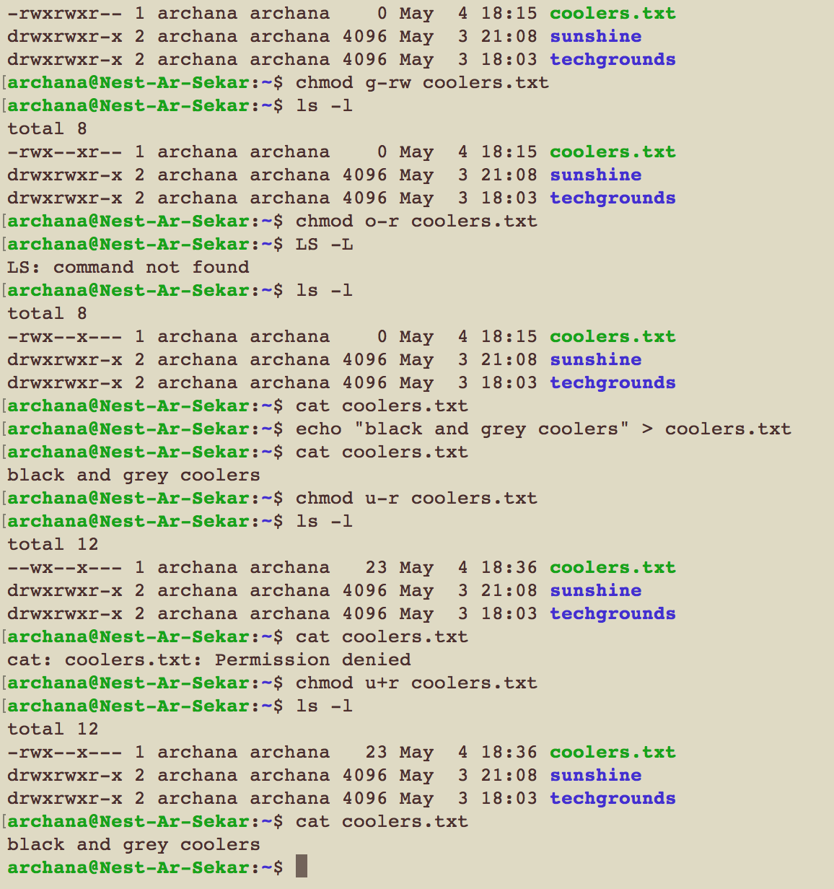
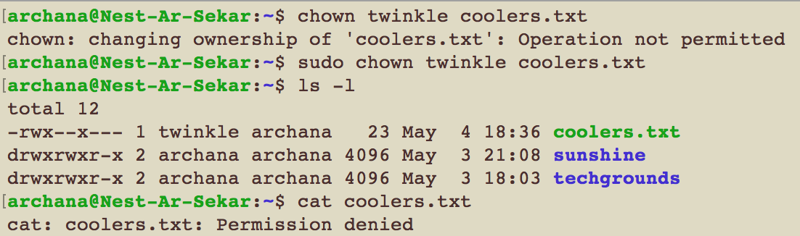
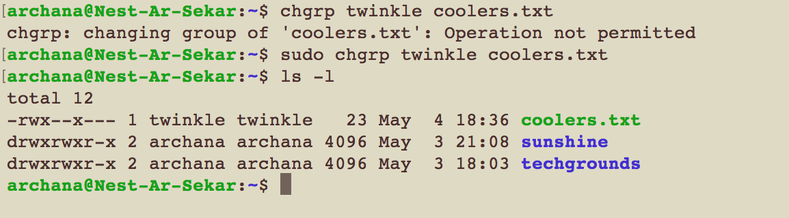

# LNX-05 File Permissions
- Learing about file permissions and how to change them.

## Key terminology
- ls  -l listing of files with permission string
- file permission string comprises of 10 characters like -rwxrwxr-x
    - (-) first character describe the type of the object, either a file (-) or directory (d)
    - (rwx) character 2 to 4  describe the user permission
    - (rwx) character 5 to 7  describe the group permission
    - (r-x) character 8 to 10  describe the others/world permission
    - r stands for read
    - w stands for write
    - x stands for executable
    - chmod (command is used to change the file permission)
    - chown (command is used to change the user ownership)
    - chgrp (command is used to change the group ownership)

## Exercise
- Create a text file.
- Make a long listing to view the file’s permissions. Who is the file’s owner and group? What kind of permissions does the file have?
- Make the file executable by adding the execute permission (x).
- Remove the read and write permissions (rw) from the file for the group and everyone else, but not for the owner. Can you still read it?
- Change the owner of the file to a different user. If everything went well, you shouldn’t be able to read the file unless you assume root privileges with ‘sudo’.
- Change the group ownership of the file to a different group.

### Sources
- [file permission tutorial](https://www.youtube.com/watch?v=ngJG6Ix5FR4)
- [change user ownership of file](https://www.cyberciti.biz/faq/how-to-use-chmod-and-chown-command/)
- [change group ownership of file](https://docs.oracle.com/cd/E19683-01/816-4883/6mb2joat3/index.html)

### Overcome challanges
By referring to the above links I was able to comprehend the file permission structure followed in linux. I practiced the command to become familiar. 

### Results

1. Created file and list permission

2. Make the file executable by adding the execute permission

3. Remove the read and write permissions for the group and everyone 

4. Change the owner of the file to a different user

5. Change the group ownership of the file to a different group

