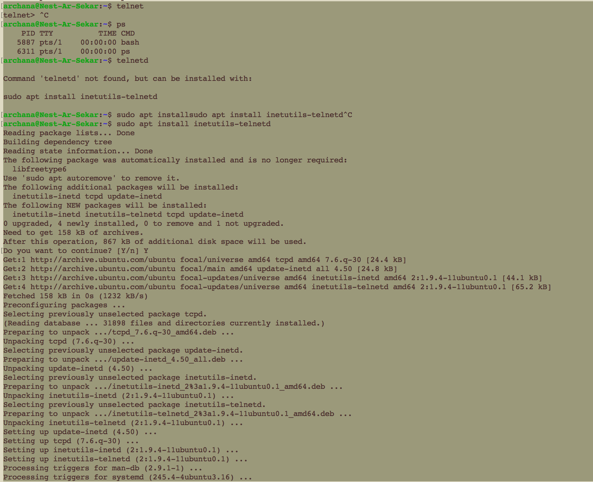
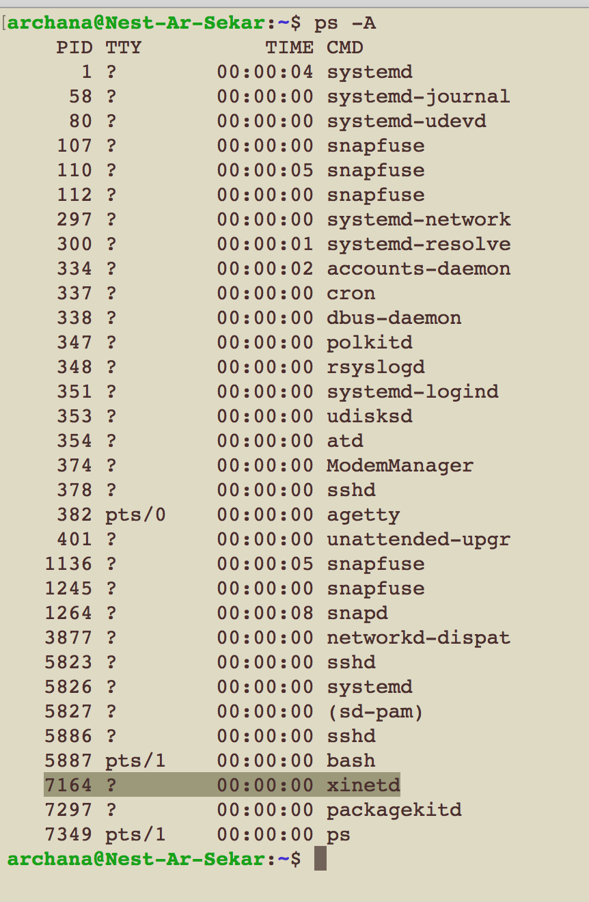
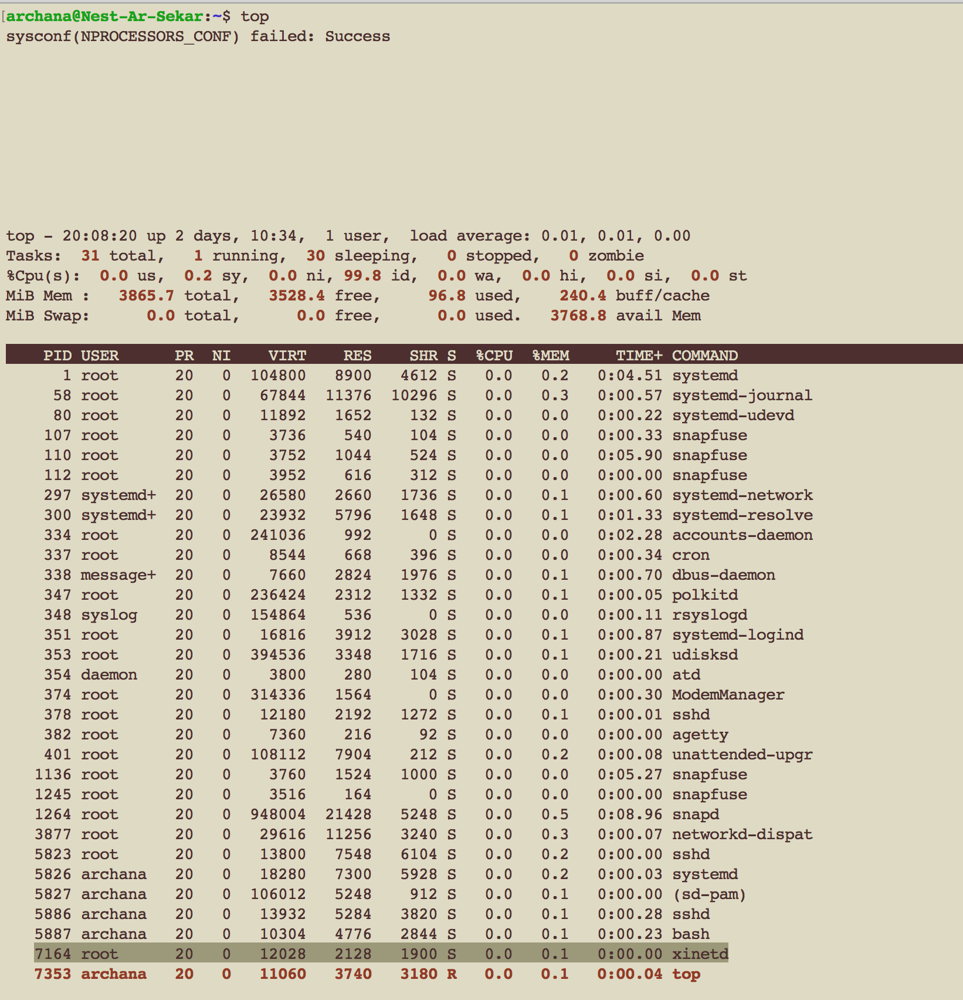
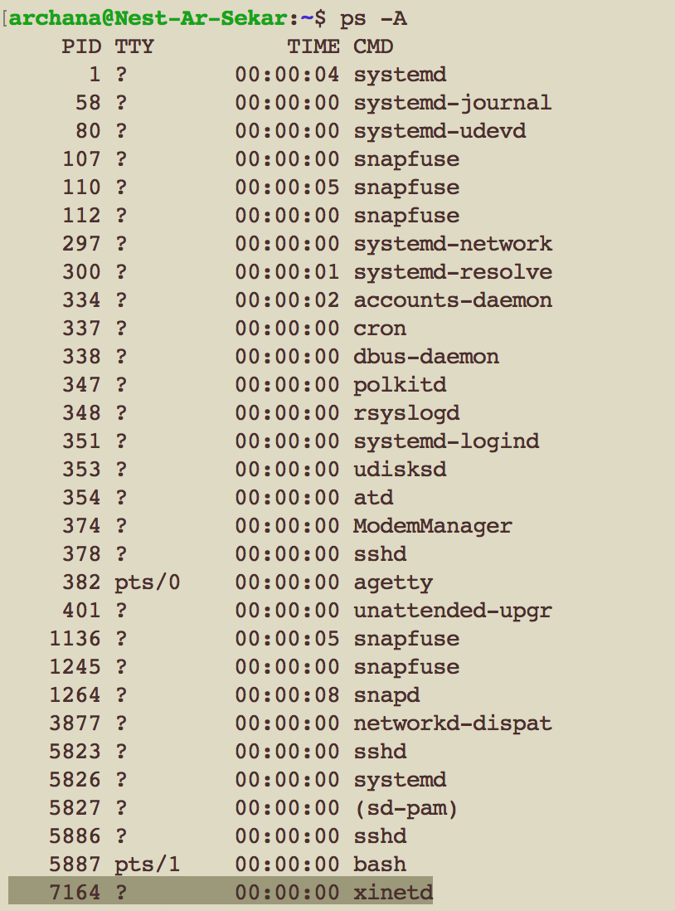
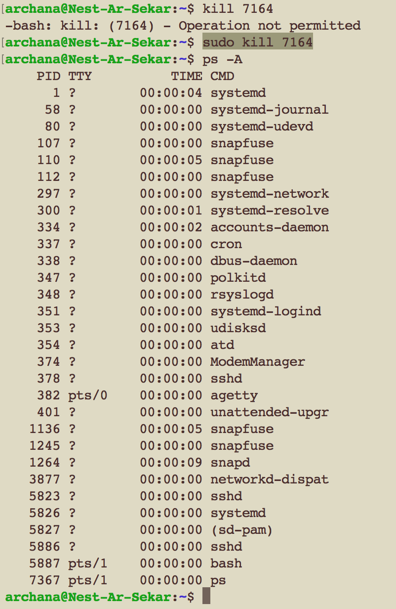

# LNX-06 Processes
A process is an instance of a running code. There are three categories of processes run in Linux and each serves different purposes.
1. Daemons - It runs in the background and it is non-interactive
2. Services - It may be interactive and Services respond to requests from programs.
3. Programs - It is run and used by users.

SSH(secure shell) is used to connect to remote Linux machines. To make this connection to your machine possible, you’ll have to start the ssh service by starting the ssh daemon. Telnet was used before SSH. It is an outdated and not secure/encrypted network protocol used to virtually access a computer. 

## Key terminology
- Init process - mother(parent) of all processes on the system. It is the first program that is executed when Linux system boots up; it manages all other processes on the system.
- PID - process ID - every process has it's own PID
- ps command - it is used to locate a process. It displays information about the active processes on the system; though not in the form of an interface
- pgrep PROCESSNAME - command used to retrieve PID based on the process name.
- top command - displays list of all currently running processes along with it's memory usage 
- kill PID/PROCESSNAME command helps to kill a process in Linux; telnetd in case of this exercise.

## Exercise
- Start the telnet daemon
- Find out the PID of the telnet daemon
- Find out how much memory telnetd is using
- Stop or kill the telnetd process

### Sources
- [install and start telnetd](https://linuxways.net/ubuntu/how-to-install-telnet-server-and-client-on-ubuntu/)
- [List all running processes](https://geek-university.com/list-all-running-processes/)
- [top command to check memory usage](https://phoenixnap.com/kb/linux-commands-check-memory-usage)
- [how to kill a process in linux](https://phoenixnap.com/kb/how-to-kill-a-process-in-linux)

### Overcome challanges
This is not necessarily a challenge but these are my learnings from this exercise. This exercise helped me understand that there are multiple commands to kill a process but I went ahead with one command as shown below yet I want to explore more about the other possibilities too in the future. 

### Results

Following are the results derived based on the commands used.

1. Installing the telnet daemon

2. PID of the telnet daemon

3. Memory used by telnet is 0.1%

4. Listing the process

5. How to stop/kill the telnetd process

