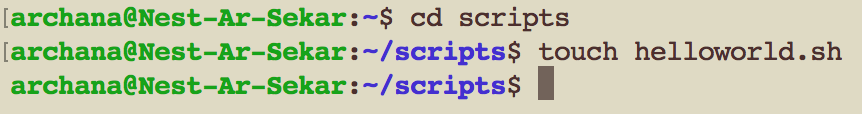
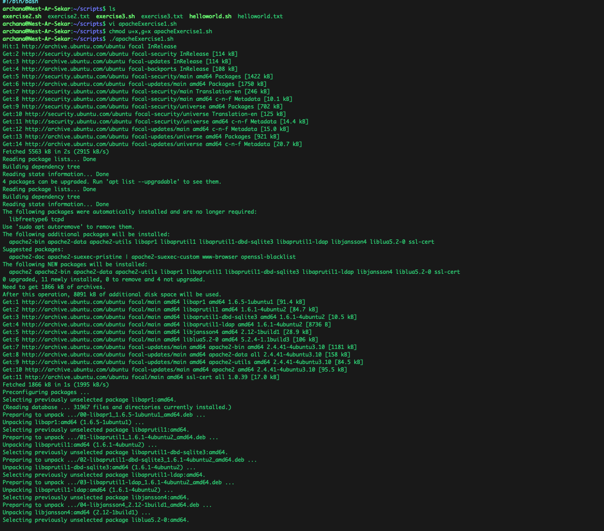

# LNX-07 Bash Scripting 
The Linux command line is provided by a program called the shell.
Shell scripting is an important part of process automation in Linux. Scripting helps you write a sequence of commands in a file and then execute them.

What is a bash script?
A bash script is a series of commands written in a file. These are read and executed by the bash program. The program executes line by line. 

Variables?
A variable is a value that can change, depending on conditions or on information passed to the programWe can assign a value to a string of characters so that the value can be read somewhere else in the script. Once we create a variable, we can access the variable, modify the variable, read the variable, perform operations on it.

Conditions?
The shell provides conditions. You can use conditions in a shell script for decision making. In shell we mainly use IF conditional statement for decision making. Shell also supports if, if else and if elif else conditional statements. 

## Key terminology

- .sh - bash scripts end with .sh
- #! /bin/bash (shebang) - It is the first line of the script. It tells the shell to execute it via bash shell
- export NAME=VALUE  - adds new variable to the list (environment)
- echo $NAME  - shows variables that are on the terminal
- $NAME - reading the variable
- PATH variable - It contains an ordered list of paths. It specifies the directories to be searched to find a command. Absolute path does not have to be specified when you run this command. The default systemwide PATH value is specified in the */etc/profile* file.
- i(insert mode) in vi - to start typing text
- exit -  to close vi
- :wq - command is used to save the changes in vi
- '=': to assign a variable
- ‘$<insert variable name here>’ - to read the value of a variable
- echo $[ $RANDOM % 10 + 1] - to generates a random number between 1 and 10
- if/elif/else conditions - You can choose these conditions to use parts of your script if a certain condition is met

## Exercise
Exercise 1:
- Create a directory called ‘scripts’. Place all the scripts you make in this directory.
- Add the scripts directory to the PATH variable.
- Create a script that appends a line of text to a text file whenever it is executed.
- Create a script that installs the httpd package, activates httpd, and enables httpd. Finally, your script should print the status of httpd in the terminal.

Exercise 2:
- Create a script that generates a random number between 1 and 10, stores it in a variable, and then appends the number to a text file.

Exercise 3:
- Create a script that generates a random number between 1 and 10, stores it in a variable, and then appends the number to a text file only if the number is bigger than 5. If the number is 5 or smaller, it should append a line of text to that same text file instead.

### Sources
- [Bash scripting tutorial](https://www.tutorialspoint.com/unix/shell_scripting.htm)

- [how to write bash scripts](https://www.freecodecamp.org/news/shell-scripting-crash-course-how-to-write-bash-scripts-in-linux/)

- [Directories to search for executable programs $PATH](https://linuxize.com/post/how-to-add-directory-to-path-in-linux/)

- [shell scripting and shebang](https://www.youtube.com/watch?v=LTuuMtQR1uQ)

- [variables](https://www.youtube.com/watch?v=WhqfbwQbWVE)

- [variables](https://www.techtarget.com/whatis/definition/variable#:~:text=In%20programming%2C%20a%20variable%20is,uses%20when%20it%20is%20running)

- [PATH environment variable](https://www.ibm.com/docs/hr/aix/7.1?topic=accounts-path-environment-variable)

- [Shell Scripting - If & If/else](https://www.youtube.com/watch?v=qoem5hqCH6A)

- [Install apache2 on ubuntu](https://www.linuxcapable.com/how-to-install-apache-on-ubuntu-22-04-lts/)

- [What is VI editor](https://www.guru99.com/the-vi-editor.html)

- [Variable in Linux](https://www.tutorialspoint.com/unix/unix-using-variables.htm)

- [Generate a random number](https://linuxhint.com/generate-random-number-bash/)

- [if and else in linux](https://linuxize.com/post/bash-if-else-statement/)

### Overcome challanges

From learning how to exit a vi editor to formatting the loops, I faced challenges in every part of this assignment. I understood how to break down the problem in to small parts and then started working towards the end solution, as shown below. This helped me to learn sensibly and complete the task.
 
Exercise 2:

- Create a script that generates a random number between 1 and 10,
- - echo $(( $RANDOM % 10 + 1 ))
-  Stores it in a variable
- - randomnumber=$(( $RANDOM % 10 + 1 )
- then appends the number to a text file.
- - echo $randomnumber >> exercise2.txt
 
Exercise 3: 

- Create a script that generates a random number between 1 and 10, stores it in a variable
       randomnumber=$(( $RANDOM % 10 + 1 )

- then appends the number to a text file only if the number is bigger than 5

    if [[ $randomnumber -gt 5 ]]
    then
    echo $randomnumber >> exercise3.txt
	
-  If the number is 5 or smaller, it should append a line of text to that same text file instead.

    else 
    echo "The number is less than or equal to 5" >> exercise3.txt
    fi

### Results

Following are the results derived based on the commands used.

Exercise 1:

1. Created a directory called ‘scripts’. Placing all the scripts in this directory

2. Adding the scripts directory to the PATH variable.

3. Creating my first script!

   Appending a line of file to a text file.

4. Installing the apache2

Script to installs the apache2

Script run part 1

Script run part 2

Exercise 2:

2. Experimenting with random numbers

3. generating and appending random numbers

Exercise 3:
3. if or else conditions

