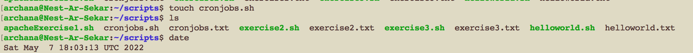
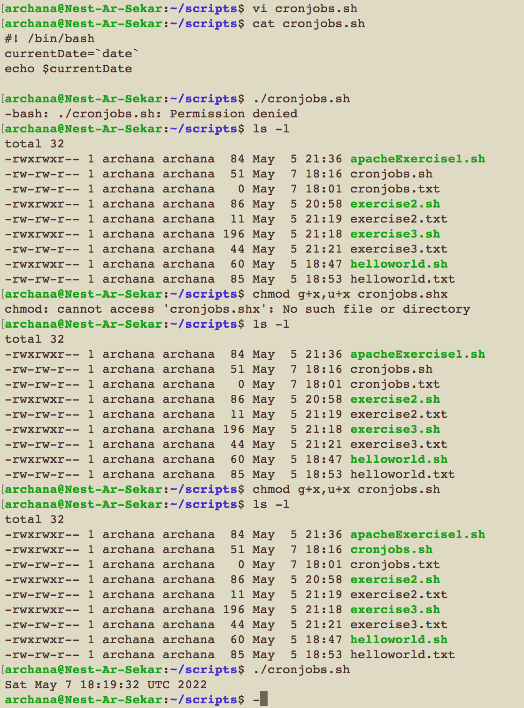
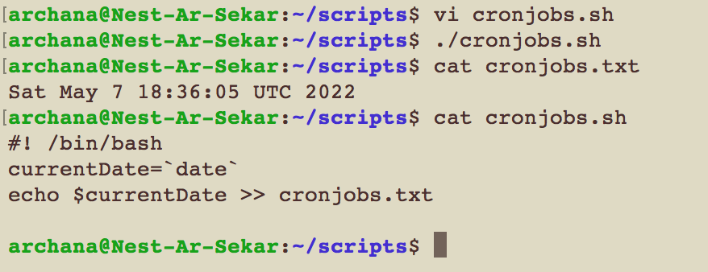
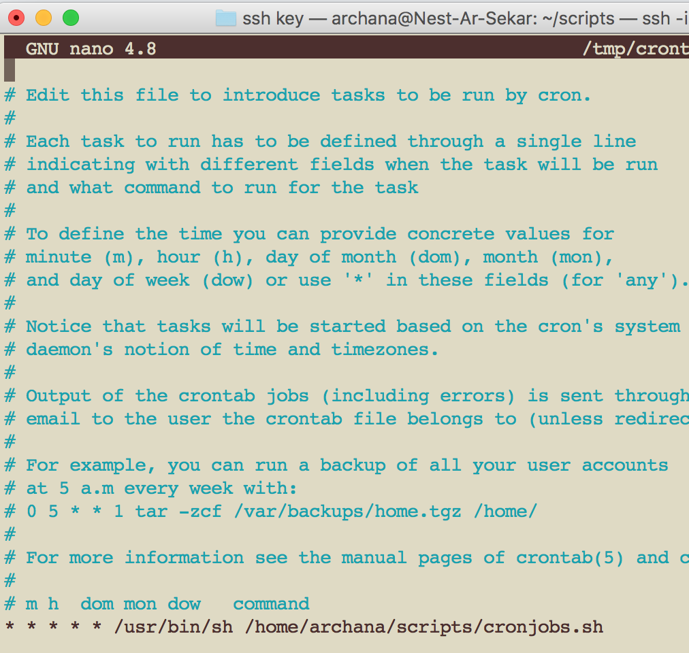
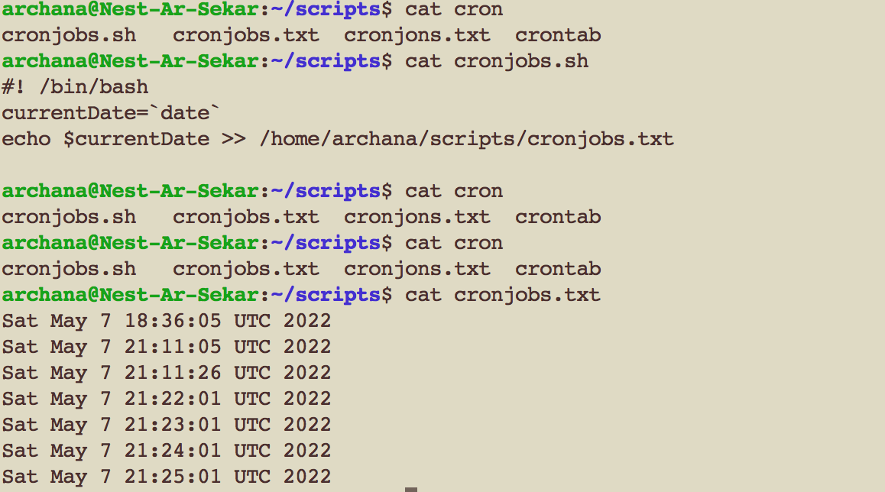
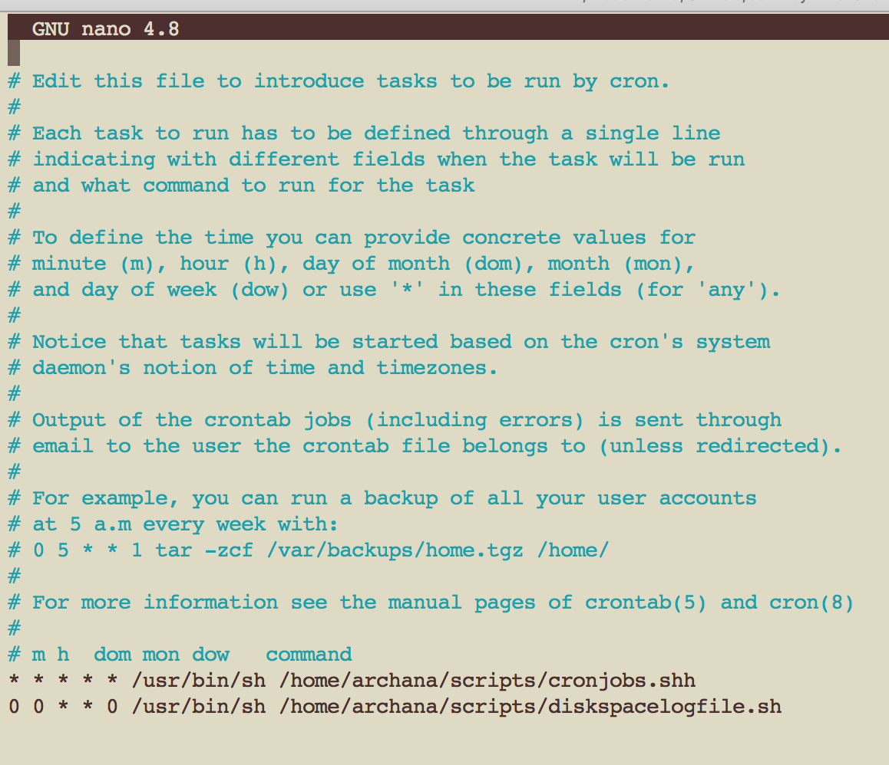
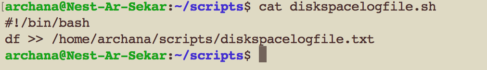
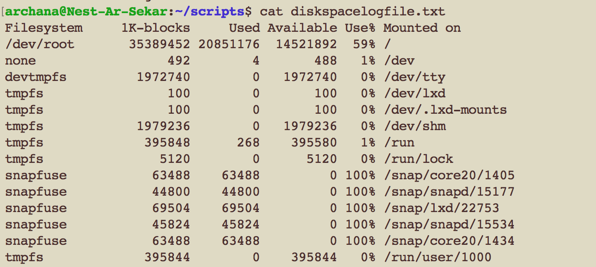

# LNX-08 Cron jobs

Cron is a time-based job scheduler in Unix. You can use Cron to schedule jobs, i.e. to execute commands or shell scripts at specified times, dates, or intervals. This allows, for example, to automate system maintenance or management, to download files from the internet, or to send emails on a regular basis. It is a daemon, i.e. a background process that always runs on the server. The tasks Cron is supposed to perform are called CronJobs.

## Key terminology

- 'date': to check the current date and timezone set in your system
- crontab - a command that creates a table or list of commands, each of which is to be executed by the operating system at a specified time
- - a(m) b(h) c(D) d(M) e(Day of the week) /directory/command output - the standard form for a crontab
- crontab -e - to edit cronjobs
- log file - log files are records that Linux stores and monitors
- /var/log - the log files are stored in here
- df -h (disk filesystems) - to read the available/used disk space 
- 0 0 * * 0 - crontab command to run weekly

## Exercise

- Create a Bash script that writes the current date and time to a file in your home directory.
- Register the script in your crontab so that it runs every minute.
- Create a script that writes available disk space to a log file in ‘/var/logs’. Use a cron job so that it runs weekly.

### Sources

- [how to use cron to automate tasks ubuntu ](https://www.digitalocean.com/community/tutorials/how-to-use-cron-to-automate-tasks-ubuntu-1804)

- [How to get current date and time in a bash script?](https://tecadmin.net/get-current-date-and-time-in-bash/)

- [run shell script in cron tab](https://askubuntu.com/questions/350861/how-to-set-a-cron-job-to-run-a-shell-script)

- [how to check free disk space](https://opensource.com/article/18/7/how-check-free-disk-space-linux)

- [how to schedule a cron command](https://crontab.guru/)

- [To verify if crontab works](https://askubuntu.com/questions/85558/verify-if-crontab-works)

### Overcome challanges

I had to understand the purpose of cronjobs and crontabs. It took me a while to figure out how to register a script in the crontab. 

### Results

Following are the results derived based on the commands used.

Exercise 1: 
1. Printing current time and date.

2. Create a Bash script that writes the current date and time (1)

3. Create a Bash script that writes the current date and time to a text file (2)

Exercise 2:
4. Crontab configuration.

5. Printing data and time with crontab.

Exercise 3:
Created a script that writes the available diskspace to a log file. Used cron jobs to automatically run the available diskspace weekly.

6. 

7. 

8. 

